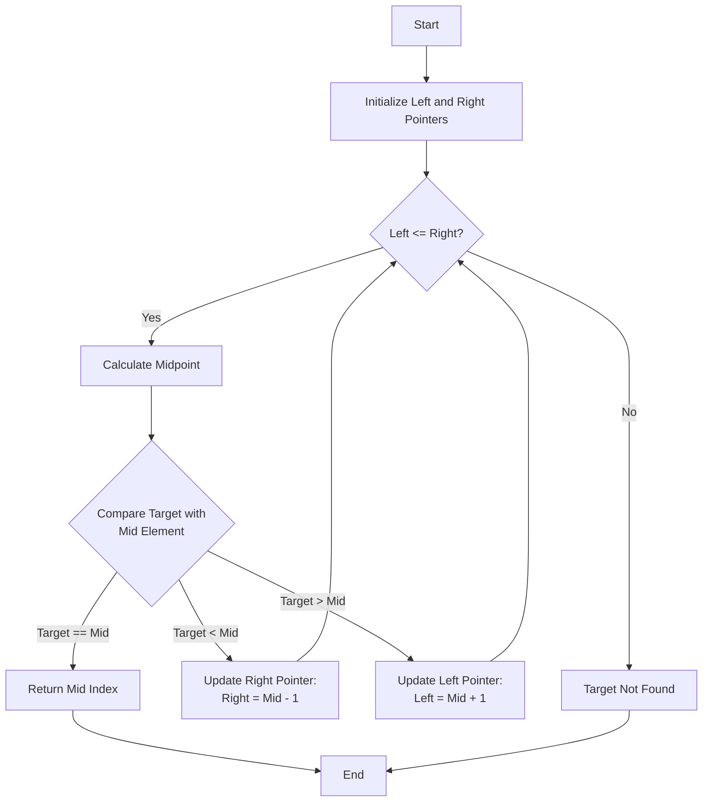

# **Binary Search Flowchart Analysis**

```mermaid
flowchart TD
    A[Start] --> B[Initialize Left and Right Pointers]
    B --> C{Left <= Right?}
    C -->|Yes| D[Calculate Midpoint]
    D --> E{Compare Target with\nMid Element}
    E -->|Target == Mid| F[Return Mid Index]
    E -->|Target < Mid| G[Update Right Pointer:\nRight = Mid - 1]
    E -->|Target > Mid| H[Update Left Pointer:\nLeft = Mid + 1]
    G --> C
    H --> C
    C -->|No| I[Target Not Found]
    F --> J[End]
    I --> J
```
