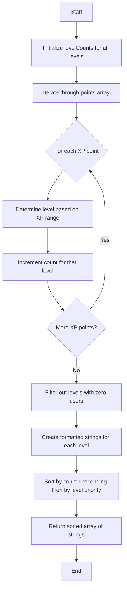

# **XP Level Classification Solution Flowchart**

```mermaid
flowchart TD
    A[Start] --> B[Initialize levelCounts for all levels]
    B --> C[Iterate through points array]
    C --> D{For each XP point}
    D --> E[Determine level based on XP range]
    E --> F[Increment count for that level]
    F --> G{More XP points?}
    G -- Yes --> D
    G -- No --> H[Filter out levels with zero users]
    H --> I[Create formatted strings for each level]
    I --> J[Sort by count descending,\nthen by level priority]
    J --> K[Return sorted array of strings]
    K --> L[End]
```
