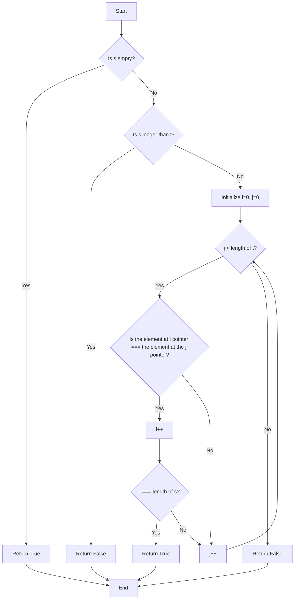

# **Is Subsequence Algorithm Flowchart**

```mermaid
flowchart TD
    A[Start] --> B{Is s empty?}
    B -->|Yes| C[Return True]
    B -->|No| D{Is s longer than t?}
    D -->|Yes| E[Return False]
    D -->|No| F[Initialize i=0, j=0]
    F --> G{j < length of t?}
    G -->|Yes| H{Is the element at i pointer === the element at the j pointer?}
    H -->|Yes| I[i++]
    I --> J{i === length of s?}
    J -->|Yes| K[Return True]
    J -->|No| L[j++]
    H -->|No| L
    L --> G
    G -->|No| M[Return False]
    M --> N[End]
    K --> N
    C --> N
    E --> N
```
