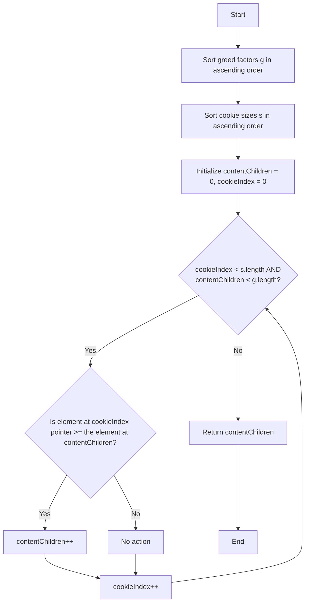

# **Assign Cookies Algorithm Flowchart**

```mermaid  
flowchart TD
    A[Start] --> B[Sort greed factors g in ascending order]
    B --> C[Sort cookie sizes s in ascending order]
    C --> D[Initialize contentChildren = 0, cookieIndex = 0]
    D --> E{cookieIndex < s.length AND\ncontentChildren < g.length?}
    E -->|Yes| F{Is element at cookieIndex pointer >= the element at contentChildren?}
    F -->|Yes| G[contentChildren++]
    F -->|No| H[No action]
    G --> I[cookieIndex++]
    H --> I
    I --> E
    E -->|No| J[Return contentChildren]
    J --> K[End]
```
