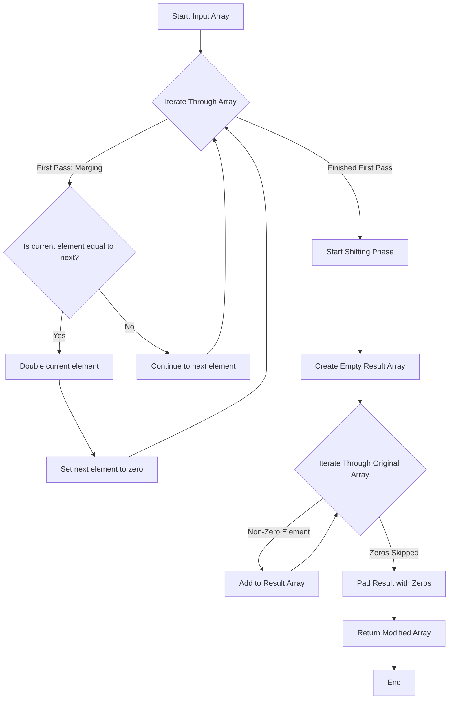

# **Array Operation Flowchart**

```mermaid
flowchart TD
    A[Start: Input Array] --> B{Iterate Through Array}
    B --> |First Pass: Merging| C{Is current element equal to next?}
    C --> |Yes| D[Double current element]
    D --> E[Set next element to zero]
    E --> B
    C --> |No| F[Continue to next element]
    F --> B
    B --> |Finished First Pass| G[Start Shifting Phase]
    G --> H[Create Empty Result Array]
    H --> I{Iterate Through Original Array}
    I --> |Non-Zero Element| J[Add to Result Array]
    J --> I
    I --> |Zeros Skipped| K[Pad Result with Zeros]
    K --> L[Return Modified Array]
    L --> M[End]
```
