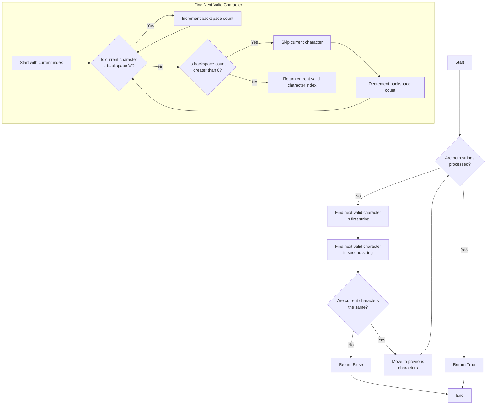

# **Backspace String Compare Algorithm Flowchart**

```mermaid
flowchart TD
    A[Start] --> B{Are both strings\nprocessed?}
    B -->|No| C[Find next valid character\nin first string]
    C --> D[Find next valid character\nin second string]
    D --> E{Are current characters\nthe same?}
    E -->|No| F[Return False]
    E -->|Yes| G[Move to previous\ncharacters]
    G --> B
    B -->|Yes| H[Return True]
    F --> I[End]
    H --> I

    subgraph "Find Next Valid Character"
        J[Start with current index]
        K{Is current character\na backspace '#'?}
        L[Increment backspace count]
        M{Is backspace count\ngreater than 0?}
        N[Skip current character]
        O[Decrement backspace count]
        P[Return current valid character index]
    end

    J --> K
    K -->|Yes| L
    L --> K
    K -->|No| M
    M -->|Yes| N
    N --> O
    O --> K
    M -->|No| P
```
