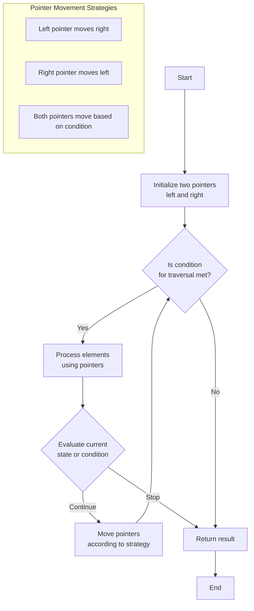

# Two Pointers Pattern Flowchart (Generic)

```mermaid
flowchart TD
    A[Start] --> B[Initialize two pointers\nleft and right]
    B --> C{Is condition\nfor traversal met?}
    C -->|Yes| D[Process elements\nusing pointers]
    D --> E{Evaluate current\nstate or condition}
    E -->|Continue| F[Move pointers\naccording to strategy]
    F --> C
    E -->|Stop| G[Return result]
    C -->|No| G
    G --> H[End]

    subgraph "Pointer Movement Strategies"
        I[Left pointer moves right]
        J[Right pointer moves left]
        K[Both pointers move based on condition]
    end
```
