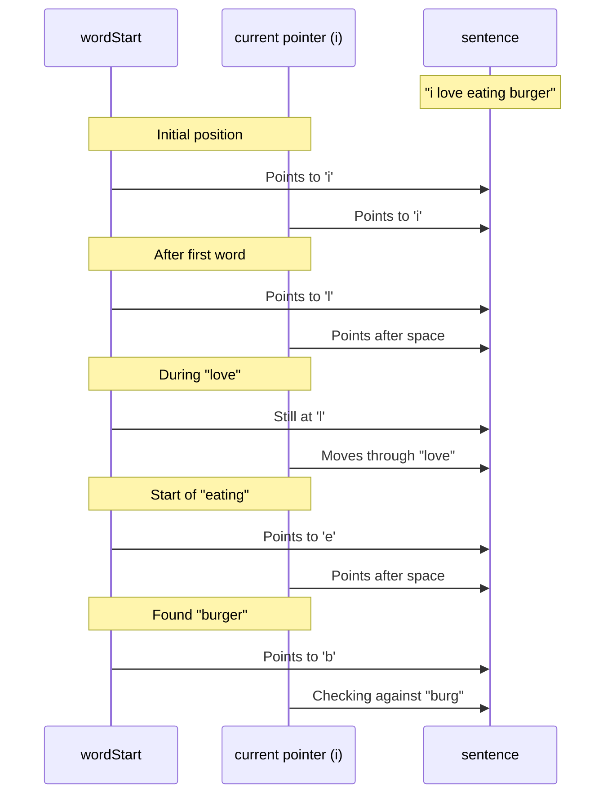

# **Visual Representation Of How The Two Pointers Move**

```mermaid
sequenceDiagram
    participant ws as wordStart
    participant i as current pointer (i)
    participant s as sentence
    Note over s: "i love eating burger"
    Note over ws,i: Initial position
    ws->>s: Points to 'i'
    i->>s: Points to 'i'
    Note over ws,i: After first word
    ws->>s: Points to 'l'
    i->>s: Points after space
    Note over ws,i: During "love"
    ws->>s: Still at 'l'
    i->>s: Moves through "love"
    Note over ws,i: Start of "eating"
    ws->>s: Points to 'e'
    i->>s: Points after space
    Note over ws,i: Found "burger"
    ws->>s: Points to 'b'
    i->>s: Checking against "burg"

```
