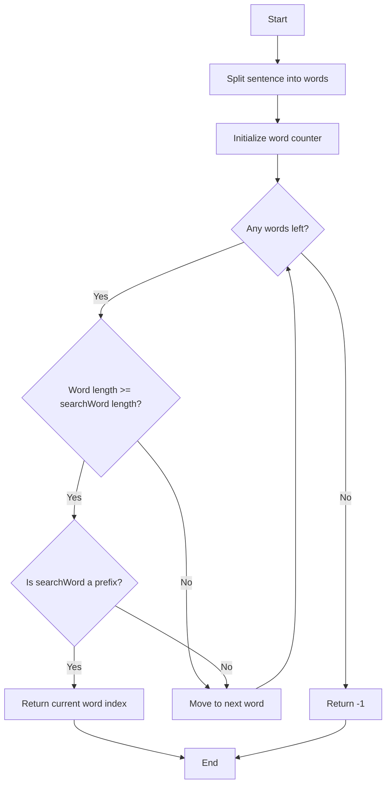

# **Check If A Word Occurs As A Prefix Of Any Word In A Sentence**

```mermaid
flowchart TD
    A[Start] --> B[Split sentence into words]
    B --> C[Initialize word counter]
    C --> D{Any words left?}
    D -->|No| E[Return -1]
    D -->|Yes| F{Word length >= searchWord length?}
    F -->|No| G[Move to next word]
    G --> D
    F -->|Yes| H{Is searchWord a prefix?}
    H -->|No| G
    H -->|Yes| I[Return current word index]
    I --> J[End]
    E --> J
```
