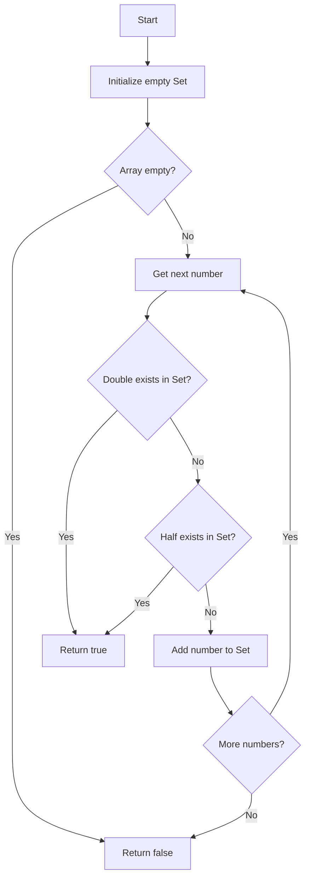

# **Check If N and Its Double Exist Flowchart**

```mermaid
flowchart TD
A[Start] --> B[Initialize empty Set]
B --> C{Array empty?}
C -->|Yes| D[Return false]
C -->|No| E[Get next number]
E --> F{Double exists in Set?}
F -->|Yes| G[Return true]
F -->|No| H{Half exists in Set?}
H -->|Yes| G
H -->|No| I[Add number to Set]
I --> J{More numbers?}
J -->|Yes| E
J -->|No| D

```
