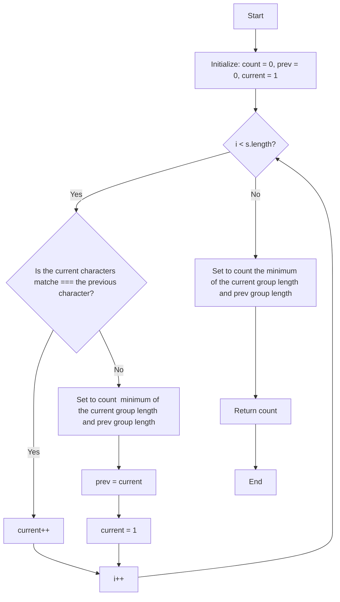

# **Count Binary Substrings Algorithm Flowchart**

```mermaid
flowchart TD
    A[Start] --> B[Initialize: count = 0, prev = 0, current = 1]
    B --> C{i < s.length?}
    C -->|Yes| D{Is the current characters matche === the previous character?}
    D -->|Yes| E[current++]
    E --> G[i++]
    G --> C
    D -->|No| F[Set to count  minimum of the current group length and prev group length]
    F --> H[prev = current]
    H --> I[current = 1]
    I --> G
    C -->|No| J[Set to count the minimum of the current group length and prev group length]
    J --> K[Return count]
    K --> L[End]
```
