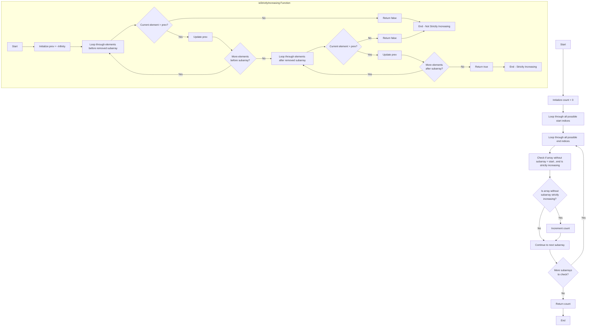

# **Incremovable Subarrays Solution Flowchart**

```mermaid
flowchart TD
    A[Start] --> B[Initialize count = 0]
    B --> C[Loop through all possible start indices]
    C --> D[Loop through all possible end indices]
    D --> E[Check if array without subarray = start...end is strictly increasing]
    E --> F{Is array without\nsubarray strictly\nincreasing?}
    F -->|Yes| G[Increment count]
    F -->|No| H[Continue to next subarray]
    G --> H
    H --> I{More subarrays\nto check?}
    I -->|Yes| D
    I -->|No| J[Return count]
    J --> K[End]

    subgraph "isStrictlyIncreasing Function"
    AA[Start] --> BB[Initialize prev = -Infinity]
    BB --> CC[Loop through elements before removed subarray]
    CC --> DD{Current element > prev?}
    DD -->|No| EE[Return false]
    DD -->|Yes| FF[Update prev]
    FF --> GG{More elements\nbefore subarray?}
    GG -->|Yes| CC
    GG -->|No| HH[Loop through elements after removed subarray]
    HH --> II{Current element > prev?}
    II -->|No| JJ[Return false]
    II -->|Yes| KK[Update prev]
    KK --> LL{More elements\nafter subarray?}
    LL -->|Yes| HH
    LL -->|No| MM[Return true]
    EE --> NN[End - Not Strictly Increasing]
    JJ --> NN
    MM --> OO[End - Strictly Increasing]
    end
```
