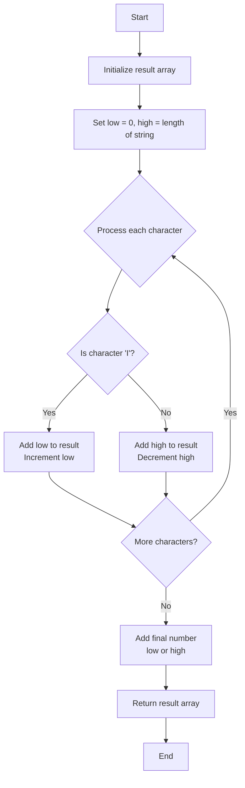

# **942. DI String Match**

```mermaid
flowchart TD
    A[Start] --> B[Initialize result array]
    B --> C[Set low = 0, high = length of string]
    C --> D{Process each character}
    D --> E{Is character 'I'?}
    E -->|Yes| F[Add low to result\nIncrement low]
    E -->|No| G[Add high to result\nDecrement high]
    F --> H{More characters?}
    G --> H
    H -->|Yes| D
    H -->|No| I[Add final number\nlow or high]
    I --> J[Return result array]
    J --> K[End]
```
