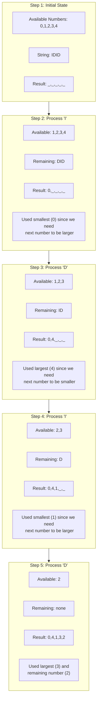

# **Greedy Visualization**

```mermaid
graph TD
subgraph Step1["Step 1: Initial State"]
A1[Available Numbers: 0,1,2,3,4]
B1[String: IDID]
C1[Result: _,_,_,_,_]
end

    subgraph Step2["Step 2: Process 'I'"]
        A2[Available: 1,2,3,4]
        B2[Remaining: DID]
        C2[Result: 0,_,_,_,_]
        D2["Used smallest (0) since we need\n next number to be larger"]
    end

    subgraph Step3["Step 3: Process 'D'"]
        A3[Available: 1,2,3]
        B3[Remaining: ID]
        C3[Result: 0,4,_,_,_]
        D3["Used largest (4) since we need\n next number to be smaller"]
    end

    subgraph Step4["Step 4: Process 'I'"]
        A4[Available: 2,3]
        B4[Remaining: D]
        C4[Result: 0,4,1,_,_]
        D4["Used smallest (1) since we need\n next number to be larger"]
    end

    subgraph Step5["Step 5: Process 'D'"]
        A5[Available: 2]
        B5[Remaining: none]
        C5[Result: 0,4,1,3,2]
        D5["Used largest (3) and\n remaining number (2)"]
    end

    Step1 --> Step2
    Step2 --> Step3
    Step3 --> Step4
    Step4 --> Step5
```
