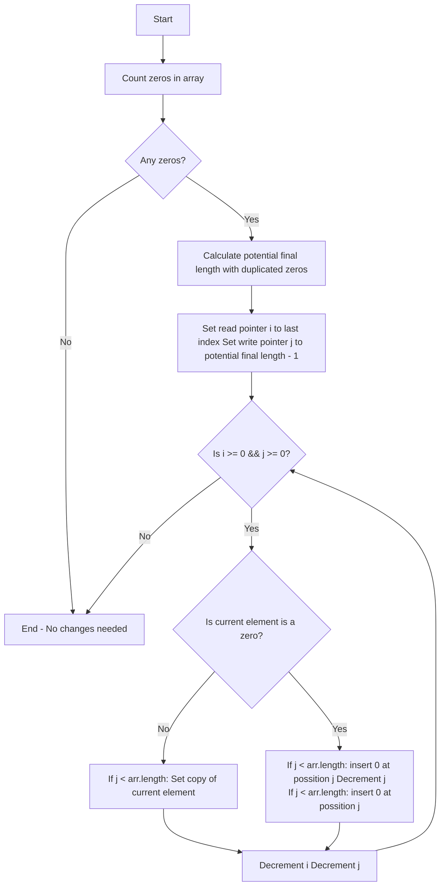

# **Duplicate Zeros Flowchart**

```mermaid
flowchart TD
A[Start] --> B[Count zeros in array]
B --> C{Any zeros?}
C -->|No| K[End - No changes needed]
C -->|Yes| D[Calculate potential final length<brr/> with duplicated zeros]
D --> E[Set read pointer i to last index<brr/> Set write pointer j to potential final length - 1]
E --> F{Is i >= 0 && j >= 0?}
F -->|No| K
F -->|Yes| G{Is current element is a zero?}
G -->|No| H[If j < arr.length:<brr/> Set copy of current element]
G -->|Yes| I[If j < arr.length:<brr/> insert 0 at possition j Decrement j\n If j < arr.length:<brr/> insert 0 at possition j]
H --> J[Decrement i<brr/> Decrement j]
I --> J
J --> F
```
