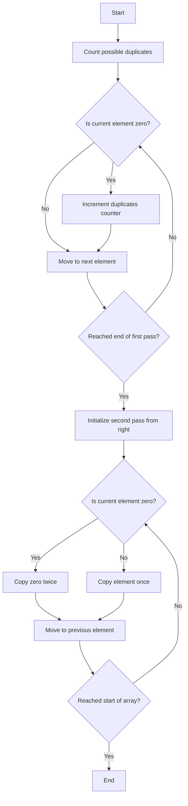

# **Duplicate Zeros Solution Flowchart**

```mermaid
flowchart TD
A[Start] --> B[Count possible duplicates]
B --> C{Is current element zero?}
C -->|Yes| D[Increment duplicates counter]
C -->|No| E[Move to next element]
D --> E
E --> F{Reached end of first pass?}
F -->|No| C
F -->|Yes| G[Initialize second pass from right]
G --> H{Is current element zero?}
H -->|Yes| I[Copy zero twice]
H -->|No| J[Copy element once]
I --> K[Move to previous element]
J --> K
K --> L{Reached start of array?}
L -->|No| H
L -->|Yes| M[End]
```
