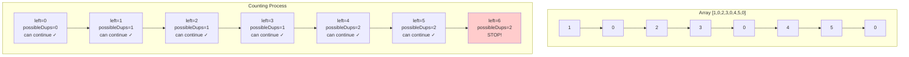

# **Zero Counting Process Visualization**

```mermaid
graph TD
subgraph "Array [1,0,2,3,0,4,5,0]"
A1[1] --> A2[0]
A2 --> A3[2]
A3 --> A4[3]
A4 --> A5[0]
A5 --> A6[4]
A6 --> A7[5]
A7 --> A8[0]
end

    subgraph "Counting Process"
        B1["left=0<br/>possibleDups=0<br/>can continue ✓"] --> B2["left=1<br/>possibleDups=1<br/>can continue ✓"]
        B2 --> B3["left=2<br/>possibleDups=1<br/>can continue ✓"]
        B3 --> B4["left=3<br/>possibleDups=1<br/>can continue ✓"]
        B4 --> B5["left=4<br/>possibleDups=2<br/>can continue ✓"]
        B5 --> B6["left=5<br/>possibleDups=2<br/>can continue ✓"]
        B6 --> B7["left=6<br/>possibleDups=2<br/>STOP!"]
    end

    style B7 fill:#ffcccc
```
