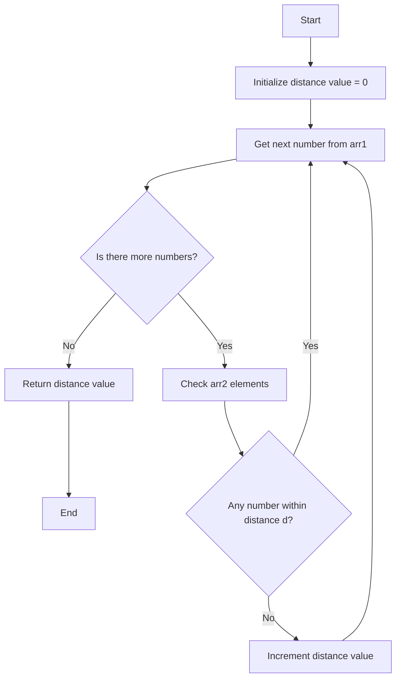

# **Find the Distance Value Between Two Arrays Flowchart**

```mermaid
flowchart TB
A[Start] --> B[Initialize distance value = 0]
B --> C[Get next number from arr1]
C --> D{Is there more numbers?}
D -->|No| E[Return distance value]
D -->|Yes| F[Check arr2 elements]
F --> G{Any number within distance d?}
G -->|Yes| C
G -->|No| H[Increment distance value]
H --> C
E --> I[End]
```
