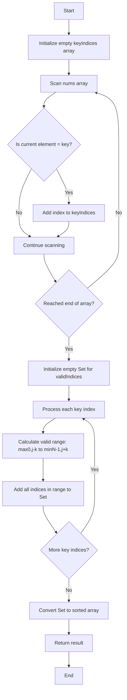

# **K-Distant Indices Algorithm Flowchart**

```mermaid
flowchart TD
A[Start] --> B[Initialize empty keyIndices array]
B --> C[Scan nums array]
C --> D{Is current element = key?}
D -- Yes --> E[Add index to keyIndices]
D -- No --> F[Continue scanning]
E --> F
F --> G{Reached end of array?}
G -- No --> C
G -- Yes --> H[Initialize empty Set for validIndices]
H --> I[Process each key index]
I --> J[Calculate valid range: max0,j-k to minN-1,j+k]
J --> K[Add all indices in range to Set]
K --> L{More key indices?}
L -- Yes --> I
L -- No --> M[Convert Set to sorted array]
M --> N[Return result]
N --> O[End]
```
