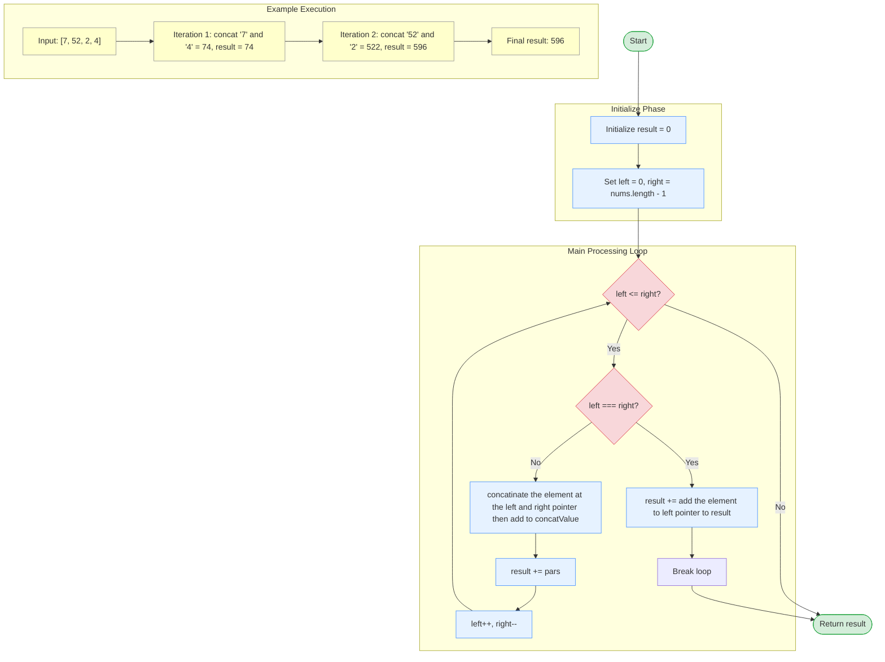

# **Array Concatenation Value Algorithm Flowchart**

```mermaid  
flowchart TD
    A([Start]) --> B[Initialize result = 0]
    B --> C[Set left = 0, right = nums.length - 1]
    C --> D{left <= right?}

    D -->|Yes| E{left === right?}
    D -->|No| K([Return result])
    
    E -->|Yes| F[result += add the element to left pointer to result]
    E -->|No| G["concatinate the element at the left and right pointer then add to concatValue"]
    
    F --> H[Break loop]
    G --> I[result += pars]
    
    I --> J[left++, right--]
    J --> D
    
    H --> K
    
    %% Add annotations for clarity
    subgraph "Initialize Phase"
        B
        C
    end
    
    subgraph "Main Processing Loop"
        D
        E
        F
        G
        H
        I
        J
    end
    
    %% Add example data
    subgraph "Example Execution"
        Z1["Input: [7, 52, 2, 4]"]
        Z2["Iteration 1: concat '7' and '4' = 74, result = 74"]
        Z3["Iteration 2: concat '52' and '2' = 522, result = 596"]
        Z4["Final result: 596"]
        
        Z1 --> Z2 --> Z3 --> Z4
    end
    
    %% Add explanatory notes
    classDef note fill:#ffffcc,stroke:#999,stroke-width:1px
    classDef process fill:#e6f2ff,stroke:#4d94ff,stroke-width:1px
    classDef decision fill:#f8d7da,stroke:#dc3545,stroke-width:1px
    classDef terminator fill:#d4edda,stroke:#28a745,stroke-width:1px
    
    class A,K terminator
    class B,C,F,G,I,J process
    class D,E decision
    class Z1,Z2,Z3,Z4 note
```
