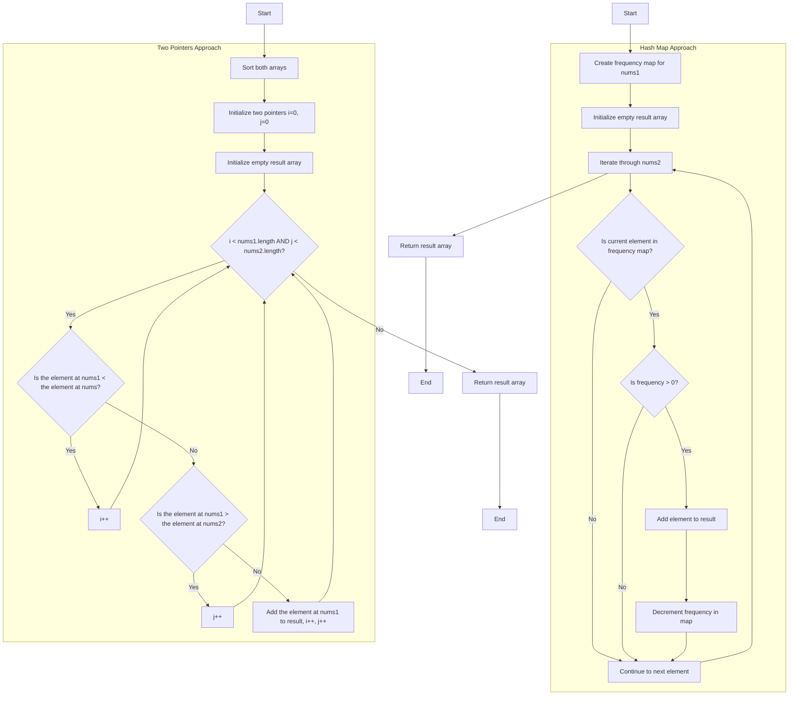

# **Intersection of Two Arrays II - Solution Flowchart**

```mermaid
flowchart TD
    A[Start] --> B[Create frequency map for nums1]
    B --> C[Initialize empty result array]
    C --> D[Iterate through nums2]
    D --> E{Is current element in frequency map?}
    E -->|No| G[Continue to next element]
    G --> D
    E -->|Yes| F{Is frequency > 0?}
    F -->|No| G
    F -->|Yes| H[Add element to result]
    H --> I[Decrement frequency in map]
    I --> G
    D --> J[Return result array]
    J --> K[End]

    subgraph "Hash Map Approach"
    B
    C
    D
    E
    F
    G
    H
    I
    end

    L[Start] --> M[Sort both arrays]
    M --> N[Initialize two pointers i=0, j=0]
    N --> O[Initialize empty result array]
    O --> P{i < nums1.length AND j < nums2.length?}
    P -->|No| V[Return result array]
    P -->|Yes| Q{Is the element at nums1 < the element at nums?}
    Q -->|Yes| R[i++]
    R --> P
    Q -->|No| S{Is the element at nums1 > the element at nums2?}
    S -->|Yes| T[j++]
    T --> P
    S -->|No| U[Add the element at nums1 to result, i++, j++]
    U --> P
    V --> W[End]

    subgraph "Two Pointers Approach"
    M
    N
    O
    P
    Q
    R
    S
    T
    U
    end
```
