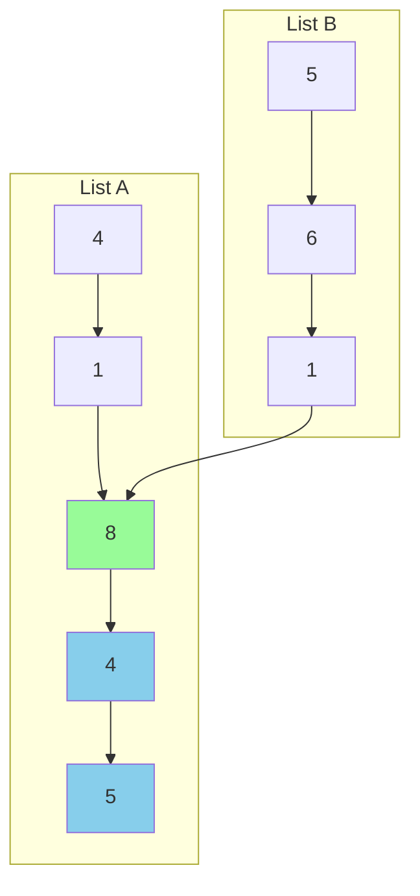

<!-- I'll walk through a detailed example using Example 1 from the problem, where two lists intersect at node value 8. Let's visualize each step of the algorithm. -->

# **Linked List Intersection Algorithm Walkthrough**



## **Let's walk through the algorithm step by step:**

### **Initial Setup:**

```javascript
pointerA = headA (value: 4)
pointerB = headB (value: 5)
```

### **Step-by-Step Movement:**

```javascript
// Step 1
pointerA: 4 -> 1
pointerB: 5 -> 6

// Step 2
pointerA: 1 -> 8
pointerB: 6 -> 1

// Step 3
pointerA: 8 -> 4
pointerB: 1 -> 8

// Step 4
pointerA: 4 -> 5
pointerB: 8 -> 4

// Step 5
pointerA: 5 -> null -> headB(5)
pointerB: 4 -> 5

// Step 6
pointerA: 5 -> 6
pointerB: 5 -> null -> headA(4)

// Step 7
pointerA: 6 -> 1
pointerB: 4 -> 1

// Step 8
pointerA: 1 -> 8
pointerB: 1 -> 8  // Pointers meet! This is the intersection
```

## Let's analyze why this works

1. **Distance Analysis**:

   - List A (before intersection): [4, 1] (length = 2)
   - List B (before intersection): [5, 6, 1] (length = 3)
   - Common part: [8, 4, 5] (length = 3)

2. **Total Distance Traveled**:

   - PointerA path: [4, 1, 8, 4, 5, 5, 6, 1, 8] = 9 steps
   - PointerB path: [5, 6, 1, 8, 4, 5, 4, 1, 8] = 9 steps

3. **Why They Meet**:

   - When pointerA reaches the end of list A, it moves to headB
   - When pointerB reaches the end of list B, it moves to headA
   - This equalizes the distance they travel before meeting

4. **Mathematical Proof**:

- **Let's say:**
- Distance before intersection in A = 2 nodes
- Distance before intersection in B = 3 nodes
- Common part = 3 nodes
- Both pointers will travel exactly:
  (2 + 3) nodes to reach intersection = 5 nodes
- Making them meet at the same point

## **Key Insights:**

1. The algorithm automatically handles different list lengths
2. The switch to the other list's head ensures equal distance traveled
3. If there's no intersection, both pointers will become null simultaneously
4. The solution maintains O(1) space complexity as we only use two pointers

## **Common Mistakes to Avoid:**

1. Not handling null pointers properly
2. Forgetting to check for list equality before moving pointers
3. Not considering edge cases (empty lists, single-node lists)
4. Modifying the original list structure

## **Would you like me to:**

1. Explain any specific part of the walkthrough in more detail?
2. Show how the algorithm handles a case with no intersection?
3. Discuss optimization techniques for this solution?
