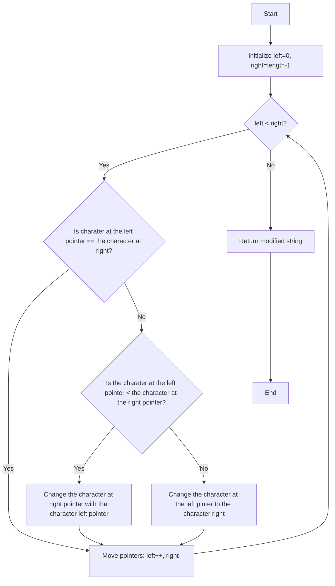

# **Lexicographically Smallest Palindrome Flowchart**

```mermaid
flowchart TD
    A[Start] --> B[Initialize left=0, right=length-1]
    B --> C{left < right?}
    C -->|Yes| D{Is charater at the left pointer == the character at right?}
    D -->|Yes| E[Move pointers: left++, right--]
    D -->|No| F{Is the charater at the left pointer < the character at the right pointer?}
    F -->|Yes| G[Change the character at right pointer with the character left pointer]
    F -->|No| H[Change the character at the left pinter to the character right]
    G --> E
    H --> E
    E --> C
    C -->|No| I[Return modified string]
    I --> J[End]
```
