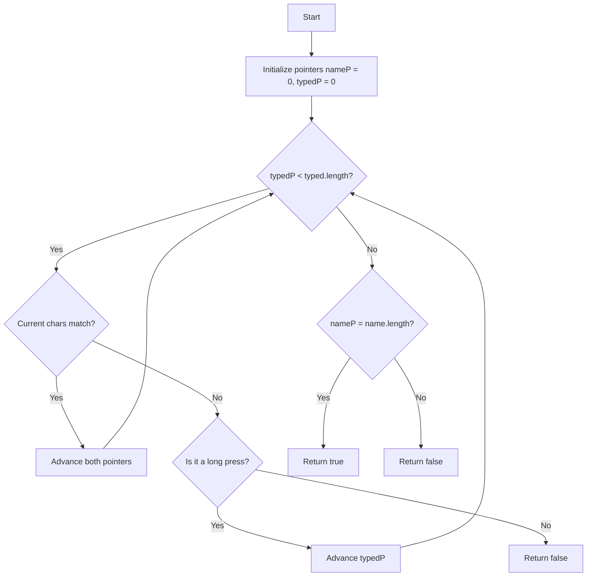

# **Long Pressed Name Solution Flowchart**

```mermaid
flowchart TD
    A[Start] --> B[Initialize pointers nameP = 0, typedP = 0]
    B --> C{typedP < typed.length?}
    C -->|Yes| D{Current chars match?}
    D -->|Yes| E[Advance both pointers]
    E --> C
    D -->|No| F{Is it a long press?}
    F -->|Yes| G[Advance typedP]
    G --> C
    F -->|No| H[Return false]
    C -->|No| I{nameP = name.length?}
    I -->|Yes| J[Return true]
    I -->|No| K[Return false]
```
