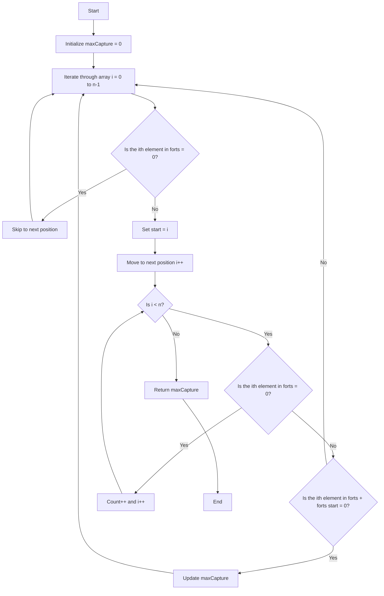

# **Maximum Enemy Forts Capture Flowchart**

```mermaid
flowchart TD
    A[Start] --> B[Initialize maxCapture = 0]
    B --> C[Iterate through array i = 0 to n-1]
    C --> D{Is the ith element in forts = 0?}
    D -- Yes --> E[Skip to next position]
    E --> C
    D -- No --> F[Set start = i]
    F --> G[Move to next position i++]
    G --> H{Is i < n?}
    H -- No --> M[Return maxCapture]
    H -- Yes --> I{Is the ith element in forts = 0?}
    I -- No --> J{Is the ith element in forts + forts start = 0?}
    J -- Yes --> K[Update maxCapture]
    J -- No --> C
    K --> C
    I -- Yes --> L[Count++ and i++]
    L --> H
    M --> N[End]
```
