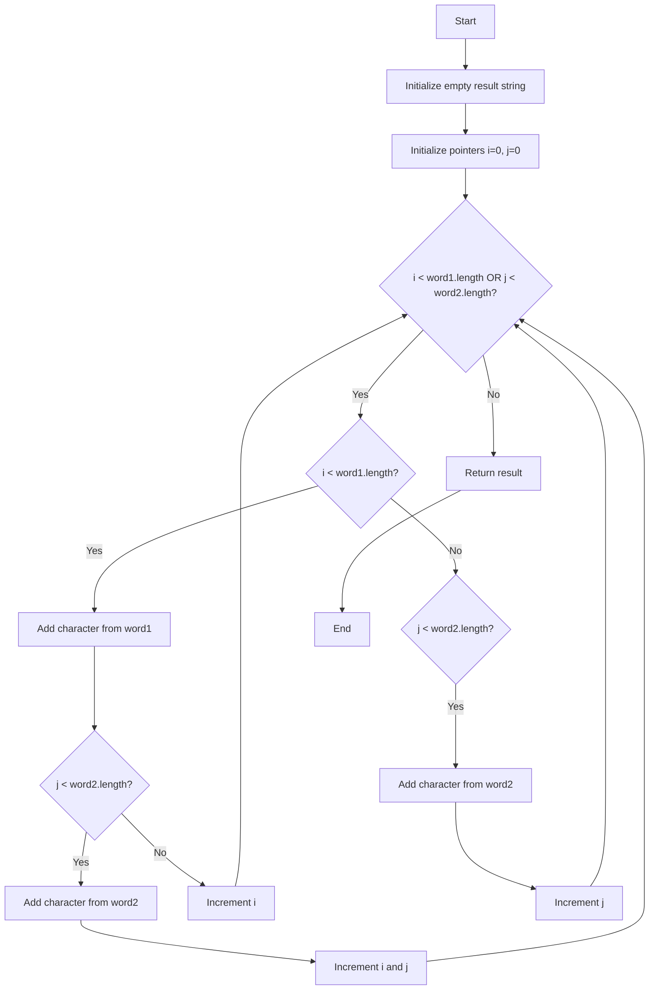

# **Merge Strings Alternately Flowchart**

```mermaid
flowchart TD
A[Start] --> B[Initialize empty result string]
B --> C[Initialize pointers i=0, j=0]
C --> D{i < word1.length OR j < word2.length?}
D -->|Yes| E{i < word1.length?}
E -->|Yes| F[Add character from word1]
F --> G{j < word2.length?}
G -->|Yes| H[Add character from word2]
H --> I[Increment i and j]
I --> D
G -->|No| J[Increment i]
J --> D
E -->|No| K{j < word2.length?}
K -->|Yes| L[Add character from word2]
L --> M[Increment j]
M --> D
D -->|No| N[Return result]
N --> O[End]
```
