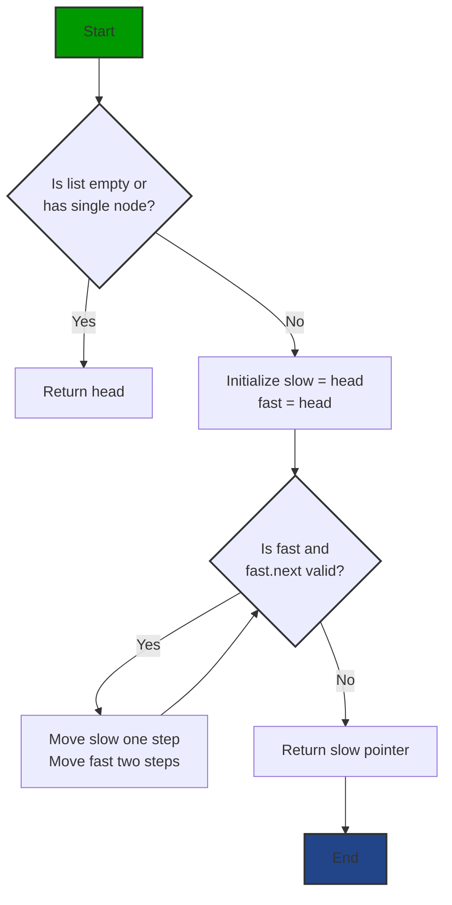

# **Middle Node Finding Process**

```mermaid
flowchart TD
    A[Start] --> B{Is list empty or\nhas single node?}
    B -->|Yes| C[Return head]
    B -->|No| D[Initialize slow = head\nfast = head]
    D --> E{Is fast and\nfast.next valid?}
    E -->|Yes| F[Move slow one step\nMove fast two steps]
    F --> E
    E -->|No| G[Return slow pointer]
    G --> H[End]

    style A fill:#090,stroke:#333,stroke-width:2px
    style H fill:#248,stroke:#333,stroke-width:2px
    style B fill:#16,stroke:#333,stroke-width:2px
    style E fill:#bb,stroke:#333,stroke-width:2px
```
