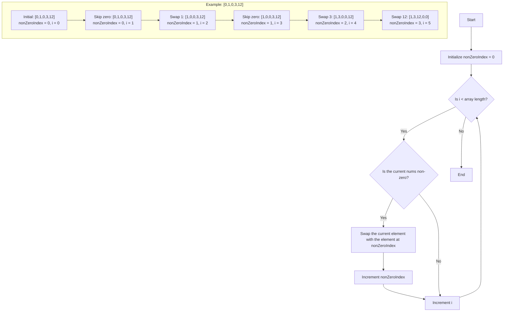

# **Move Zeroes Algorithm Flowchart**

```mermaid
flowchart TD
A[Start] --> B[Initialize nonZeroIndex = 0]
B --> C{Is i < array length?}
C -->|Yes| D{Is the current nums non-zero?}
D -->|Yes| E[Swap the current element with the element at nonZeroIndex]
E --> F[Increment nonZeroIndex]
F --> G[Increment i]
D -->|No| G
G --> C
C -->|No| H[End]

    subgraph "Example: [0,1,0,3,12]"
        I["Initial: [0,1,0,3,12]
        nonZeroIndex = 0, i = 0"]
        J["Skip zero: [0,1,0,3,12]
        nonZeroIndex = 0, i = 1"]
        K["Swap 1: [1,0,0,3,12]
        nonZeroIndex = 1, i = 2"]
        L["Skip zero: [1,0,0,3,12]
        nonZeroIndex = 1, i = 3"]
        M["Swap 3: [1,3,0,0,12]
        nonZeroIndex = 2, i = 4"]
        N["Swap 12: [1,3,12,0,0]
        nonZeroIndex = 3, i = 5"]
    end

    I --> J --> K --> L --> M --> N
```
