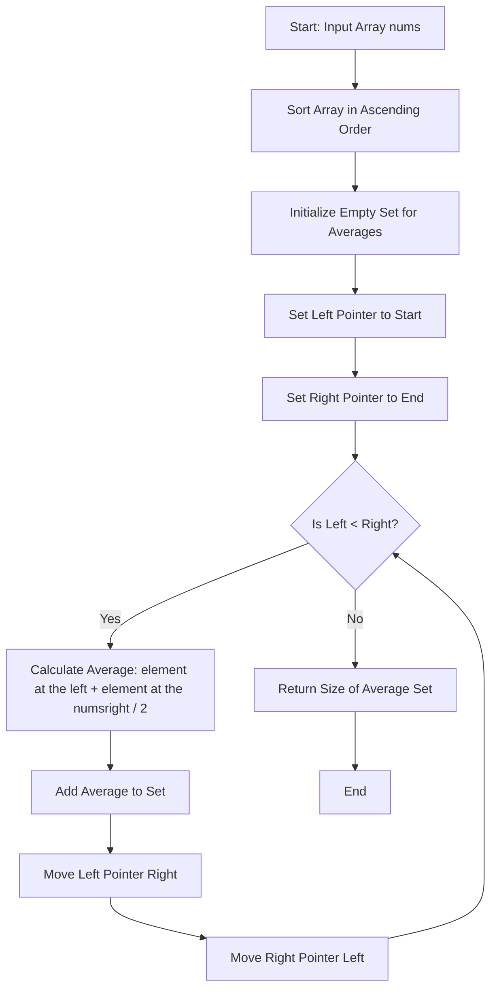

# **Number Of Distinct Average**

```mermaid
flowchart TD
    A[Start: Input Array nums] --> B[Sort Array in Ascending Order]
    B --> C[Initialize Empty Set for Averages]
    C --> D[Set Left Pointer to Start]
    D --> E[Set Right Pointer to End]
    E --> F{Is Left < Right?}
    F -->|Yes| G[Calculate Average: element at the left + element at the numsright / 2]
    G --> H[Add Average to Set]
    H --> I[Move Left Pointer Right]
    I --> J[Move Right Pointer Left]
    J --> F
    F -->|No| K[Return Size of Average Set]
    K --> L[End]
```
