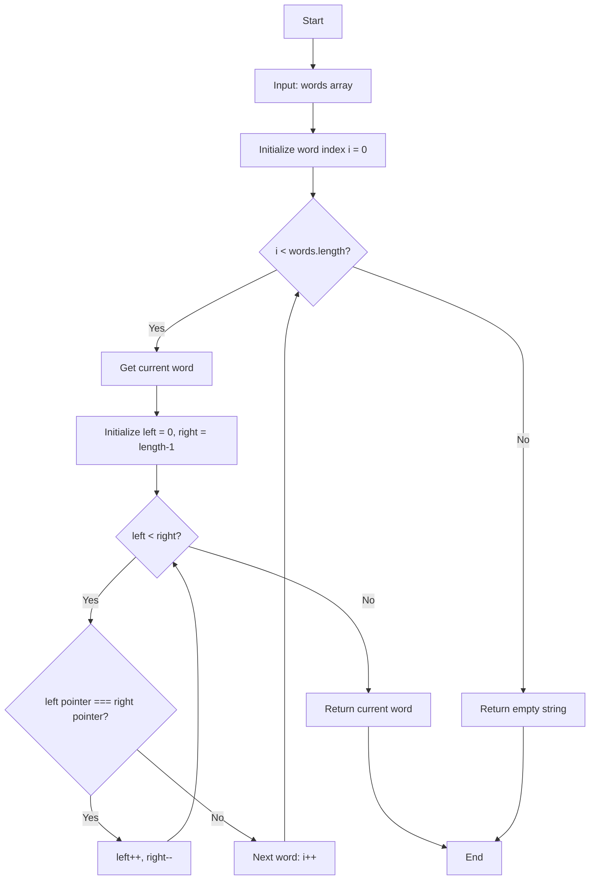

# **First Palindrome Solution Flowchart**

```mermaid
flowchart TD
    A[Start] --> B[Input: words array]
    B --> C[Initialize word index i = 0]
    C --> D{i < words.length?}
    D -->|Yes| E[Get current word]
    E --> F[Initialize left = 0, right = length-1]
    F --> G{left < right?}
    G -->|Yes| H{left pointer === right pointer?}
    H -->|Yes| I[left++, right--]
    H -->|No| J[Next word: i++]
    I --> G
    G -->|No| K[Return current word]
    J --> D
    D -->|No| L[Return empty string]
    K --> M[End]
    L --> M
```
