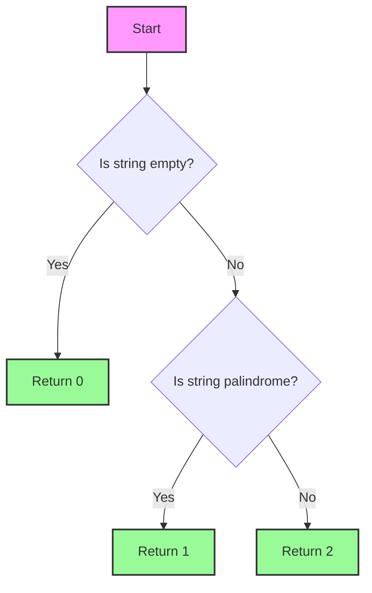

# **Remove Palindromic Subsequences Flowchart**

```mermaid
flowchart TD
A[Start] --> B{Is string empty?}
B -->|Yes| C[Return 0]
B -->|No| D{Is string palindrome?}
D -->|Yes| E[Return 1]
D -->|No| F[Return 2]

    style A fill:#f9f,stroke:#333,stroke-width:2px
    style C fill:#98FB98,stroke:#333,stroke-width:2px
    style E fill:#98FB98,stroke:#333,stroke-width:2px
    style F fill:#98FB98,stroke:#333,stroke-width:2px
```
