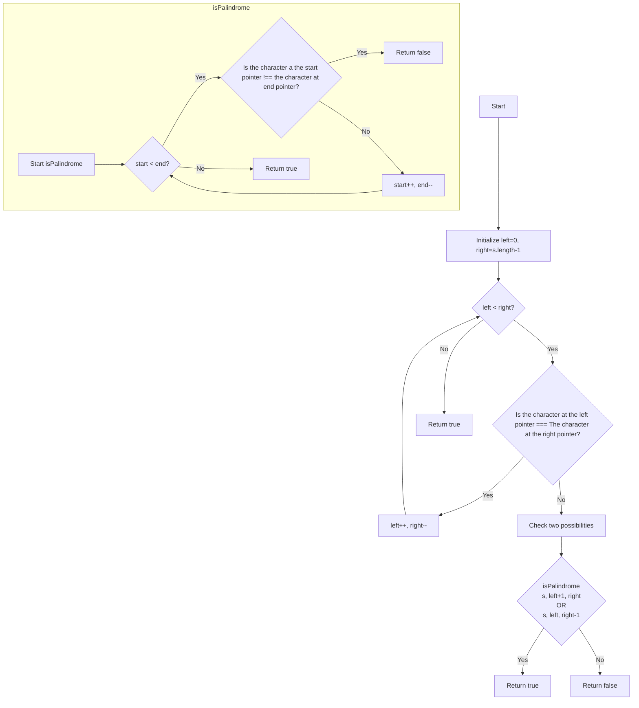

# **Valid Palindrome II Algorithm Flowchart**

```mermaid
flowchart TD
    A[Start] --> B[Initialize left=0, right=s.length-1]
    B --> C{left < right?}
    C -->|Yes| D{Is the character at the left pointer === The character at the right pointer?}
    C -->|No| E[Return true]
    D -->|Yes| F[left++, right--]
    F --> C
    D -->|No| G[Check two possibilities]
    G --> H{isPalindrome\ns, left+1, right\nOR\ns, left, right-1}
    H -->|Yes| I[Return true]
    H -->|No| J[Return false]

    subgraph isPalindrome
        K[Start isPalindrome] --> L{start < end?}
        L -->|Yes| M{Is the character a the start pointer !== the character at end pointer?}
        L -->|No| N[Return true]
        M -->|Yes| O[Return false]
        M -->|No| P[start++, end--]
        P --> L
    end
```
