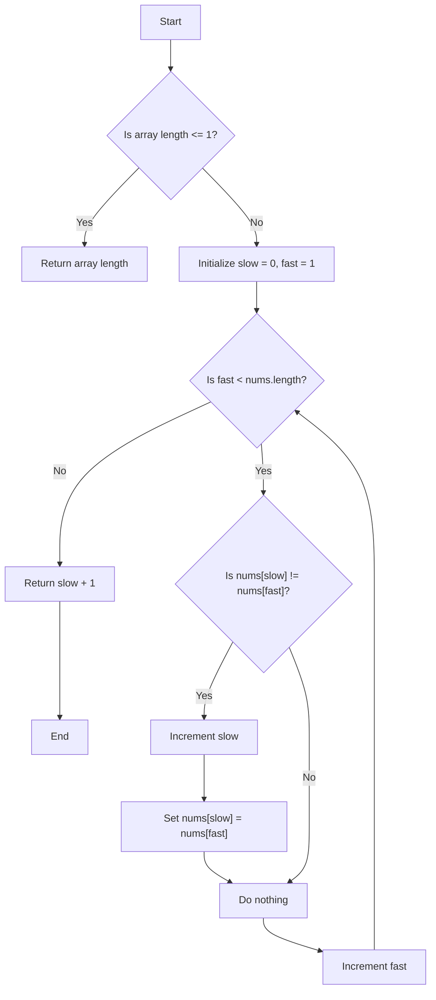

# **Remove Duplicates from Sorted Array Flowchat**

```mermaid
flowchart TD
    A[Start] --> B{Is array length <= 1?}
    B -->|Yes| C[Return array length]
    B -->|No| D[Initialize slow = 0, fast = 1]
    D --> E{Is fast < nums.length?}
    E -->|No| J[Return slow + 1]
    E -->|Yes| F{"Is nums[slow] != nums[fast]?"}
    F -->|Yes| G[Increment slow]
    G --> H["Set nums[slow] = nums[fast]"]
    F -->|No| I[Do nothing]
    H --> I
    I --> K[Increment fast]
    K --> E
    J --> L[End]

```
