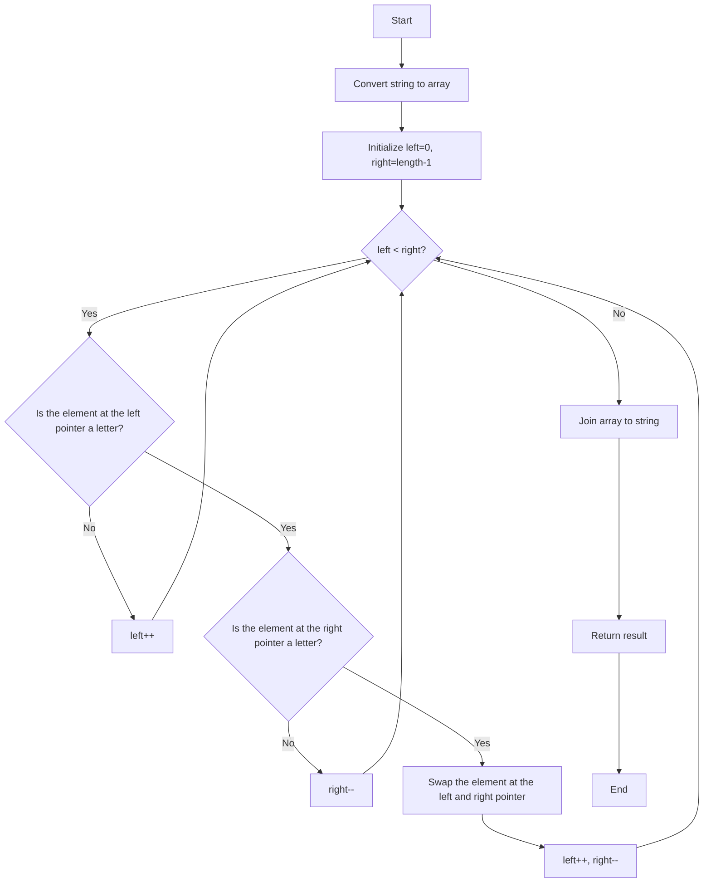

# **Reverse Only Letters Flowchart**

```mermaid
flowchart TD
A[Start] --> B[Convert string to array]
B --> C[Initialize left=0, right=length-1]
C --> D{left < right?}
D -->|Yes| E{Is the element at the left pointer a letter?}
E -->|No| F[left++]
F --> D
E -->|Yes| G{Is the element at the right pointer a letter?}
G -->|No| H[right--]
H --> D
G -->|Yes| I[Swap the element at the left and right pointer]
I --> J[left++, right--]
J --> D
D -->|No| K[Join array to string]
K --> L[Return result]
L --> M[End]
```
