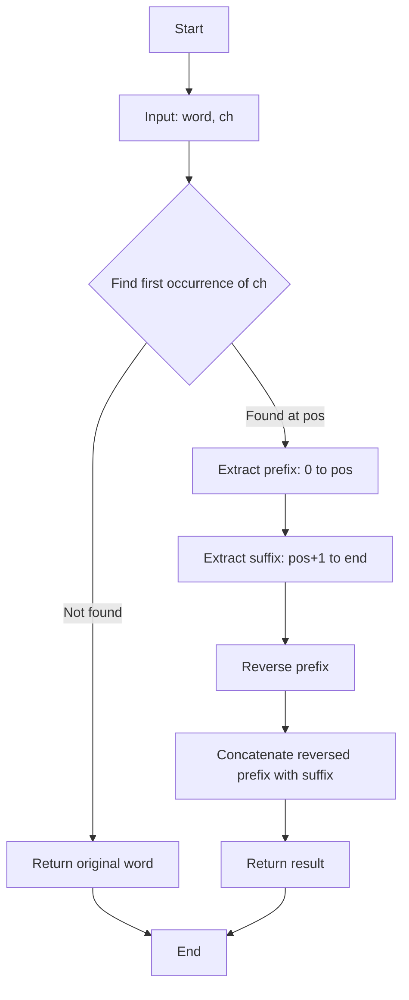

# **Reverse Prefix Solution Flowchart**

```mermaid
flowchart TD
    A[Start] --> B[Input: word, ch]
    B --> C{Find first occurrence of ch}
    C -->|Not found| D[Return original word]
    C -->|Found at pos| E[Extract prefix: 0 to pos]
    E --> F[Extract suffix: pos+1 to end]
    F --> G[Reverse prefix]
    G --> H[Concatenate reversed prefix with suffix]
    H --> I[Return result]
    D --> J[End]
    I --> J
```
