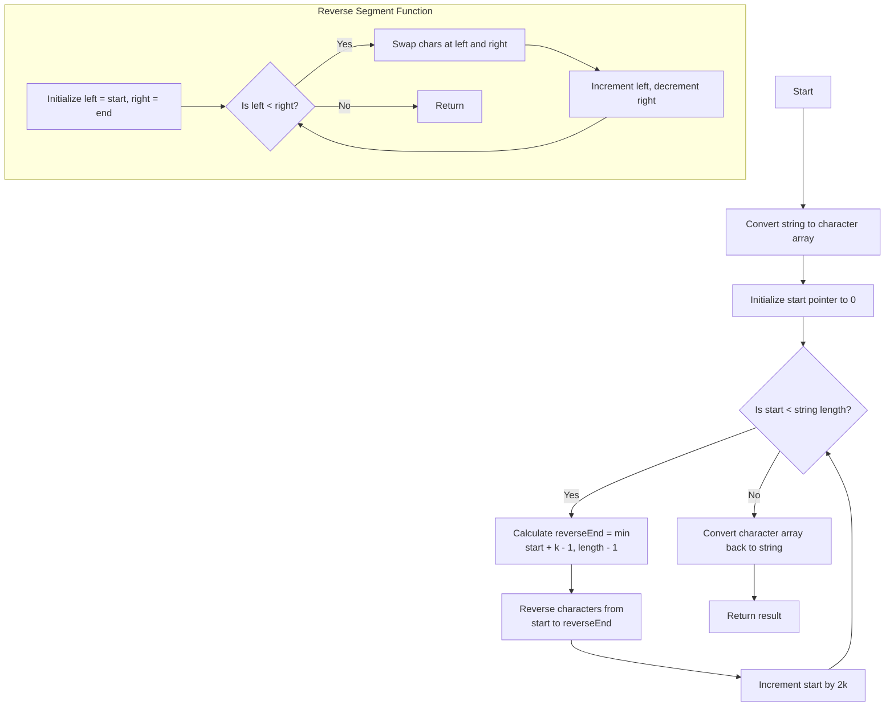

# **Reverse String II Solution Flowchart**

```mermaid
flowchart TD
    A[Start] --> B[Convert string to character array]
    B --> C[Initialize start pointer to 0]
    C --> D{Is start < string length?}
    D -->|Yes| E[Calculate reverseEnd = min\nstart + k - 1, length - 1]
    E --> F[Reverse characters from\nstart to reverseEnd]
    F --> G[Increment start by 2k]
    G --> D
    D -->|No| H[Convert character array back to string]
    H --> I[Return result]

    subgraph reverseSegment[Reverse Segment Function]
        J[Initialize left = start, right = end] --> K{Is left < right?}
        K -->|Yes| L[Swap chars at left and right]
        L --> M[Increment left, decrement right]
        M --> K
        K -->|No| N[Return]
    end
```
