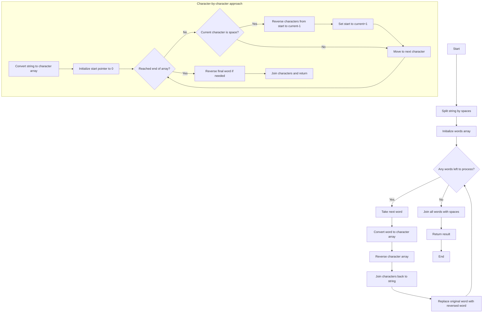

# **Reverse Words in a String III - Solution Flowchart**

```mermaid
flowchart TD
    A[Start] --> B[Split string by spaces]
    B --> C[Initialize words array]
    C --> D{Any words left to process?}
    D -->|Yes| E[Take next word]
    E --> F[Convert word to character array]
    F --> G[Reverse character array]
    G --> H[Join characters back to string]
    H --> I[Replace original word with reversed word]
    I --> D
    D -->|No| J[Join all words with spaces]
    J --> K[Return result]
    K --> L[End]

    subgraph "Character-by-character approach"
    M[Convert string to character array] --> N[Initialize start pointer to 0]
    N --> O{Reached end of array?}
    O -->|No| P{Current character is space?}
    P -->|Yes| Q[Reverse characters from start to current-1]
    Q --> R[Set start to current+1]
    R --> S[Move to next character]
    S --> O
    P -->|No| S
    O -->|Yes| T[Reverse final word if needed]
    T --> U[Join characters and return]
    end
```
