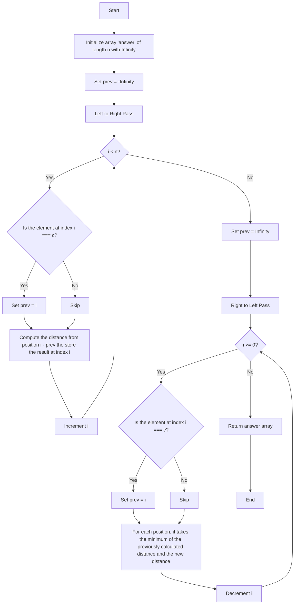

# **Shortest Distance to Character Algorithm Flowchart**

```mermaid
flowchart TD
    A[Start] --> B[Initialize array 'answer' of length n with Infinity]
    B --> C[Set prev = -Infinity]

    C --> D[Left to Right Pass]
    D --> E{i < n?}
    E -->|Yes| F{Is the element at index i === c?}
    F -->|Yes| G[Set prev = i]
    F -->|No| H[Skip]
    G --> I[Compute the distance from position i - prev the store the result at index i]
    H --> I
    I --> J[Increment i]
    J --> E
    
    E -->|No| K[Set prev = Infinity]
    
    K --> L[Right to Left Pass]
    L --> M{i >= 0?}
    M -->|Yes| N{Is the element at index i === c?}
    N -->|Yes| O[Set prev = i]
    N -->|No| P[Skip]
    O --> Q[For each position, it takes the minimum of the previously calculated distance and the new distance]
    P --> Q
    Q --> R[Decrement i]
    R --> M
    
    M -->|No| S[Return answer array]
    S --> T[End]
```
