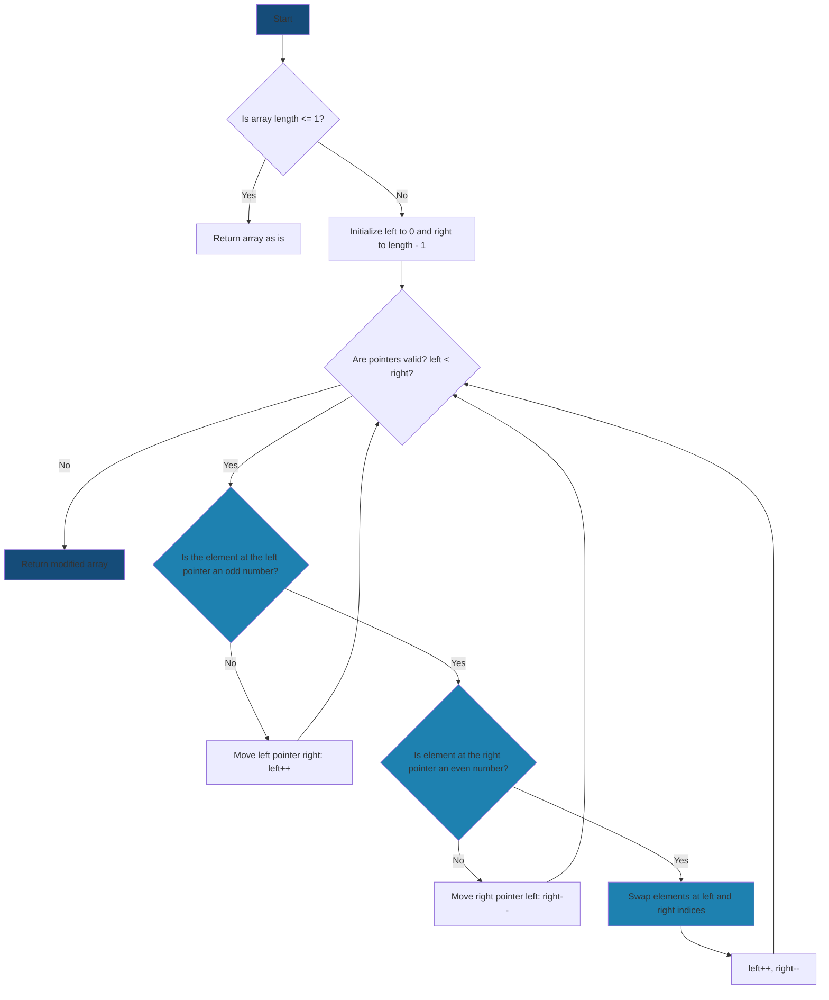

# **Sort Array By Parity Flowchart**

```mermaid
flowchart TD
    A[Start] --> B{Is array length <= 1?}
    B -->|Yes| C[Return array as is]
    B -->|No| D[Initialize left to 0 and right to length - 1]
    D --> E{Are pointers valid? left < right?}
    E -->|No| F[Return modified array]
    E -->|Yes| G{Is the element at the left pointer an odd number?}
    G -->|No| H[Move left pointer right: left++]
    G -->|Yes| I{Is element at the right pointer an even number?}
    I -->|No| J[Move right pointer left: right--]
    I -->|Yes| K[Swap elements at left and right indices]
    K --> L[left++, right--]
    H --> E
    J --> E
    L --> E


    style A fill:#154c79
    style F fill:#154c79
    style K fill:#1e81b0
    style G fill:#1e81b0
    style I fill:#1e81b0
    style E fill:#f0e68
```
