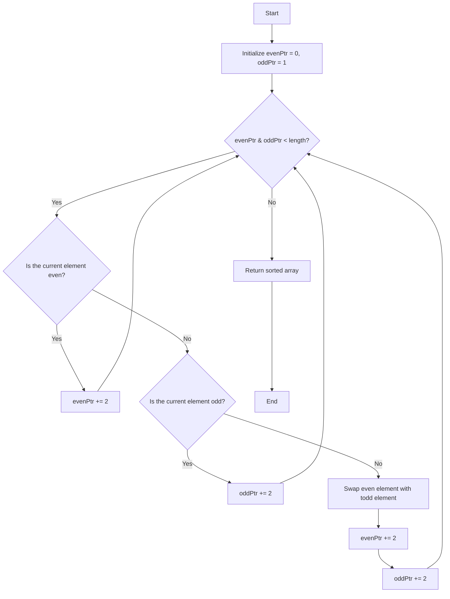

# **Sort Array By Parity ll Flowchart**

```mermaid
flowchart TD
    A[Start] --> B[Initialize evenPtr = 0, oddPtr = 1]
    B --> C{evenPtr & oddPtr < length?}
    C -- Yes --> D{Is the current element even?}
    D -- Yes --> E[evenPtr += 2]
    E --> C
    D -- No --> F{Is the current element odd?}
    F -- Yes --> G[oddPtr += 2]
    G --> C
    F -- No --> H[Swap even element with todd element]
    H --> I[evenPtr += 2]
    I --> J[oddPtr += 2]
    J --> C
    C -- No --> K[Return sorted array]
    K --> L[End]
```
