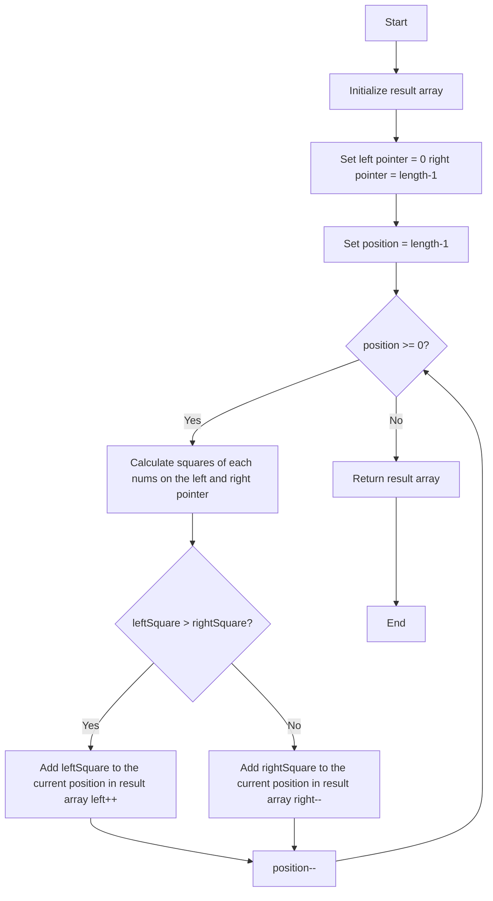

# **Sorted Squares Solution Flowchart**

```mermaid
flowchart TD
    A[Start] --> B[Initialize result array]
    B --> C[Set left pointer = 0 right pointer = length-1]
    C --> D[Set position = length-1]
    D --> E{position >= 0?}
    E -->|Yes| F[Calculate squares of each nums on the left and right pointer]
    F --> G{leftSquare > rightSquare?}
    G -->|Yes| H[Add leftSquare to the current position in result array left++]
    G -->|No| I[Add rightSquare to the current position in result array right--]
    H --> J[position--]
    I --> J
    J --> E
    E -->|No| K[Return result array]
    K --> L[End]
```
