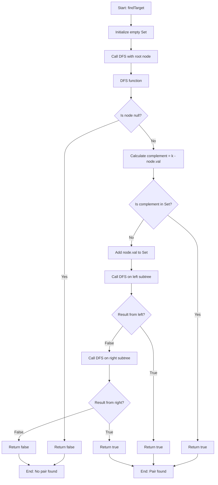

# **Two Sum IV BST - Solution Flowchart**

```mermaid
flowchart TD
    A[Start: findTarget] --> B[Initialize empty Set]
    B --> C[Call DFS with root node]

    C --> D[DFS function]
    D --> E{Is node null?}
    E -->|Yes| F[Return false]
    
    E -->|No| G[Calculate complement = k - node.val]
    G --> H{Is complement in Set?}
    H -->|Yes| I[Return true]
    
    H -->|No| J[Add node.val to Set]
    J --> K[Call DFS on left subtree]
    K --> L{Result from left?}
    L -->|True| M[Return true]
    
    L -->|False| N[Call DFS on right subtree]
    N --> O{Result from right?}
    O -->|True| P[Return true]
    O -->|False| Q[Return false]
    
    F --> R[End: No pair found]
    I --> S[End: Pair found]
    M --> S
    P --> S
    Q --> R
```
