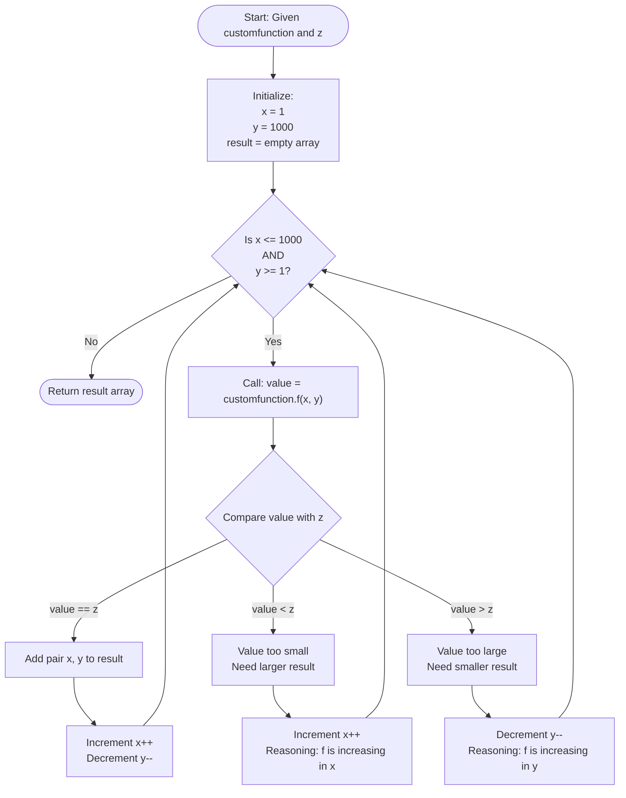

# 1237. Find Positive Integer Solution for a Given Equation Flowchart

```mermaid
flowchart TD
    Start([Start: Given customfunction and z]) --> Init[Initialize:<br/>x = 1<br/>y = 1000<br/>result = empty array]

    Init --> Check{Is x <= 1000<br/>AND<br/>y >= 1?}

    Check -->|No| Return([Return result array])

    Check -->|Yes| CallFunc["Call: value = customfunction.f(x, y)"]

    CallFunc --> Compare{Compare value with z}

    Compare -->|value == z| Found[Add pair x, y to result]
    Found --> MoveBoth[Increment x++<br/>Decrement y--]
    MoveBoth --> Check

    Compare -->|value < z| TooSmall[Value too small<br/>Need larger result]
    TooSmall --> IncX[Increment x++<br/>Reasoning: f is increasing in x]
    IncX --> Check

    Compare -->|value > z| TooLarge[Value too large<br/>Need smaller result]
    TooLarge --> DecY[Decrement y--<br/>Reasoning: f is increasing in y]
    DecY --> Check

    style Start fill:#e1f5e
    style Return fill:#ffe1e
    style Found fill:#fff4e
    style Compare fill:#e1f0f
    style Check fill:#f0e1f

```
