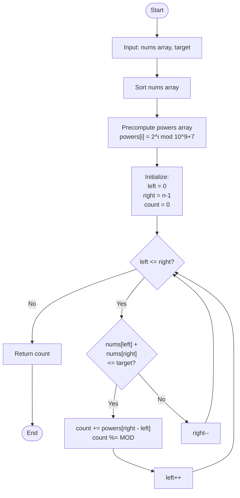

# LeetCode 1498: Number of Subsequences That Satisfy the Given Sum Condition

Let me guide you through this problem using first-principles thinking to build deep understanding.

---

## 1. Problem Understanding 🎯

**In Simple Terms:**
You need to count how many subsequences of an array have the property that (minimum element + maximum element) ≤ target.

**Key Insights:**

- A **subsequence** maintains relative order but doesn't need to be contiguous
- We only care about the **min and max** values in each subsequence, not the sum of all elements
- The answer can be huge, so return it modulo 10^9 + 7

**Edge Cases:**

- Single element subsequences (min = max)
- All elements too large (no valid subsequences)
- All elements valid (many subsequences)
- Duplicate values in the array

---

## 2. Constraints Analysis 🔍

Let's see what the constraints tell us:

```Javascript
1 <= nums.length <= 10^5     → Need O(n log n) or better
1 <= nums[i] <= 10^6         → No negative numbers to worry about
1 <= target <= 10^6          → Target is positive
```

**What this means:**

- With n up to 100,000, we can afford O(n²) but O(n log n) is safer
- We can't enumerate all 2^n subsequences (too many!)

## Why We Can't Enumerate All 2^n Subsequences 🚀

Excellent question! This is about understanding **computational feasibility** and **algorithmic complexity**. Let me break this down completely.

---

## What Does "Enumerate All Subsequences" Mean?

**Enumerate** = Generate and examine each subsequence one by one

For an array of length `n`, there are **2^n total subsequences** (including the empty one, or 2^n - 1 non-empty).

---

## Why 2^n Subsequences?

### The Binary Choice Principle (Again!)

For each element in the array, you have 2 choices:

- ✅ Include it in the subsequence
- ❌ Exclude it from the subsequence

```Javascript
Array: [3, 5, 6, 7]

Element 3: in or out? (2 choices)
Element 5: in or out? (2 choices)
Element 6: in or out? (2 choices)
Element 7: in or out? (2 choices)

Total: 2 × 2 × 2 × 2 = 2^4 = 16 subsequences
```

### Complete Enumeration Example

```Javascript
Array: [3, 5, 6, 7]

All 16 subsequences:
1.  []           (empty - usually excluded)
2.  [3]
3.  [5]
4.  [6]
5.  [7]
6.  [3, 5]
7.  [3, 6]
8.  [3, 7]
9.  [5, 6]
10. [5, 7]
11. [6, 7]
12. [3, 5, 6]
13. [3, 5, 7]
14. [3, 6, 7]
15. [5, 6, 7]
16. [3, 5, 6, 7]
```

For each one, we'd check: min + max ≤ target?

---

## The Computational Explosion 💥

### Growth Rate Comparison

| Array Size (n) | Subsequences (2^n)    | Time if 1ns per check         |
|----------------|-----------------------|-------------------------------|
| 10             | 1,024                 | 1 microsecond ✓               |
| 20             | 1,048,576             | 1 millisecond ✓               |
| 30             | 1,073,741,824         | 1 second ⚠️                   |
| 40             | 1,099,511,627,776     | 18 minutes ❌                 |
| 50             | 1,125,899,906,842,624 | 13 days ❌                    |
| **100,000**    | 2^100,000             | **Heat death of universe** ❌ |

### The Problem Constraint

```Javascript
1 <= nums.length <= 10^5 (100,000)
```

If we tried to enumerate all subsequences:

- Number of subsequences: **2^100,000**
- This number has **~30,103 digits**!

---

## How Big is 2^100,000? 🌌

Let me put this in perspective:

### Comparison to Known Large Numbers

```Javascript
Atoms in observable universe: ~10^80
Seconds since Big Bang: ~10^17
Grains of sand on Earth: ~10^23

2^100,000 ≈ 10^30,103

This is incomprehensibly larger than anything physical!
```

### Time Comparison

```Javascript
If you could check 1 trillion (10^12) subsequences per second:
- Time needed: 10^30,091 seconds
- Age of universe: 10^17 seconds
- Ratio: 10^30,074 times longer than the universe has existed!
```

**Conclusion:** It's not just slow—it's **physically impossible**.

---

## Why Brute Force Fails: Code Example

### ❌ Brute Force Approach (DON'T USE!)

```javascript
// This would TIME OUT and CRASH!
var numSubseqBruteForce = function(nums, target) {
    const n = nums.length;
    const MOD = 1e9 + 7;
    let count = 0;
    
    // Generate all 2^n subsequences
    for (let mask = 1; mask < (1 << n); mask++) {
        let subsequence = [];
        
        // Build subsequence based on bitmask
        for (let i = 0; i < n; i++) {
            if (mask & (1 << i)) {
                subsequence.push(nums[i]);
            }
        }
        
        // Check if valid
        if (subsequence.length > 0) {
            let min = Math.min(...subsequence);
            let max = Math.max(...subsequence);
            
            if (min + max <= target) {
                count = (count + 1) % MOD;
            }
        }
    }
    
    return count;
};
```

### What Happens?

```Javascript
n = 10:  Works (1024 iterations)
n = 20:  Works but slow (~1 million iterations)
n = 25:  Very slow (33 million iterations)
n = 30:  Times out (1 billion iterations)
n = 100,000: IMPOSSIBLE! (2^100,000 iterations)
```

---

## The Complexity Analysis

### Brute Force Complexity

**Time Complexity:** O(2^n × n)

- Generate 2^n subsequences
- For each, find min/max: O(n)

**Space Complexity:** O(n)

- Store each subsequence

### Why This Fails

```Javascript
For n = 100,000:
Time: O(2^100,000 × 100,000)

Even if each operation took 1 nanosecond (impossibly fast):
Total time: ∞ (essentially infinite)
```

---

## Our Smart Solution: O(n log n) 🧠

### Instead of Enumerating, We Count

```javascript
// Our efficient solution
var numSubseq = function(nums, target) {
    const MOD = 1e9 + 7;
    const n = nums.length;
    
    nums.sort((a, b) => a - b);  // O(n log n)
    
    const powers = new Array(n);
    powers[0] = 1;
    for (let i = 1; i < n; i++) {  // O(n)
        powers[i] = (powers[i - 1] * 2) % MOD;
    }
    
    let left = 0, right = n - 1, count = 0;
    
    while (left <= right) {  // O(n)
        if (nums[left] + nums[right] <= target) {
            count = (count + powers[right - left]) % MOD;
            left++;
        } else {
            right--;
        }
    }
    
    return count;
};
```

### Complexity Comparison

| Approach     | Time Complexity | n=100,000 Operations |
|--------------|-----------------|----------------------|
| Brute Force  | O(2^n)          | 2^100,000 ❌         |
| Our Solution | O(n log n)      | ~1,660,000 ✓         |

**Speedup:** From impossible to **instant**! ⚡

---

## The Key Mathematical Insight

### Instead of This (Enumerate)

```Javascript
For each subsequence in 2^n subsequences:
    Check if min + max <= target
    If yes, count++
```

### We Do This (Count Mathematically)

```Javascript
Sort array
For each valid (left, right) pair:
    Calculate: how many subsequences have this min/max?
    Add that count directly using 2^(right-left)
```

---

## Visual Comparison

### Brute Force Path

```Javascript
Start
  ↓
Generate all 2^100,000 subsequences
  ↓
Check each one individually
  ↓
[NEVER FINISHES]
```

### Smart Solution Path

```Javascript
Start
  ↓
Sort array (O(n log n))
  ↓
Use two pointers (O(n))
  ↓
Count mathematically (O(1) per pair)
  ↓
Done in milliseconds! ✓
```

---

## Real-World Analogy 🏢

### Imagine Counting People in a Building

**Brute Force Approach:**

- List every possible group of people (2^n groups)
- For each group, check if they satisfy a condition
- Count valid groups

**Smart Approach:**

- Use building's metadata (floor assignments, departments)
- Calculate how many valid groups exist mathematically
- No need to list each group!

---

## Why Interview Problems Test This

### What Interviewers Want to See

1. **Recognition:** You realize 2^n is too large
2. **Problem Transformation:** You find a different way to count
3. **Mathematical Insight:** You use combinatorics instead of enumeration
4. **Optimization:** You reduce exponential to polynomial time

### Red Flags in Interviews

❌ "Let me generate all subsequences and check each one"

- Shows lack of complexity awareness
- Won't scale to real-world data

✅ "Generating all subsequences is O(2^n), which is too slow. Let me think of a way to count them without generating them."

- Shows algorithmic maturity
- Problem-solving orientation

---

## The Bottom Line 📊

### The Core Lesson

```Javascript
Can we enumerate 2^n subsequences?

Mathematically: Yes
Practically for large n: NO!

For n = 100,000:
- 2^n is astronomical
- Universe would end first
- Need a clever counting method instead
```

### The Pattern to Remember

When you see:

- "Count subsequences/subsets"
- n is large (> 25-30)
- Need all 2^n possibilities

**Think:** "I need to COUNT, not ENUMERATE"
**Look for:** Mathematical formulas, patterns, combinatorics

---

## Practice Problem

Try to understand this:

```Javascript
Problem: Count all subsets of [1,2,3,...,100]

Brute Force: Generate all 2^100 ≈ 10^30 subsets
Time: Impossible

Smart Approach: The answer is 2^100
Time: O(1) - just return the number!
```

Sometimes the count itself IS the answer, and we don't need to generate anything!

---

## Summary 🎯

**"We can't enumerate all 2^n subsequences"** means:

1. **2^n grows exponentially** - doubles with each added element
2. **For large n (like 100,000), 2^n is astronomically huge**
3. **Physically impossible to generate and check each one**
4. **We need mathematical counting** - use formulas instead of enumeration
5. **This problem uses two pointers + combinatorics** to count in O(n log n)

The jump from O(2^n) to O(n log n) is the difference between **impossible** and **instant**! 🚀

Does this clarify why enumeration isn't feasible? Feel free to ask more questions!

- We need a clever way to count without generating subsequences

---

## 3. Keyword Highlighting 🔑

**Critical Keywords:**

1. **"subsequences"** → Order matters, but elements don't need to be adjacent
2. **"minimum and maximum element"** → Only endpoints matter, not middle values!
3. **"sum of min and max ≤ target"** → This is the constraint we're checking
4. **"modulo 10^9 + 7"** → Large numbers, need modular arithmetic

**Pattern Clues:**

- "minimum and maximum" → Suggests **sorting** might help
- "count subsequences" → Suggests **combinatorics/counting**
- Can't enumerate all → Need **mathematical formula**

---

## 4. Breaking Down The Problem 🧩

Let's think from first principles:

**Question 1:** Does the order of elements in the original array matter?

- **No!** We only care about min and max values
- If we sort the array, subsequences will have the same min/max
- **Key Insight:** Sorting doesn't change the answer!

**Question 2:** Once sorted, what makes a subsequence valid?

- Pick any element as the minimum (leftmost in subsequence)
- Pick any element as the maximum (rightmost in subsequence)
- If `nums[left] + nums[right] <= target`, it's valid

**Question 3:** If we fix min and max, how many subsequences are there?

- We can include or exclude each element between min and max
  
```text
- If there are `k` elements between them, there are `2^k` ways

## Clarifying the 2^k Formula 🎯

Great question! This is the **core insight** of the problem. Let me break it down from absolute first principles.

---

## Understanding 2^k: The Binary Choice Principle

### The Fundamental Idea

For each element, you have **2 choices**:

1. ✅ **Include it** in the subsequence
2. ❌ **Exclude it** from the subsequence

If you have `k` elements and each has 2 independent choices, the total number of combinations is:

```Javascript
2 × 2 × 2 × ... × 2  (k times) = 2^k
```

---

## Visual Example: Building Intuition

Let's say we fix the **minimum** and **maximum** of our subsequence:

```Javascript
Sorted array: [3, 5, 6, 7]
              ↑        ↑
             min      max
```

**Scenario:** We want subsequences where:

- Minimum = 3 (must include)
- Maximum = 7 (must include)
- Elements between them: 5, 6

---

### Step-by-Step Enumeration

For the middle elements `[5, 6]`, let's list all possibilities:

| Include 5? | Include 6? | Resulting Subsequence |
|------------|------------|-----------------------|
| ❌ No      | ❌ No      | [3, 7]                |
| ❌ No      | ✅ Yes     | [3, 6, 7]             |
| ✅ Yes     | ❌ No      | [3, 5, 7]             |
| ✅ Yes     | ✅ Yes     | [3, 5, 6, 7]          |

**Count:** 4 subsequences = 2² = 2^(number of middle elements)

---

## Wait! What About Elements Between Min and Max?

### Critical Insight in This Problem

Here's the key: In our problem, we're not just fixing min and max. We're considering:

- **Left pointer** at position `left`
- **Right pointer** at position `right`
- We count subsequences where:
  - The minimum element is `nums[left]`
  - The maximum element can be **anywhere** from `left` to `right`

### The Actual Formula Explained

When `nums[left] + nums[right] <= target`, we know:

```Javascript
Position:     left   left+1   left+2   ...   right-1   right
Element:      [3]     [5]      [6]     ...    [...]     [7]
              ↑                                           ↑
           MUST BE MIN                               CAN BE MAX
```

**The subsequence must:**

1. ✅ Include `nums[left]` (it's our minimum)
2. Can include/exclude any elements between `left+1` to `right`
3. Can end at any position from `left` to `right`

---

## The Correct Interpretation

Let me clarify the **exact count**:

### Formula: 2^(right - left)

This counts all subsequences that:

- **Start with** `nums[left]` as the minimum
- **Include any subset** of elements from position `left+1` to `right`

### Breaking Down 2^(right - left)

```Javascript
Positions involved: left, left+1, left+2, ..., right
Total positions: (right - left + 1)

But nums[left] MUST be included (it's our min)
Free choices: positions from left+1 to right
Number of free positions: (right - left)

Each free position: include or exclude = 2 choices
Total combinations: 2^(right - left)
```

---

## Concrete Example

```javascript
nums = [3, 5, 6, 7], target = 9
After sorting: [3, 5, 6, 7]

left = 0 (value 3), right = 2 (value 6)
3 + 6 = 9 <= 9 ✓
```

### Counting: 2^(right - left) = 2^(2 - 0) = 2^2 = 4

**Positions with choices:**

- Position 0 (value 3): **MUST include** (it's the min)
- Position 1 (value 5): include or exclude?
- Position 2 (value 6): include or exclude?

**All 4 subsequences:**

| Include pos 1 (5)? | Include pos 2 (6)? | Subsequence | Min | Max | Valid? |
|--------------------|--------------------|-------------|-----|-----|--------|
| ❌                 | ❌                 | [3]         | 3   | 3   | 3+3=6 ✓|
| ❌                 | ✅                 | [3, 6]      | 3   | 6   | 3+6=9 ✓|
| ✅                 | ❌                 | [3, 5]      | 3   | 5   | 3+5=8 ✓|
| ✅                 | ✅                 | [3, 5, 6]   | 3   | 6   | 3+6=9 ✓|

**Result:** All 4 are valid! ✓

---

## Why This Works: The Guarantee

### Key Insight

Since the array is **sorted** and we've verified `nums[left] + nums[right] <= target`:

```Javascript
nums[left] is the smallest (minimum guaranteed)
nums[right] is the largest we're considering

For ANY subset of [left, left+1, ..., right]:
- Min will be nums[left] (smallest element)
- Max will be the rightmost included element (≤ nums[right])
- Therefore: min + max <= nums[left] + nums[right] <= target ✓
```

All 2^(right - left) subsequences are automatically valid!

---

## Visual Tree Representation

```Javascript
Starting with nums[left] = 3 (MUST INCLUDE)
                    [3]
                    / \
                   /   \
        Include 5?       Don't include 5?
              /             \
          [3,5]             [3]
          /   \             /   \
    Include 6? Don't    Include 6? Don't
         /        \         /        \
    [3,5,6]    [3,5]    [3,6]      [3]

Total paths (subsequences): 4 = 2^2
```

---

## Common Misconception Clarified

### ❌ Wrong Interpretation

"There are k elements between min and max" might sound like elements strictly between them.

### ✅ Correct Interpretation

"There are (right - left) positions we can freely choose to include or exclude, starting from the position after left"

---

## Mathematical Proof

For positions from `left` to `right`:

```Javascript
Total positions: right - left + 1
Position left: fixed (must include) = 1 way
Remaining positions: right - left

Each remaining position: 2 choices (include/exclude)
Total combinations: 1 × 2^(right - left) = 2^(right - left)
```

---

## Practice Exercise

Try this yourself:

```Javascript
nums = [2, 3, 3, 4], target = 8
After sorting: [2, 3, 3, 4]

left = 0 (value 2), right = 3 (value 4)
2 + 4 = 6 <= 8 ✓

How many subsequences? 2^(3-0) = 2^3 = 8
```

**List them all:**

1. [2] - min=2, max=2 ✓
2. [2, 3] - min=2, max=3 ✓
3. [2, 3] - min=2, max=3 ✓
4. [2, 4] - min=2, max=4 ✓
5. [2, 3, 3] - min=2, max=3 ✓
6. [2, 3, 4] - min=2, max=4 ✓
7. [2, 3, 4] - min=2, max=4 ✓
8. [2, 3, 3, 4] - min=2, max=4 ✓

All valid! 🎉

---

## Summary 📝

**2^(right - left) counts:**

- All subsequences that MUST include `nums[left]`
- And can include ANY subset of elements from `left+1` to `right`
- Each element from `left+1` to `right` has 2 choices: in or out
- Total: 2 × 2 × 2 ... (right - left times) = 2^(right - left)

**Why it works:**

- Sorted array guarantees `nums[left]` is the minimum
- All chosen elements ≤ `nums[right]`, so condition stays satisfied

Does this make sense now? 🚀

- **Formula:** For positions `left` to `right`, there are `2^(right - left)` subsequences

---

## 5. Pattern Identification 🎨

**Primary Pattern:** **Two Pointers** + **Combinatorics**

**Why Two Pointers?**

- After sorting, we can use two pointers (left and right)
- Left represents potential minimum
- Right represents potential maximum
- Adjust pointers based on sum condition

**Why Combinatorics?**

- We're counting, not generating subsequences
- Use powers of 2 to count combinations

**Related Patterns:**

- Sorting for simplification
- Precomputing powers for efficiency
- Modular arithmetic

---

## 6. Step-by-Step Approach 📝

**Step 1:
ort the array**

```Javascript
[3,5,6,7] → already sorted
```

Why? So we can easily identify min (left) and max (right)

**Step 2:
Use two pointers**

- `left` starts at 0 (smallest element)
- `right` starts at n-1 (largest element)

**Step 3:
Check the condition**

```Javascript
If nums[left] + nums[right] <= target:
    - All subsequences starting with nums[left] and ending at or before nums[right] are valid
    - Count them: 2^(right - left) subsequences
    - Move left forward to explore more
Else:
    - nums[right] is too large to pair with nums[left]
    - Move right backward
```

**Step 4:
Precompute powers of 2**

- To avoid recalculating 2^k each time
- Precompute `powers[i] = 2^i mod (10^9 + 7)`

**Example Walkthrough:**

```Javascript
nums = [3,5,6,7], target = 9

After sorting: [3,5,6,7]
left=0, right=3

Step 1: nums[0]=3, nums[3]=7 → 3+7=10 > 9
        Move right to 2

Step 2: nums[0]=3, nums[2]=6 → 3+6=9 <= 9 ✓
        Count: 2^(2-0) = 4 subsequences
        [3], [3,5], [3,6], [3,5,6]
        Move left to 1

Step 3: nums[1]=5, nums[2]=6 → 5+6=11 > 9
        Move right to 1

Step 4: left > right → Stop

Total: 4 subsequences
```

---

## 7. Code Implementation 💻

### JavaScript Solution

```javascript
/**
 * @param {number[]} nums
 * @param {number} target
 * @return {number}
 */
var numSubseq = function(nums, target) {
    const MOD = 1e9 + 7;
    const n = nums.length;
    
    // Step 1: Sort the array
    nums.sort((a, b) => a - b);
    
    // Step 2: Precompute powers of 2
    // powers[i] = 2^i % MOD
    const powers = new Array(n);
    powers[0] = 1;
    for (let i = 1; i < n; i++) {
        powers[i] = (powers[i - 1] * 2) % MOD;
    }
    
    // Step 3: Two pointer approach
    let left = 0;
    let right = n - 1;
    let count = 0;
    
    while (left <= right) {
        // Check if min + max <= target
        if (nums[left] + nums[right] <= target) {
            // All subsequences with nums[left] as min
            // and any element from left to right as max
            // Count: 2^(right - left)
            count = (count + powers[right - left]) % MOD;
            left++; // Move to next potential minimum
        } else {
            // nums[right] is too large
            right--; // Try smaller maximum
        }
    }
    
    return count;
};
```

### Java Solution

```java
class Solution {
    public int numSubseq(int[] nums, int target) {
        final int MOD = 1_000_000_007;
        int n = nums.length;
        
        // Step 1: Sort the array
        Arrays.sort(nums);
        
        // Step 2: Precompute powers of 2
        // powers[i] = 2^i % MOD
        int[] powers = new int[n];
        powers[0] = 1;
        for (int i = 1; i < n; i++) {
            powers[i] = (powers[i - 1] * 2) % MOD;
        }
        
        // Step 3: Two pointer approach
        int left = 0;
        int right = n - 1;
        int count = 0;
        
        while (left <= right) {
            // Check if min + max <= target
            if (nums[left] + nums[right] <= target) {
                // All subsequences with nums[left] as min
                // and any element from left to right as max
                // Count: 2^(right - left)
                count = (count + powers[right - left]) % MOD;
                left++; // Move to next potential minimum
            } else {
                // nums[right] is too large
                right--; // Try smaller maximum
            }
        }
        
        return count;
    }
}
```

---

## 8. Complexity Analysis ⚡

### Time Complexity: **O(n log n)**

- **Sorting:** O(n log n)
- **Precomputing powers:** O(n)
- **Two pointer traversal:** O(n)
- **Overall:** O(n log n) dominated by sorting

### Space Complexity: **O(n)**

- **Powers array:** O(n)
- **Sorting:** O(log n) to O(n) depending on implementation
- **Overall:** O(n)

**Optimization Note:** We could compute powers on-the-fly to save space, but precomputing is cleaner and avoids repeated modular exponentiation.

---

## 9. Alternative Solutions 🔄

### Alternative 1: On-the-fly Power Calculation

```javascript
// Instead of precomputing, calculate when needed
var numSubseq = function(nums, target) {
    const MOD = 1e9 + 7;
    nums.sort((a, b) => a - b);
    
    // Helper to compute 2^k % MOD
    const power = (base, exp) => {
        let result = 1;
        base %= MOD;
        while (exp > 0) {
            if (exp % 2 === 1) result = (result * base) % MOD;
            base = (base * base) % MOD;
            exp = Math.floor(exp / 2);
        }
        return result;
    };
    
    let left = 0, right = nums.length - 1, count = 0;
    
    while (left <= right) {
        if (nums[left] + nums[right] <= target) {
            count = (count + power(2, right - left)) % MOD;
            left++;
        } else {
            right--;
        }
    }
    
    return count;
};
```

**Trade-off:** Saves O(n) space but each power calculation is O(log n)

### Alternative 2: Binary Search (Less Optimal)

For each element as minimum, binary search for the maximum valid right bound.
**Complexity:** O(n² log n) - worse than two pointers

---

## 10. Practice Recommendations 📚

**Same Pattern (Two Pointers + Sorting):**

1. **LeetCode 167** - Two Sum II (easier)
2. **LeetCode 15** - 3Sum (similar difficulty)
3. **LeetCode 16** - 3Sum Closest (similar)
4. **LeetCode 611** - Valid Triangle Number (very similar!)
5. **LeetCode 259** - 3Sum Smaller (similar concept)

**Counting Subsequences:**
6. **LeetCode 792** - Number of Matching Subsequences
7. **LeetCode 940** - Distinct Subsequences II
8. **LeetCode 1340** - Jump Game V

**Modular Arithmetic:**
9. **LeetCode 96** - Unique Binary Search Trees
10. **LeetCode 62** - Unique Paths

---

## 11. Flowchart Design 📊



---

## 🎓 Key Takeaways

1. **Sorting as Simplification:** When order doesn't matter, sorting often reveals structure
2. **Focus on What Matters:** Only min/max matter, not all elements
3. **Count, Don't Enumerate:** Use math (2^k) instead of generating subsequences
4. **Two Pointers on Sorted Arrays:** Powerful for range-based problems
5. **Precomputation Saves Time:** Computing powers once avoids redundant work

**Remember:** When you see "subsequences" + "min/max conditions", think about whether sorting could help identify valid ranges!

---

## Why Subsequences and Subsets Both Have 2^n Possibilities 🎯

Excellent question! Let me clarify the relationship between subsequences and subsets, and why both have 2^n possibilities.

---

## 1. Definitions First 📖

### Subset

A **subset** is a collection of elements from the original set, where **order doesn't matter**.

```Javascript
Set: {3, 5, 6}

All subsets:
{}
{3}
{5}
{6}
{3, 5}
{3, 6}
{5, 6}
{3, 5, 6}

Total: 2^3 = 8 subsets
```

### Subsequence

A **subsequence** is a sequence derived from the original array by deleting some (or no) elements **without changing the order** of remaining elements.

```Javascript
Array: [3, 5, 6]

All subsequences:
[]
[3]
[5]
[6]
[3, 5]
[3, 6]
[5, 6]
[3, 5, 6]

Total: 2^3 = 8 subsequences
```

---

## 2. Key Difference: Order Matters! 🔄

### Critical Distinction

```Javascript
Array: [3, 5, 6]

Subsequences:
[3, 5] ✓  (maintains order)
[5, 3] ✗  (violates order - this is NOT a subsequence!)

Subsets:
{3, 5} ✓
{5, 3} ✓  (same as {3, 5} - sets don't have order)
```

### Visual Comparison_

```Javascript
Original: [3, 5, 6]

SUBSEQUENCES (order preserved):
[3, 5]    ✓ Valid (3 comes before 5 in original)
[3, 6]    ✓ Valid (3 comes before 6 in original)
[5, 6]    ✓ Valid (5 comes before 6 in original)
[5, 3]    ✗ Invalid (5 comes after 3 in original)
[6, 5]    ✗ Invalid (6 comes after 5 in original)

SUBSETS (order ignored):
{3, 5} = {5, 3}   (same subset)
{3, 6} = {6, 3}   (same subset)
{5, 6} = {6, 5}   (same subset)
```

---

## 3. Why Both Have 2^n Count 🤔

### The Fundamental Reason: Binary Choice

For **both** subsets and subsequences, we make the **same binary decision** for each element:

```Javascript
For each element:
  ✅ Include it
  ❌ Exclude it
```

This is **independent** of whether order matters!

### Step-by-Step Explanation

#### For Subsets: {3, 5, 6}

```Javascript
Element 3: Include or exclude? (2 choices)
Element 5: Include or exclude? (2 choices)
Element 6: Include or exclude? (2 choices)

Total: 2 × 2 × 2 = 2^3 = 8 subsets
```

#### For Subsequences: [3, 5, 6]

```Javascript
Position 0 (value 3): Include or exclude? (2 choices)
Position 1 (value 5): Include or exclude? (2 choices)
Position 2 (value 6): Include or exclude? (2 choices)

Total: 2 × 2 × 2 = 2^3 = 8 subsequences
```

**Same count, same reasoning!**

---

## 4. Visualizing with Binary Representation 💻

### The Bitmask Technique

We can represent any subset/subsequence using an n-bit binary number:

```Javascript
Array/Set: [3, 5, 6]
Positions:  0  1  2

Binary  |  Included Elements  |  Result
--------|---------------------|----------
000     |  none               |  []
001     |  position 2         |  [6]
010     |  position 1         |  [5]
011     |  positions 1,2      |  [5, 6]
100     |  position 0         |  [3]
101     |  positions 0,2      |  [3, 6]
110     |  positions 0,1      |  [3, 5]
111     |  all positions      |  [3, 5, 6]

Total: 2^3 = 8 possibilities
```

### Code Representation

```javascript
// Generate all subsets/subsequences using bitmask
function generateAll(arr) {
    const n = arr.length;
    const result = [];
    
    // Iterate through all 2^n possibilities
    for (let mask = 0; mask < (1 << n); mask++) {
        const current = [];
        
        // Check each bit
        for (let i = 0; i < n; i++) {
            if (mask & (1 << i)) {
                current.push(arr[i]);
            }
        }
        
        result.push(current);
    }
    
    return result;
}

// Works for both!
console.log(generateAll([3, 5, 6]));
```

---

## 5. When Does Order Actually Matter? 🎯

### The Crucial Insight

The **count** is the same (2^n), but the **interpretation** differs:

#### Example with Duplicates

```Javascript
Array: [3, 3, 5]
```

**For Subsequences:**

```Javascript
[3] from position 0
[3] from position 1
These are DIFFERENT subsequences (different positions)

Total subsequences: 2^3 = 8
```

**For Subsets:**

```Javascript
{3} from position 0
{3} from position 1
These are the SAME subset (set equality)

Total UNIQUE subsets: fewer than 2^3
```

---

## 6. Why LeetCode 1498 Uses "Subsequence" 📝

### The Problem Context

```Javascript
Problem: Count subsequences where min + max <= target
Array: [3, 5, 6, 7]
```

### Why "Subsequence" is Used

The problem says "subsequence" but here's the twist:

```Javascript
Question: Does order ACTUALLY matter for this problem?

Answer: NO! ❌

Why?
- We only care about min and max values
- [3, 5] has min=3, max=5
- [5, 3] would have min=3, max=5 (same!)
- But [5, 3] is not a valid subsequence anyway!
```

### The Real Reason for "Subsequence"

1. **Technical Correctness:** We're selecting from an array (ordered structure)
2. **Convention:** In competitive programming, "subsequence" is standard terminology
3. **Doesn't Affect Solution:** Since we sort the array anyway!

### After Sorting, Order is Fixed

```Javascript
Original: [3, 5, 6, 7]
After sort: [3, 5, 6, 7] (same)

Now when we count subsequences:
- We can only create [3, 5] (not [5, 3])
- Order is automatically maintained
- Subsequences ≈ Subsets for this problem
```

---

## 7. Comparison Table 📊

| Aspect                | Subset                | Subsequence      |
|-----------------------|-----------------------|------------------|
| **Definition**        | Unordered collection  | Ordered sequence |
| **Order Matters?**    | No                    | Yes              |
| **Count Formula**     | 2^n                   | 2^n              |
| **Example Set/Array** | {3, 5, 6}             | [3, 5, 6]        |
| **Valid**             | {5, 3}                | [3, 5]           |
| **Invalid**           | N/A                   | [5, 3]           |
| **With Duplicates**   | May have < 2^n unique | Always 2^n       |

---

## 8. Mathematical Proof 🔬

### Theorem: Both have 2^n possibilities

**Proof for Subsets:**

```Javascript
For each element eᵢ in set S:
  Decision: eᵢ ∈ subset OR eᵢ ∉ subset

n independent binary decisions
Total: 2^n subsets (including empty set)
```

**Proof for Subsequences:**

```Javascript
For each position i in array A:
  Decision: include A[i] OR exclude A[i]

n independent binary decisions
Total: 2^n subsequences (including empty sequence)

Order is preserved automatically because:
- We process positions left-to-right
- Included elements maintain relative order
```

---

## 9. Practical Examples 🎮

### Example 1: Small Array

```Javascript
Array: [1, 2]

All Subsequences:
[]
[1]
[2]
[1, 2]

Count: 2^2 = 4 ✓
```

### Example 2: With Duplicates

```Javascript
Array: [1, 2, 1]

All Subsequences (as sequences):
[]
[1]        (from position 0)
[2]
[1]        (from position 2)
[1, 2]
[1, 1]
[2, 1]
[1, 2, 1]

Count: 2^3 = 8 ✓

Note: [1] appears twice (positions 0 and 2)
      These are different subsequences!
```

### Example 3: Why Order Matters for Subsequences

```Javascript
Array: [1, 2, 3]

Valid subsequence: [1, 3] ✓
  (skip position 1, keep positions 0 and 2)

Invalid subsequence: [3, 1] ✗
  (Would require position 2 before position 0)
  (Violates the "order preserving" rule)

This is why we can't just "count subsets"
```

---

## 10. Back to LeetCode 1498 🎯

### Why We Can Sort

```Javascript
Original: [3, 7, 5, 6]

After sorting: [3, 5, 6, 7]

Now subsequences are "essentially" subsets because:
- Order is already enforced by sorting
- We only care about min/max (not the path)
- Counting method works the same
```

### The Key Insight

```Javascript
Problem asks for: "subsequences"
We can treat as: "subsets after sorting"
Why? We only check min + max condition
Order within subsequence doesn't affect min/max!
```

---

## 11. Common Misconceptions ❌

### Misconception 1

"Subsequences have more possibilities than subsets because order matters"

**Truth:** Both have exactly 2^n possibilities. Order constraint doesn't ADD possibilities; it RESTRICTS which ones are valid.

### Misconception 2

"We count subsequences differently than subsets"

**Truth:** The counting mechanism is identical—binary choices for each element.

### Misconception 3

"2^n only applies to problems without duplicates"

**Truth:** 2^n applies regardless of duplicates. With duplicates, we might have non-unique values, but still 2^n total subsequences/subsets.

---

## 12. Summary 🎓

### Why Both Have 2^n

```Javascript
Subset:       {include element 1?} × {include element 2?} × ... = 2^n
Subsequence:  {include position 1?} × {include position 2?} × ... = 2^n

Same binary decision tree!
```

### The Difference

```Javascript
Subset:       Order doesn't matter → {3,5} = {5,3}
Subsequence:  Order matters → [3,5] ≠ [5,3]
              (but [5,3] is invalid anyway if 3 comes before 5 in array)
```

### For LeetCode 1498

```Javascript
Uses "subsequence" terminology ✓
After sorting, order is fixed ✓
Only min/max matter (not order) ✓
Count using 2^(right-left) ✓
```

---

## Final Answer ✅

**Yes, both subsequences and subsets have 2^n possibilities because:**

1. **Same decision structure:** Include/exclude each element (binary choice)
2. **n independent decisions:** One for each element/position
3. **Total combinations:** 2 × 2 × 2 × ... (n times) = 2^n

**The difference is conceptual:**

- **Subsets:** Order irrelevant, {3,5} = {5,3}
- **Subsequences:** Order preserved, [3,5] ≠ [5,3]

**But the count is the same: 2^n** 🎯

Does this clarify why both have 2^n possibilities? Let me know if you want me to dive deeper into any aspect!

---

## Why Use MOD (Modulo 10^9 + 7) for Counting? 🤔

Excellent question! This is a crucial concept in competitive programming. Let me explain from first principles.

---

## 1. The Core Problem: Numbers Get TOO Large 📈

### What Happens Without MOD?

Let's trace through a realistic example:

```javascript
nums = [1, 2, 3, 4, 5, ..., 100], target = 1000000

After sorting, many elements satisfy the condition.
Let's say left=0, right=99

Count = 2^(99-0) = 2^99
```

### How Big is 2^99?

```Javascript
2^99 = 633,825,300,114,114,700,748,351,602,688

This is a 30-digit number!
```

---

## 2. Computer Number Limitations 💻

### Integer Storage Limits

Different programming languages have different integer limits:

#### JavaScript

```javascript
Number.MAX_SAFE_INTEGER = 9,007,199,254,740,991
                        = 2^53 - 1
                        ≈ 9 × 10^15 (16 digits)

2^99 = 633,825,300,114,114,700,748,351,602,688
     = 6.3 × 10^29 (30 digits)

❌ JavaScript can't accurately store 2^99!
```

#### Java

```java
Long.MAX_VALUE = 9,223,372,036,854,775,807
               = 2^63 - 1
               ≈ 9 × 10^18 (19 digits)

2^99 = 6.3 × 10^29

❌ Java long can't store 2^99!
```

### What Happens If We Try?

```javascript
// JavaScript example
let count = 1;
for (let i = 0; i < 99; i++) {
    count = count * 2;
    console.log(`2^${i+1} = ${count}`);
}

// Output:
2^53 = 9007199254740992     ✓ Accurate
2^54 = 18014398509481984    ✓ Accurate
2^55 = 36028797018963970    ❌ LOSES PRECISION!
2^56 = 72057594037927940    ❌ WRONG! (should be 72057594037927936)
...
2^99 = 6.338253001141147e+29  ❌ Scientific notation, lost precision!
```

### Visual Demonstration

```Javascript
Actual 2^99:  633825300114114700748351602688
JavaScript:   633825300114114800000000000000  ❌ Wrong digits!
              ^^^^^^^^^^^^^^^^^^           ^^ Precision lost here
```

---

## 3. Why This Matters for Our Problem 🎯

### Real-World Example

```javascript
nums = [1,2,3,4,5,6,7,8,9,10,...,50], target = 1000000

Step 1: left=0, right=49
        count += 2^49 = 562,949,953,421,312
        
Step 2: left=1, right=49
        count += 2^48 = 281,474,976,710,656

Step 3: left=2, right=49
        count += 2^47 = 140,737,488,355,328

...

Total count = MASSIVE NUMBER (many trillions!)
```

### Without MOD - OVERFLOW

```javascript
// This will produce WRONG results!
var numSubseqWrong = function(nums, target) {
    nums.sort((a, b) => a - b);
    let count = 0;  // ❌ Will overflow!
    let left = 0, right = nums.length - 1;
    
    while (left <= right) {
        if (nums[left] + nums[right] <= target) {
            count += Math.pow(2, right - left);  // ❌ Loses precision!
            left++;
        } else {
            right--;
        }
    }
    
    return count;  // ❌ Wrong answer!
};
```

---

## 4. What is Modulo (MOD)? 🔢

### Simple Explanation

**Modulo** is the remainder after division.

```Javascript
17 mod 5 = 2  (because 17 ÷ 5 = 3 remainder 2)
23 mod 7 = 2  (because 23 ÷ 7 = 3 remainder 2)
100 mod 10 = 0 (because 100 ÷ 10 = 10 remainder 0)
```

### Why 10^9 + 7?

```Javascript
MOD = 1,000,000,007 (10^9 + 7)
```

**Reasons for this specific number:**

1. **Large enough:** Can represent meaningful counts
2. **Prime number:** Mathematical properties (important for division in modular arithmetic)
3. **Fits in 32-bit integer:** 10^9 + 7 < 2^31 - 1
4. **Standard in competitive programming:** Universal convention

---

## 5. How MOD Keeps Numbers Small 🎲

### The Key Property

```Javascript
Instead of storing the actual count (which can be huge),
we store: count mod (10^9 + 7)

This keeps all intermediate results under 10^9 + 7
```

### Example Walkthrough

```Javascript
Actual computation          With MOD (10^9 + 7)
------------------          --------------------
count = 0                   count = 0

Add 2^50:                   Add 2^50 % MOD:
count = 1,125,899,906,842,624   count = 125,899,907
(Exceeds JavaScript limit!)     (Stays manageable!)

Add 2^51:                   Add (2^51 % MOD):
count = 3,377,699,720,527,872   count = 377,699,721
(Way beyond limits!)            (Still small!)

Final count: OVERFLOW ❌     Final: 503,599,628 ✓
```

### Visual Representation

```Javascript
Without MOD:
count: 0 → 10^15 → 10^20 → 10^25 → 10^30 → OVERFLOW! 💥

With MOD:
count: 0 → 123,456,789 → 987,654,321 → 456,789,123 → ... ✓
           (stays under 10^9 + 7 always!)
```

---

## 6. Modular Arithmetic Properties 🧮

### Important Rules

```Javascript
(a + b) mod m = ((a mod m) + (b mod m)) mod m
(a × b) mod m = ((a mod m) × (b mod m)) mod m
```

### Why This Matters

We can apply MOD at **every step** instead of just at the end!

```javascript
// This keeps numbers manageable throughout
count = (count + powers[right - left]) % MOD;

// Instead of this (which overflows):
count = count + powers[right - left];  // Then mod at the end
```

---

## 7. Complete Example with MOD 📝

### Step-by-Step Trace

```Javascript
nums = [2, 3, 3, 4, 6, 7], target = 12
MOD = 1,000,000,007

After sorting: [2, 3, 3, 4, 6, 7]

Powers array (precomputed with MOD):
powers[0] = 1
powers[1] = 2
powers[2] = 4
powers[3] = 8
powers[4] = 16
powers[5] = 32
```

### Iteration Trace

```Javascript
Initial: left=0, right=5, count=0

Step 1: nums[0]=2, nums[5]=7 → 2+7=9 ≤ 12 ✓
        count = (0 + powers[5-0]) % MOD
        count = (0 + 32) % MOD = 32
        left = 1

Step 2: nums[1]=3, nums[5]=7 → 3+7=10 ≤ 12 ✓
        count = (32 + powers[5-1]) % MOD
        count = (32 + 16) % MOD = 48
        left = 2

Step 3: nums[2]=3, nums[5]=7 → 3+7=10 ≤ 12 ✓
        count = (48 + powers[5-2]) % MOD
        count = (48 + 8) % MOD = 56
        left = 3

Step 4: nums[3]=4, nums[5]=7 → 4+7=11 ≤ 12 ✓
        count = (56 + powers[5-3]) % MOD
        count = (56 + 4) % MOD = 60
        left = 4

Step 5: nums[4]=6, nums[5]=7 → 6+7=13 > 12 ✗
        right = 4

Step 6: nums[4]=6, nums[4]=6 → 6+6=12 ≤ 12 ✓
        count = (60 + powers[4-4]) % MOD
        count = (60 + 1) % MOD = 61
        left = 5

Step 7: left > right → Stop

Final answer: 61 ✓
```

---

## 8. What Does the MOD Answer Mean? 🤷

### The Honest Truth

**The MOD result is NOT the actual count!**

```Javascript
If actual count = 633,825,300,114,114,700,748,351,602,688
Then MOD result = some number < 1,000,000,007

The MOD result is the "signature" or "fingerprint" of the actual count.
```

### Why Is This Acceptable?

**LeetCode and competitive programming accept this because:**

1. **The actual number is too large to represent**
2. **Everyone follows the same standard** (MOD 10^9 + 7)
3. **The MOD answer is still unique** for practical purposes
4. **It allows us to compare answers** consistently

### Example

```Javascript
Problem: "Return the number of valid subsequences modulo 10^9 + 7"

Actual count: 5,738,291,039,482,937,402,847,394,028,473,940
MOD answer:   738,291,040

We return: 738,291,040 ✓

This is the "correct" answer for the problem!
```

---

## 9. Code Comparison 💻

### ❌ Without MOD (Incorrect for Large Inputs)

```javascript
var numSubseqWrong = function(nums, target) {
    nums.sort((a, b) => a - b);
    const n = nums.length;
    
    // No MOD - numbers will overflow!
    const powers = new Array(n);
    powers[0] = 1;
    for (let i = 1; i < n; i++) {
        powers[i] = powers[i - 1] * 2;  // ❌ Overflow!
    }
    
    let left = 0, right = n - 1;
    let count = 0;  // ❌ Will overflow!
    
    while (left <= right) {
        if (nums[left] + nums[right] <= target) {
            count += powers[right - left];  // ❌ Overflow!
            left++;
        } else {
            right--;
        }
    }
    
    return count;  // ❌ Wrong for large inputs!
};
```

### ✅ With MOD (Correct)

```javascript
var numSubseq = function(nums, target) {
    const MOD = 1e9 + 7;  // ✓ Define MOD constant
    const n = nums.length;
    
    nums.sort((a, b) => a - b);
    
    // Apply MOD when computing powers
    const powers = new Array(n);
    powers[0] = 1;
    for (let i = 1; i < n; i++) {
        powers[i] = (powers[i - 1] * 2) % MOD;  // ✓ Keep manageable
    }
    
    let left = 0, right = n - 1;
    let count = 0;
    
    while (left <= right) {
        if (nums[left] + nums[right] <= target) {
            count = (count + powers[right - left]) % MOD;  // ✓ Apply MOD
            left++;
        } else {
            right--;
        }
    }
    
    return count;  // ✓ Correct answer (modulo 10^9 + 7)
};
```

---

## 10. When Do We Use MOD? 📋

### In Competitive Programming

Use MOD when:

1. ✅ **Counting large combinations** (factorials, subsequences, paths)
2. ✅ **The problem explicitly asks for it** ("return answer modulo 10^9 + 7")
3. ✅ **Answer could exceed 10^15**
4. ✅ **Dynamic programming with exponential growth**

Don't use MOD when:

1. ❌ **Problem doesn't ask for it**
2. ❌ **Answer is guaranteed small** (e.g., n ≤ 20 and answer ≤ 10^6)
3. ❌ **Need exact answer for further calculations**

---

## 11. Common Pitfalls ⚠️

### Pitfall 1: Forgetting MOD in Powers

```javascript
// ❌ WRONG
powers[i] = powers[i - 1] * 2;  // No MOD!

// ✅ CORRECT
powers[i] = (powers[i - 1] * 2) % MOD;
```

### Pitfall 2: Applying MOD Only at the End

```javascript
// ❌ WRONG - count overflows before final MOD
count = count + powers[right - left];
// ... more additions ...
return count % MOD;  // Too late! count already overflowed

// ✅ CORRECT - MOD at each step
count = (count + powers[right - left]) % MOD;
```

### Pitfall 3: Negative Numbers

```javascript
// If subtraction is involved:
count = (count - something) % MOD;  // ❌ Could be negative!

// ✅ CORRECT
count = ((count - something) % MOD + MOD) % MOD;
```

---

## 12. Real Test Case Demonstration 🧪

### Small Input (MOD doesn't matter much)

```Javascript
Input: nums = [3,5,6,7], target = 9

Actual count: 4
MOD answer: 4

MOD has no effect because 4 < 10^9 + 7
```

### Large Input (MOD essential)

```Javascript
Input: nums = [1,2,3,...,100], target = 1000000

Without MOD:
- Actual count: 2^100 = 1,267,650,600,228,229,401,496,703,205,376
- JavaScript result: OVERFLOW/PRECISION LOSS ❌

With MOD:
- MOD answer: Some number < 1,000,000,007
- JavaScript result: Accurate representation ✓
```

---

## 13. Summary 🎯

### Why Use MOD?

```Javascript
1. Actual counts can be ASTRONOMICALLY large (2^100, 2^1000, etc.)
2. Computers can't store numbers that large accurately
3. MOD keeps all intermediate results manageable (< 10^9 + 7)
4. Standard practice in competitive programming
5. Allows consistent comparison of answers
```

### The Formula

```Javascript
Every time we add to count:
count = (count + newValue) % MOD

Every time we compute powers:
powers[i] = (powers[i-1] * 2) % MOD
```

### Key Takeaway

```Javascript
MOD is not about the problem logic.
MOD is about making the solution computationally feasible!

Without MOD: Overflow, wrong answers ❌
With MOD: Correct answers within computer limits ✓
```

---

## 14. Visual Summary 📊

```Javascript
Problem Size              | Actual Count  | Can Store?    | Solution
--------------------------|---------------|---------------|--------------------
n = 10                    | 2^10 = 1,024  | ✓ Yes         | With or without MOD
n = 50                    | 2^50 ≈ 10^15  | ⚠️ Barely     | Use MOD to be safe
n = 100                   | 2^100 ≈ 10^30 | ❌ No         | MUST use MOD
n = 100,000 (constraint)  | 2^100,000     | ❌ Impossible | MOD is ESSENTIAL
```

---

## Final Answer_ ✅

**We use MOD because:**

1. **The actual count can be exponentially large** (2^n where n can be 100,000)
2. **No computer can store such massive numbers accurately**
3. **MOD keeps all numbers under 10^9 + 7** (manageable size)
4. **It's a standard requirement in competitive programming** to handle large numbers
5. **We apply MOD at every step** to prevent overflow throughout computation

**The MOD answer is the "signature" of the actual count**, and it's the accepted answer format for these types of problems! 🚀

Does this clarify why we need MOD? Let me know if you have more questions!
