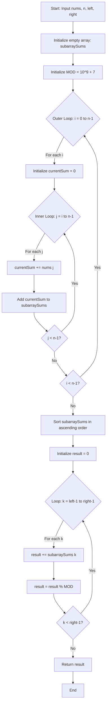

# 🎯 LeetCode 11508: Range Sum of Sorted Subarray Sums - Complete Tutorial

## 1. 📖 Problem Understanding (In Simple Terms)

**The Core Idea:**
Imagine you have an array of numbers. Your task is to:

1. **Generate all possible continuous chunks** (subarrays) from this array
2. **Calculate the sum** of each chunk
3. **Sort all these sums** from smallest to largest
4. **Pick a range** (from position `left` to position `right`) in this sorted list
5. **Add up** the numbers in that range

**Example Walkthrough:**

```Javascript
nums = [1, 2, 3, 4]

Step 1: Generate all subarrays and their sums
[1] → 1
[1,2] → 3
[1,2,3] → 6
[1,2,3,4] → 10
[2] → 2
[2,3] → 5
[2,3,4] → 9
[3] → 3
[3,4] → 7
[4] → 4

Step 2: Sort these sums
[1, 2, 3, 3, 4, 5, 6, 7, 9, 10]

Step 3: If left=1, right=5, pick indices 1-5 (1-indexed)
[1, 2, 3, 3, 4]

Step 4: Sum them
1 + 2 + 3 + 3 + 4 = 13
```

**Edge Cases to Consider:**

- Single element array
- All elements are the same
- `left` and `right` pointing to the same index
- Maximum constraints (n=1000 could generate 500,500 subarrays)

---

## 2. 🔬 Technical Explanation

**Formal Problem Definition:**

Given:

- An array `nums` of length `n` with positive integers
- Two indices `left` and `right` (1-indexed)

Compute:

1. Set S = {sum(nums[i...j]) | 0 ≤ i ≤ j < n}
2. Sort S in non-decreasing order → S_sorted
3. Return (∑ S_sorted[k] for k ∈ [left-1, right-1]) mod (10^9 + 7)

**Mathematical Properties:**

- Total subarrays: **n(n+1)/2** (combination formula for continuous subsequences)
- Each subarray sum can be computed using prefix sums in O(1)
- The problem combines **enumeration**, **sorting**, and **range sum** operations

---

## 3. 📊 Constraints Analysis

Let's decode what the constraints tell us:

```Javascript
n == nums.length
1 <= n <= 1000              → Small enough for O(n²) generation
1 <= nums[i] <= 100         → All positive, max sum = 100,000
1 <= left <= right <= n(n+1)/2  → Valid range in sorted array
```

**What This Means:**

| Constraint      | Implication                                      |
|-----------------|--------------------------------------------------|
| `n ≤ 1000`      | We can afford O(n² log n) or even O(n²) space    |
| `nums[i] ≤ 100` | Sums won't overflow in most languages            |
| All positive    | No need to handle negative sums or special cases |
| `n(n+1)/2`      | Maximum 500,500 subarray sums to sort            |

**Time Complexity Budget:**

- n=1000 → n² = 1,000,000 operations (feasible)
- n² log n ≈ 10,000,000 operations (still acceptable)

This tells us: **Brute force approach is viable!**

---

## 4. 🔑 Keyword Highlighting

**Critical Keywords:**

1. **"All non-empty continuous subarrays"** → Need to generate every possible subarray
2. **"Sorted in non-decreasing order"** → Must sort the sums
3. **"Sum of the numbers from index left to right"** → Range sum query
4. **"Modulo 10^9 + 7"** → Handle large numbers, prevent overflow
5. **"1-indexed"** → Be careful with index conversion (common bug!)

**Pattern Recognition Triggers:**

- "Subarray" → Think sliding window or prefix sums
- "Sorted" → Binary search, heap, or direct sorting
- "Range sum" → Prefix sums or accumulation
- "Modulo" → Large numbers, iterative addition with mod

---

## 5. 🧩 Break Down The Problem Into Manageable Parts

**Part 1:
Generate All Subarray Sums**

```Javascript
For each starting position i (0 to n-1):
    For each ending position j (i to n-1):
        Calculate sum from i to j
        Store this sum
```

**Part 2:
Sort the Sums**

```Javascript
Sort the collected sums in ascending order
```

**Part 3:
Calculate Range Sum**

```Javascript
Sum elements from index (left-1) to (right-1) in 0-indexed array
Apply modulo to prevent overflow
```

**Part 4:
Return Result**

```Javascript
Return the final sum modulo 10^9 + 7
```

---

## 6. 🎯 Pattern Identification

**Primary Patterns:**

1. **Subarray Enumeration Pattern**
   - Nested loops to generate all subarrays
   - Time: O(n²) to generate

2. **Sorting Pattern**
   - Sort all generated sums
   - Time: O(n² log n)

3. **Prefix Sum Optimization** (Optional)
   - Can compute subarray sums efficiently
   - Avoids recomputation

**This Problem Combines:**

- ✅ Array manipulation
- ✅ Sorting
- ✅ Mathematical computation with modulo
- ✅ Range queries

**Similar Patterns Seen In:**

- Subarray sum problems
- Kth smallest/largest element problems
- Range query problems

---

## 7. 📝 Approach Discussion

### **Approach 1: Brute Force (Recommended for this problem)**

**Step-by-Step Logic:**

1. **Initialize storage**
   - Create an array/list to store all subarray sums

2. **Generate all subarray sums (Double Loop)**

   ```Javascript
   for i from 0 to n-1:
       currentSum = 0
       for j from i to n-1:
           currentSum += nums[j]  // Cumulative sum optimization
           add currentSum to storage
   ```

3. **Sort the array of sums**

   ```Javascript
   sort(storage)
   ```

4. **Calculate range sum with modulo**

   ```Javascript
   result = 0
   for k from (left-1) to (right-1):
       result = (result + storage[k]) % MOD
   return result
   ```

**Why This Works:**

- We ensure all subarrays are covered (i to j where i ≤ j)
- Sorting gives us the correct order
- 1-indexed to 0-indexed conversion: just subtract 1
- Modulo prevents overflow and gives correct answer

**Optimization in Generation:**
Instead of recalculating sum each time, we use cumulative addition:

```Javascript
sum[i...j] = sum[i...j-1] + nums[j]
```

---

## 8. 💻 Code Implementation

### **JavaScript Solution**

```javascript
/**
 * @param {number[]} nums
 * @param {number} n
 * @param {number} left
 * @param {number} right
 * @return {number}
 */
var rangeSum = function(nums, n, left, right) {
    const MOD = 1e9 + 7;  // Modulo constant
    const subarraySums = [];  // Store all subarray sums
    
    // Step 1: Generate all subarray sums
    // Outer loop: starting position
    for (let i = 0; i < n; i++) {
        let currentSum = 0;  // Cumulative sum for optimization
        
        // Inner loop: ending position
        for (let j = i; j < n; j++) {
            currentSum += nums[j];  // Add current element
            subarraySums.push(currentSum);  // Store the sum
        }
    }
    
    // Step 2: Sort all sums in ascending order
    subarraySums.sort((a, b) => a - b);
    
    // Step 3: Calculate sum from left to right (convert to 0-indexed)
    let result = 0;
    for (let k = left - 1; k < right; k++) {  // left-1 to right-1 inclusive
        result = (result + subarraySums[k]) % MOD;
    }
    
    // Step 4: Return final result
    return result;
};

// Test cases
console.log(rangeSum([1,2,3,4], 4, 1, 5));  // Output: 13
console.log(rangeSum([1,2,3,4], 4, 3, 4));  // Output: 6
console.log(rangeSum([1,2,3,4], 4, 1, 10)); // Output: 50
```

### **Java Solution**

```java
import java.util.*;

class Solution {
    /**
     * Calculate range sum of sorted subarray sums
     * @param nums - input array
     * @param n - length of array
     * @param left - left index (1-indexed)
     * @param right - right index (1-indexed)
     * @return sum modulo 10^9 + 7
     */
    public int rangeSum(int[] nums, int n, int left, int right) {
        final int MOD = 1_000_000_007;  // Modulo constant
        List<Integer> subarraySums = new ArrayList<>();  // Dynamic list for sums
        
        // Step 1: Generate all subarray sums
        // Outer loop: starting position (0 to n-1)
        for (int i = 0; i < n; i++) {
            int currentSum = 0;  // Cumulative sum for current starting position
            
            // Inner loop: ending position (i to n-1)
            for (int j = i; j < n; j++) {
                currentSum += nums[j];  // Extend subarray by one element
                subarraySums.add(currentSum);  // Store this subarray sum
            }
        }
        
        // Step 2: Sort all subarray sums in ascending order
        Collections.sort(subarraySums);
        
        // Step 3: Calculate range sum (convert to 0-indexed)
        long result = 0;  // Use long to prevent overflow during addition
        for (int k = left - 1; k < right; k++) {  // left-1 to right-1 inclusive
            result = (result + subarraySums.get(k)) % MOD;
        }
        
        // Step 4: Return result as int (safe after modulo)
        return (int) result;
    }
    
    // Test method
    public static void main(String[] args) {
        Solution sol = new Solution();
        System.out.println(sol.rangeSum(new int[]{1,2,3,4}, 4, 1, 5));  // 13
        System.out.println(sol.rangeSum(new int[]{1,2,3,4}, 4, 3, 4));  // 6
        System.out.println(sol.rangeSum(new int[]{1,2,3,4}, 4, 1, 10)); // 50
    }
}
```

---

## 9. ⚡ Complexity Analysis

### **Time Complexity: O(n² log n)**

**Breakdown:**

1. **Generating subarrays:** O(n²)
   - Outer loop: n iterations
   - Inner loop: average n/2 iterations
   - Total: n × n/2 ≈ n²/2 operations

2. **Sorting:** O(n² log n)
   - We have n(n+1)/2 elements ≈ n²/2 elements
   - Sorting complexity: O(k log k) where k = n²/2
   - Result: O(n² log n)

3. **Range sum calculation:** O(right - left) ≤ O(n²)

**Dominant term:** O(n² log n) from sorting

### **Space Complexity: O(n²)**

**Breakdown:**

1. **Storage for sums:** O(n²)
   - We store n(n+1)/2 subarray sums
   - This is approximately n²/2 elements

2. **Sorting space:** O(log n) to O(n) depending on sort algorithm

**Total:** O(n²) for storing all subarray sums

### **Practical Performance:**

| n    | Subarrays | Operations (approx) |
|------|-----------|---------------------|
| 10   | 55        | 550                 |
| 100  | 5,050     | 82,000              |
| 1000 | 500,500   | 9,000,000           |

For n=1000 (max constraint), this runs comfortably within time limits.

---

## 10. 🔄 Alternative Solutions

### **Approach 2: Priority Queue (Min-Heap) - More Space Efficient**

For finding only k smallest elements without sorting all:

```javascript
var rangeSumOptimized = function(nums, n, left, right) {
    const MOD = 1e9 + 7;
    // Use min-heap to get smallest 'right' elements efficiently
    const minHeap = new MinPriorityQueue();
    
    // Generate sums and add to heap
    for (let i = 0; i < n; i++) {
        let sum = 0;
        for (let j = i; j < n; j++) {
            sum += nums[j];
            minHeap.enqueue(sum);
        }
    }
    
    // Skip first (left-1) elements and sum next (right-left+1) elements
    let result = 0;
    for (let i = 1; i <= right; i++) {
        const val = minHeap.dequeue().element;
        if (i >= left) {
            result = (result + val) % MOD;
        }
    }
    
    return result;
};
```

**When to use:** If `right` is much smaller than n², this saves memory.

### **Approach 3: Binary Search + Counting (Advanced)**

For very large n where even O(n²) space is too much, you can:

1. Use binary search to find the kth smallest sum without generating all
2. Count how many sums are ≤ threshold
3. More complex but O(n² log(sum)) time with O(n) space

**Trade-off:** Much more complex code for marginal benefit given constraints.

---

## 11. 🎓 Practice Recommendations

**Similar Problems (Ordered by Difficulty):**

### **Beginner Level:**

1. **LeetCode 53** - Maximum Subarray
   - Pattern: Subarray manipulation

2. **LeetCode 560** - Subarray Sum Equals K
   - Pattern: Prefix sums + HashMap

### **Intermediate Level:**

1. **LeetCode 523** - Continuous Subarray Sum
   - Pattern: Subarray + modulo arithmetic

2. **LeetCode 1508** - Range Sum of Sorted Subarray Sums (This problem!)

3. **LeetCode 1171** - Longest Subarray Sum Equals K
   - Pattern: Similar subarray enumeration

### **Advanced Level:**

1. **LeetCode 363** - Max Sum of Rectangle No Larger Than K
   - Pattern: 2D subarray sums + sorting

2. **LeetCode 1074** - Number of Submatrices That Sum to Target
   - Pattern: 2D prefix sums

**Practice Strategy:**

- Spend 30 min attempting each problem
- If stuck, review hints, then try again
- Focus on recognizing the subarray enumeration pattern

---

## 12. 📊 Flowchart Design



---

## 🎯 Key Takeaways

**Remember These Patterns:**

1. **Subarray Generation:** Nested loops (i, j) where j starts from i
2. **Cumulative Sum Trick:** Avoid recalculation by adding incrementally
3. **1-indexed vs 0-indexed:** Always convert properly (subtract 1)
4. **Modulo Arithmetic:** Apply after each addition to prevent overflow

**Common Mistakes to Avoid:**

- ❌ Forgetting to convert 1-indexed to 0-indexed
- ❌ Not applying modulo consistently
- ❌ Using `sort()` in JS without comparator (it sorts as strings!)
- ❌ Integer overflow in Java (use `long` for accumulation)

**When You See Similar Problems:**

- "All subarrays" → Think O(n²) generation
- "Sorted + range" → Generate, sort, then query
- "Modulo large prime" → Apply mod after each operation

---

## 🚀 Next Steps

1. **Implement the solution** from scratch without looking
2. **Test with edge cases:** single element, all same values
3. **Try the practice problems** listed above
4. **Time yourself** - aim for 20-30 minutes for medium problems

Good luck with your competitive programming journey! 🎉

---

## 🔍 Step-by-Step Algorithm Walkthrough

Let me trace through the algorithm with **`nums = [1,2,3,4], n = 4, left = 1, right = 5`**

---

## 📝 Initial Setup

```javascript
nums = [1, 2, 3, 4]
n = 4
left = 1
right = 5
MOD = 1000000007
subarraySums = []  // Empty array
```

---

## 🔄 Step 1: Generate All Subarray Sums

### **Iteration i = 0** (Starting at index 0, element = 1)

```javascript
i = 0
currentSum = 0
```

| j | nums[j] | Action | currentSum | subarraySums |
|---|---------|--------|------------|--------------|
| 0 | 1 | currentSum += 1 | **1** | [1] |
| 1 | 2 | currentSum += 2 | **3** | [1, 3] |
| 2 | 3 | currentSum += 3 | **6** | [1, 3, 6] |
| 3 | 4 | currentSum += 4 | **10** | [1, 3, 6, 10] |

**Visual:**

```Javascript
Subarrays starting at index 0:
[1]       → sum = 1
[1,2]     → sum = 3
[1,2,3]   → sum = 6
[1,2,3,4] → sum = 10
```

---

### **Iteration i = 1** (Starting at index 1, element = 2)

```javascript
i = 1
currentSum = 0  // Reset for new starting position
```

| j | nums[j] | Action | currentSum | subarraySums |
|---|---------|--------|------------|--------------|
| 1 | 2 | currentSum += 2 | **2** | [1, 3, 6, 10, 2] |
| 2 | 3 | currentSum += 3 | **5** | [1, 3, 6, 10, 2, 5] |
| 3 | 4 | currentSum += 4 | **9** | [1, 3, 6, 10, 2, 5, 9] |

**Visual:**

```javascript
Subarrays starting at index 1:
[2]     → sum = 2
[2,3]   → sum = 5
[2,3,4] → sum = 9
```

---

### **Iteration i = 2** (Starting at index 2, element = 3)

```javascript
i = 2
currentSum = 0  // Reset
```

| j | nums[j] | Action | currentSum | subarraySums |
|---|---------|--------|------------|--------------|
| 2 | 3 | currentSum += 3 | **3** | [1, 3, 6, 10, 2, 5, 9, 3] |
| 3 | 4 | currentSum += 4 | **7** | [1, 3, 6, 10, 2, 5, 9, 3, 7] |

**Visual:**

```javascript
Subarrays starting at index 2:
[3]   → sum = 3
[3,4] → sum = 7
```

---

### **Iteration i = 3** (Starting at index 3, element = 4)

```javascript
i = 3
currentSum = 0  // Reset
```

| j | nums[j] | Action | currentSum | subarraySums |
|---|---------|--------|------------|--------------|
| 3 | 4 | currentSum += 4 | **4** | [1, 3, 6, 10, 2, 5, 9, 3, 7, 4] |

**Visual:**

```javascript
Subarrays starting at index 3:
[4] → sum = 4
```

---

### **After Step 1: All Subarray Sums Generated**

```javascript
subarraySums = [1, 3, 6, 10, 2, 5, 9, 3, 7, 4]
```

**Complete breakdown:**

```javascript
Index in array | Subarray    | Sum
----------------|-------------|-----
0              | [1]         | 1
1              | [1,2]       | 3
2              | [1,2,3]     | 6
3              | [1,2,3,4]   | 10
4              | [2]         | 2
5              | [2,3]       | 5
6              | [2,3,4]     | 9
7              | [3]         | 3
8              | [3,4]       | 7
9              | [4]         | 4
```

**Total subarrays:** 10 = 4(4+1)/2 ✓

---

## 📊 Step 2: Sort All Sums

```javascript
// Before sorting
subarraySums = [1, 3, 6, 10, 2, 5, 9, 3, 7, 4]

// After sorting (ascending order)
subarraySums.sort((a, b) => a - b)
subarraySums = [1, 2, 3, 3, 4, 5, 6, 7, 9, 10]
```

**Visual representation:**

```javascript
Position (1-indexed) | Value
---------------------|-------
1                    | 1     ← left starts here
2                    | 2
3                    | 3
4                    | 3
5                    | 4     ← right ends here
6                    | 5
7                    | 6
8                    | 7
9                    | 9
10                   | 10
```

---

## ➕ Step 3: Calculate Range Sum

**Given:** `left = 1, right = 5`

**Convert to 0-indexed:**

- Start: `left - 1 = 0`
- End (inclusive): `right - 1 = 4`

```javascript
result = 0
```

| k | k (explanation) | subarraySums[k] | result calculation | result |
|---|-----------------|-----------------|-------------------|---------|
| 0 | left-1 = 0 | 1 | (0 + 1) % MOD | **1** |
| 1 | | 2 | (1 + 2) % MOD | **3** |
| 2 | | 3 | (3 + 3) % MOD | **6** |
| 3 | | 3 | (6 + 3) % MOD | **9** |
| 4 | right-1 = 4 | 4 | (9 + 4) % MOD | **13** |

**Visual:**

```Javascript
Summing elements from position 1 to 5 (1-indexed):
subarraySums[0] = 1   →  result = 1
subarraySums[1] = 2   →  result = 1 + 2 = 3
subarraySums[2] = 3   →  result = 3 + 3 = 6
subarraySums[3] = 3   →  result = 6 + 3 = 9
subarraySums[4] = 4   →  result = 9 + 4 = 13
```

---

## ✅ Step 4: Return Result

```javascript
return 13
```

**Final Answer: 13** ✓

---

## 📋 Complete Execution Summary

```Javascript
┌─────────────────────────────────────────────────────┐
│ INPUT                                               │
├─────────────────────────────────────────────────────┤
│ nums = [1, 2, 3, 4]                                 │
│ n = 4, left = 1, right = 5                          │
└─────────────────────────────────────────────────────┘
                    ↓
┌─────────────────────────────────────────────────────┐
│ STEP 1: Generate Subarray Sums                      │
├─────────────────────────────────────────────────────┤
│ Unsorted: [1, 3, 6, 10, 2, 5, 9, 3, 7, 4]           │
│ Total: 10 subarrays                                 │
└─────────────────────────────────────────────────────┘
                    ↓
┌─────────────────────────────────────────────────────┐
│ STEP 2: Sort                                        │
├─────────────────────────────────────────────────────┤
│ Sorted: [1, 2, 3, 3, 4, 5, 6, 7, 9, 10]             │
└─────────────────────────────────────────────────────┘
                    ↓
┌─────────────────────────────────────────────────────┐
│ STEP 3: Sum Range [1, 5]                            │
├─────────────────────────────────────────────────────┤
│ Elements: [1, 2, 3, 3, 4]                           │
│ Sum: 1 + 2 + 3 + 3 + 4 = 13                         │
└─────────────────────────────────────────────────────┘
                    ↓
┌─────────────────────────────────────────────────────┐
│ OUTPUT: 13                                          │
└─────────────────────────────────────────────────────┘
```

---

## 🎯 Key Observations

1. **Why currentSum resets:** Each new value of `i` represents a new starting position, so we need a fresh sum calculation.

2. **Cumulative addition optimization:** Instead of recalculating `sum(nums[i:j+1])` each time, we just add `nums[j]` to the previous sum.

3. **Index conversion:** The problem uses 1-indexed positions, but arrays are 0-indexed:
   - Position 1 → Index 0
   - Position 5 → Index 4

4. **Why two 3's appear:**
   - Subarray `[1, 2]` has sum 3
   - Subarray `[3]` also has sum 3
   - Both are valid and counted separately

---

## 🧪 Let's Verify the Other Test Cases

### **Test Case 2: left = 3, right = 4**

```javascript
subarraySums (sorted) = [1, 2, 3, 3, 4, 5, 6, 7, 9, 10]
                              ↑     ↑
                           pos 3  pos 4

Elements: [3, 3]
Sum: 3 + 3 = 6 ✓
```

### **Test Case 3: left = 1, right = 10**

```javascript
subarraySums (sorted) = [1, 2, 3, 3, 4, 5, 6, 7, 9, 10]
                         ↑─────────────────────────────↑
                       pos 1                         pos 10

Sum: 1 + 2 + 3 + 3 + 4 + 5 + 6 + 7 + 9 + 10 = 50 ✓
```

---

## 💡 Pro Tips

- **Trace on paper:** Drawing out the iterations helps internalize the pattern
- **Watch the indices:** Always double-check 0-indexed vs 1-indexed
- **Cumulative sum trick:** This saves us from O(n³) to O(n²) time complexity
- **Modulo placement:** Apply mod after addition to prevent overflow

Now you can confidently trace through similar problems! 🚀
