# LeetCode 1574: Shortest Subarray to be Removed to Make Array Sorted - Complete Tutorial

## 1. Problem Understanding 🎯

Let me break down what we're actually trying to do:

**Simple Terms:**

- You have an array that might not be sorted
- You can remove ONE continuous chunk (subarray) from it
- After removal, the remaining elements should be in non-decreasing order (sorted)
- Find the MINIMUM length of the chunk to remove

**Key Insight:** We're not rearranging elements - we're just removing a continuous section and "closing the gap."

**Edge Cases to Consider:**

- Array already sorted → remove 0 elements
- Array completely reverse sorted → keep only 1 element
- Small arrays (length 1) → already sorted
- All elements equal → already sorted

## 2. Technical Explanation 📚

**Formal Problem Definition:**

Given an array `arr[0...n-1]`, we need to find indices `i` and `j` where `0 ≤ i ≤ j ≤ n` such that:

- The subarray `arr[i...j-1]` is removed
- The resulting array `arr[0...i-1] + arr[j...n-1]` is non-decreasing
- The length `(j - i)` is minimized

**Non-decreasing means:** `arr[k] ≤ arr[k+1]` for all valid consecutive pairs.

## 3. Constraints Analysis 🔍

```Javascript
1 <= arr.length <= 10^5
0 <= arr[i] <= 10^9
```

**What these constraints tell us:**

1. **Array Length (≤ 10^5):**
   - We need an efficient algorithm - O(n²) might be too slow
   - **Target:** O(n) or O(n log n) solution
   - Brute force checking all subarrays = O(n²) - borderline acceptable but not ideal

2. **Element Values (≤ 10^9):**
   - No special tricks with value ranges
   - Focus on relative ordering, not absolute values
   - No integer overflow concerns in comparisons

3. **Minimum array length = 1:**
   - Handle single-element arrays (already sorted)

## 4. Keyword Highlights 🔑

**Keywords that hint at the solution pattern:**

- **"subarray"** → continuous elements (not subsequence)
- **"shortest"** → minimization problem
- **"remove"** → we're deleting, not moving
- **"non-decreasing"** → sorted in ascending order (duplicates allowed)
- **"remaining elements"** → think about what's LEFT after removal

**Problem-Solving Clues:**

- **Contiguous removal** → Two-pointer approach possible
- **Keep maximum elements** → Greedy thinking
- **Sorted requirement** → Look for sorted prefixes and suffixes

## 5. Breaking Down The Problem 🧩

Let's decompose this step by step:

**Step 1: What can we keep?**
After removing a middle section, we're left with:

- **Left part:** `arr[0...i-1]`
- **Right part:** `arr[j...n-1]`

**Step 2: Three scenarios to consider:**

```Javascript
Scenario A: Keep only LEFT part
[1,2,3,10,4,2,3,5]
 ←←←←→ (remove everything after index 2)
Remove: [10,4,2,3,5]

Scenario B: Keep only RIGHT part
[1,2,3,10,4,2,3,5]
       →→→→→→→→
Remove: [1,2,3,10,4,2] or [1,2,3,10,4]

Scenario C: Keep BOTH left AND right
[1,2,3,10,4,2,3,5]
 ←←←→     →→→→→
Keep: [1,2,3] + [3,5]
Remove: [10,4,2]
```

**Step 3: Validity Check**
For scenario C, the last element of LEFT must be ≤ first element of RIGHT.

## 6. Pattern Identification 🎨

**Primary Pattern:** **Two Pointers**

**Why Two Pointers?**

1. We need to find boundaries (left end and right start)
2. We're working with a contiguous subarray
3. We need to efficiently explore different split points

**Secondary Pattern:** **Greedy + Prefix/Suffix**

- Find the longest sorted prefix
- Find the longest sorted suffix
- Greedily try to connect them

**Similar Problems Use:**

- Finding subarrays with properties
- Merging sorted segments
- Window optimization

## 7. Step-by-Step Approach 🚀

### **Algorithm Strategy:**

**Phase 1:
Find Boundaries**

```Javascript
1. Find the longest non-decreasing PREFIX (left pointer)
2. Find the longest non-decreasing SUFFIX (right pointer)
```

**Phase 2:
Calculate Minimum Removal**

```Javascript
3. Calculate three candidates:
   a) Remove everything after prefix
   b) Remove everything before suffix
   c) Remove middle part (try to connect prefix and suffix)
```

**Phase 3:
Try Connecting Prefix and Suffix**

```Javascript
4. For each position in prefix, find the smallest valid position in suffix
5. Use two pointers to efficiently find valid connections
```

### **Detailed Walkthrough with Example:**

```Javascript
arr = [1,2,3,10,4,2,3,5]
       0 1 2 3  4 5 6 7
```

**Step 1:** Find longest non-decreasing prefix

```Javascript
i = 0: arr[0]=1 ≤ arr[1]=2 ✓
i = 1: arr[1]=2 ≤ arr[2]=3 ✓
i = 2: arr[2]=3 ≤ arr[3]=10 ✓
i = 3: arr[3]=10 > arr[4]=4 ✗
left = 3 (indices 0,1,2 are sorted)
```

**Step 2:** Find longest non-decreasing suffix

```Javascript
j = 7: arr[6]=3 ≤ arr[7]=5 ✓
j = 6: arr[5]=2 ≤ arr[6]=3 ✓
j = 5: arr[4]=4 > arr[5]=2 ✗
right = 5 (indices 5,6,7 are sorted)
```

**Step 3:** Calculate candidates

```Javascript
Option A: Keep only prefix [1,2,3]
Remove: indices 3-7 → length = 5

Option B: Keep only suffix [2,3,5]
Remove: indices 0-4 → length = 5

Option C: Try to connect prefix and suffix
Need: arr[left_idx] ≤ arr[right_idx]
```

**Step 4:** Try connections (two pointers)

```Javascript
i=0 (val=1), j=5 (val=2): 1≤2 ✓ → remove [1,4] = 4 elements
i=1 (val=2), j=5 (val=2): 2≤2 ✓ → remove [2,4] = 3 elements
i=2 (val=3), j=5 (val=2): 3>2 ✗ → move j
i=2 (val=3), j=6 (val=3): 3≤3 ✓ → remove [3,5] = 3 elements
i=3 (val=10), j>=n

Minimum = 3 ✓
```

## 8. Code Implementation 💻

### **JavaScript Solution:**

```javascript
/**
 * @param {number[]} arr
 * @return {number}
 */
var findLengthOfShortestSubarray = function(arr) {
    const n = arr.length;
    
    // Phase 1: Find longest non-decreasing prefix
    let left = 0;
    while (left + 1 < n && arr[left] <= arr[left + 1]) {
        left++;
    }
    
    // Edge case: array is already sorted
    if (left === n - 1) return 0;
    
    // Phase 2: Find longest non-decreasing suffix
    let right = n - 1;
    while (right > 0 && arr[right - 1] <= arr[right]) {
        right--;
    }
    
    // Phase 3: Calculate minimum removal
    // Option A: Remove everything after prefix
    let result = right; // Keep prefix only (remove [left+1, n-1])
    
    // Option B: Remove everything before suffix  
    result = Math.min(result, n - left - 1); // Keep suffix only
    
    // Phase 4: Try to connect prefix and suffix using two pointers
    let i = 0;
    let j = right;
    
    while (i <= left && j < n) {
        if (arr[i] <= arr[j]) {
            // Valid connection: keep [0,i] and [j,n-1]
            // Remove: [i+1, j-1]
            result = Math.min(result, j - i - 1);
            i++; // Try to extend prefix
        } else {
            // arr[i] > arr[j], need larger value in suffix
            j++; // Move suffix pointer forward
        }
    }
    
    return result;
};

// Test cases
console.log(findLengthOfShortestSubarray([1,2,3,10,4,2,3,5])); // 3
console.log(findLengthOfShortestSubarray([5,4,3,2,1]));         // 4
console.log(findLengthOfShortestSubarray([1,2,3]));             // 0
```

### **Java Solution:**

```java
class Solution {
    /**
     * Finds the length of shortest subarray to remove to make array sorted
     * @param arr Input array
     * @return Minimum length of subarray to remove
     */
    public int findLengthOfShortestSubarray(int[] arr) {
        int n = arr.length;
        
        // Phase 1: Find longest non-decreasing prefix
        int left = 0;
        while (left + 1 < n && arr[left] <= arr[left + 1]) {
            left++;
        }
        
        // Edge case: array is already sorted
        if (left == n - 1) {
            return 0;
        }
        
        // Phase 2: Find longest non-decreasing suffix
        int right = n - 1;
        while (right > 0 && arr[right - 1] <= arr[right]) {
            right--;
        }
        
        // Phase 3: Calculate minimum removal
        // Option A: Remove everything after prefix
        int result = right; // Keep [0, left], remove [left+1, n-1]
        
        // Option B: Remove everything before suffix
        result = Math.min(result, n - left - 1); // Keep [right, n-1]
        
        // Phase 4: Try to connect prefix and suffix using two pointers
        int i = 0;
        int j = right;
        
        while (i <= left && j < n) {
            if (arr[i] <= arr[j]) {
                // Valid connection: keep [0,i] and [j,n-1]
                // Remove: [i+1, j-1]
                result = Math.min(result, j - i - 1);
                i++; // Try to extend prefix
            } else {
                // arr[i] > arr[j], need larger value in suffix
                j++; // Move suffix pointer forward
            }
        }
        
        return result;
    }
    
    // Test method
    public static void main(String[] args) {
        Solution sol = new Solution();
        System.out.println(sol.findLengthOfShortestSubarray(
            new int[]{1,2,3,10,4,2,3,5})); // 3
        System.out.println(sol.findLengthOfShortestSubarray(
            new int[]{5,4,3,2,1}));         // 4
        System.out.println(sol.findLengthOfShortestSubarray(
            new int[]{1,2,3}));             // 0
    }
}
```

## 9. Complexity Analysis ⚡

### **Time Complexity: O(n)**

**Breakdown:**

- Finding prefix: O(n) - single pass
- Finding suffix: O(n) - single pass
- Two-pointer merge: O(n) - each pointer moves at most n times
- **Total:** O(n) + O(n) + O(n) = **O(n)**

### **Space Complexity: O(1)**

**Breakdown:**

- Only using a few integer variables (left, right, i, j, result)
- No additional data structures
- **Total:** **O(1)** auxiliary space

## 10. Alternative Solutions 🔄

### **Alternative 1: Binary Search Approach**

```javascript
// For each position in prefix, use binary search in suffix
// Time: O(n log n), Space: O(1)
var findLengthOfShortestSubarray_BinarySearch = function(arr) {
    const n = arr.length;
    let left = 0;
    while (left + 1 < n && arr[left] <= arr[left + 1]) left++;
    if (left === n - 1) return 0;
    
    let right = n - 1;
    while (right > 0 && arr[right - 1] <= arr[right]) right--;
    
    let result = Math.min(right, n - left - 1);
    
    // For each position in prefix, binary search in suffix
    for (let i = 0; i <= left; i++) {
        let low = right, high = n - 1;
        let validJ = n;
        
        while (low <= high) {
            let mid = Math.floor((low + high) / 2);
            if (arr[mid] >= arr[i]) {
                validJ = mid;
                high = mid - 1;
            } else {
                low = mid + 1;
            }
        }
        
        if (validJ < n) {
            result = Math.min(result, validJ - i - 1);
        }
    }
    
    return result;
};
```

**Comparison:**

- ✓ More intuitive for some
- ✗ Slightly slower O(n log n) vs O(n)
- Use when: You're more comfortable with binary search

### **Alternative 2: Brute Force (Educational)**

```javascript
// Check all possible subarrays - O(n³)
// Only for understanding, not recommended
var findLengthOfShortestSubarray_BruteForce = function(arr) {
    const n = arr.length;
    
    const isSorted = (arr) => {
        for (let i = 0; i < arr.length - 1; i++) {
            if (arr[i] > arr[i + 1]) return false;
        }
        return true;
    };
    
    // Try removing subarray of length 0, 1, 2, ... n-1
    for (let len = 0; len < n; len++) {
        for (let i = 0; i <= n - len; i++) {
            // Remove arr[i...i+len-1]
            let remaining = arr.slice(0, i).concat(arr.slice(i + len));
            if (isSorted(remaining)) {
                return len;
            }
        }
    }
    
    return n - 1;
};
```

## 11. Practice Recommendations 📝

**Similar Problems (Two Pointers + Subarray):**

1. **[LeetCode 209] Minimum Size Subarray Sum** ⭐⭐
   - Pattern: Sliding window with two pointers
   - Focus: Finding minimum length subarray

2. **[LeetCode 424] Longest Repeating Character Replacement** ⭐⭐⭐
   - Pattern: Two pointers with replacement
   - Focus: Maximizing valid window

3. **[LeetCode 1493] Longest Subarray of 1's After Deleting One Element** ⭐⭐
   - Pattern: Two pointers with deletion
   - Very similar concept!

4. **[LeetCode 2779] Maximum Beauty of an Array After Applying Operation** ⭐⭐
   - Pattern: Sorting + two pointers
   - Focus: Range operations

5. **[LeetCode 845] Longest Mountain in Array** ⭐⭐
   - Pattern: Prefix/suffix analysis
   - Focus: Finding patterns in arrays

6. **[LeetCode 915] Partition Array into Disjoint Intervals** ⭐⭐⭐
   - Pattern: Prefix max, suffix min
   - Similar splitting logic

**Practice Path:**

- **Beginner:** Start with 209, 1493
- **Intermediate:** 424, 845, 915
- **Advanced:** 2779, then revisit 1574

## 12. Flowchart Design 📊

```mermaid
flowchart TD
    Start([Start: Array arr]) --> Init[Initialize pointers:<br/>left = 0, right = n-1]
    
    Init --> FindPrefix[Phase 1: Find Longest<br/>Non-Decreasing Prefix]
    
    FindPrefix --> PrefixLoop{"left + 1 < n AND<br/>arr[left] ≤ arr[left+1]?"}
    PrefixLoop -->|Yes| IncLeft["left++"]
    IncLeft --> PrefixLoop
    PrefixLoop -->|No| CheckSorted{"left == n-1?"}
    
    CheckSorted -->|Yes| ReturnZero[Return 0<br/>Array already sorted]
    CheckSorted -->|No| FindSuffix[Phase 2: Find Longest<br/>Non-Decreasing Suffix]
    
    FindSuffix --> SuffixLoop{"right > 0 AND<br/>arr[right-1] ≤ arr[right]?"}
    SuffixLoop -->|Yes| DecRight["right--"]
    DecRight --> SuffixLoop
    SuffixLoop -->|No| InitResult["Phase 3: Initialize result<br/>result = min(right, n-left-1)"]
    
    InitResult --> SetPointers[Phase 4: Set i=0, j=right<br/>Try connecting prefix & suffix]
    
    SetPointers --> TwoPointerLoop{"i ≤ left AND<br/>j < n?"}
    
    TwoPointerLoop -->|Yes| Compare{"arr[i] ≤ arr[j]?"}
    
    Compare -->|Yes| ValidConnection["Valid connection!<br/>result = min(result, j-i-1)"]
    ValidConnection --> IncI["i++<br/>Extend prefix"]
    IncI --> TwoPointerLoop
    
    Compare -->|No| IncJ["j++<br/>Need larger suffix value"]
    IncJ --> TwoPointerLoop
    
    TwoPointerLoop -->|No| ReturnResult[Return result]
    ReturnResult --> End([End])
    
    ReturnZero --> End
    
    style Start fill:#e1f5e
    style End fill:#ffe1e
    style FindPrefix fill:#e1e5f
    style FindSuffix fill:#e1e5f
    style InitResult fill:#fff4e
    style TwoPointerLoop fill:#f0e1f
    style ValidConnection fill:#e1ffe
    style ReturnResult fill:#ffe1e
    style CheckSorted fill:#fff4e
```



---

## 🎯 Key Takeaways

**Remember These Patterns:**

1. **Prefix + Suffix Analysis:** When dealing with sorted subarrays
2. **Two Pointers:** For efficiently exploring connections
3. **Greedy Thinking:** Keep maximum, remove minimum
4. **Three Scenarios:** Consider all ways to split the array

**Interview Tips:**

- Start by finding boundaries (prefix/suffix)
- Always check if array is already sorted first
- Consider edge cases: all same elements, reverse sorted
- Explain your thought process: "I'm looking for the longest sorted portions"

**Success Metrics:**

- ✅ Can explain why two pointers work
- ✅ Can identify the three removal scenarios
- ✅ Can implement in O(n) time
- ✅ Can recognize similar patterns in other problems

---
Great question! This line is indeed confusing. Let me break it down with a visual example.

## 🔍 Understanding the Logic

```javascript
result = Math.min(result, n - left - 1); // Keep suffix only
```

**Wait - the comment is WRONG!** This actually means **"Keep PREFIX only"**, not suffix. Let me clarify:

---

## Visual Breakdown

Let's use the example: `arr = [1,2,3,10,4,2,3,5]`

```Javascript
Indices:  0 1 2  3 4 5 6 7
Values:  [1,2,3,10,4,2,3,5]
          ↑ ↑ ↑           
         Sorted Prefix (left = 2)
                    ↑ ↑ ↑
                   Sorted Suffix (right = 5)
```

After Phase 1 and 2:

- `left = 2` (last index of sorted prefix)
- `right = 5` (first index of sorted suffix)
- `n = 8` (array length)

---

## Two Basic Options

### **Option A: Keep ONLY Prefix**

```Javascript
Keep:   [1,2,3]
Remove: [10,4,2,3,5]
        
Indices kept: 0 to left (0 to 2)
Indices removed: (left+1) to (n-1)
                 (2+1) to (8-1)
                 3 to 7

Length removed = (n-1) - (left+1) + 1
               = n - left - 1
               = 8 - 2 - 1
               = 5 elements removed ✓
```

**This is what `n - left - 1` calculates!**

### **Option B: Keep ONLY Suffix**

```Javascript
Keep:   [2,3,5]
Remove: [1,2,3,10,4]

Indices kept: right to (n-1) (5 to 7)
Indices removed: 0 to (right-1)
                 0 to 4

Length removed = right - 0
               = right
               = 5 elements removed ✓
```

**This is what `right` calculates!**

---

## Corrected Code with Clear Comments

```javascript
var findLengthOfShortestSubarray = function(arr) {
    const n = arr.length;
    
    // Find longest sorted prefix
    let left = 0;
    while (left + 1 < n && arr[left] <= arr[left + 1]) {
        left++;
    }
    
    if (left === n - 1) return 0; // Already sorted
    
    // Find longest sorted suffix
    let right = n - 1;
    while (right > 0 && arr[right - 1] <= arr[right]) {
        right--;
    }
    
    // Option A: Keep ONLY suffix [right...n-1]
    //           Remove [0...right-1]
    //           Length = right
    let result = right;
    
    // Option B: Keep ONLY prefix [0...left]
    //           Remove [left+1...n-1]
    //           Length = n - left - 1
    result = Math.min(result, n - left - 1);
    
    // Option C: Try to keep BOTH prefix AND suffix
    let i = 0;
    let j = right;
    
    while (i <= left && j < n) {
        if (arr[i] <= arr[j]) {
            // Keep [0...i] and [j...n-1]
            // Remove [i+1...j-1]
            // Length = j - i - 1
            result = Math.min(result, j - i - 1);
            i++;
        } else {
            j++;
        }
    }
    
    return result;
};
```

---

## 📊 Formula Breakdown Table

| **What We Keep** | **What We Remove** | **Removal Length Formula** | **Example** |
|------------------|--------------------|-----------------------------|-------------|
| **Prefix only**<br/>`[0...left]` | `[left+1...n-1]` | `n - left - 1` | Keep `[1,2,3]`<br/>Remove 5 elements |
| **Suffix only**<br/>`[right...n-1]` | `[0...right-1]` | `right` | Keep `[2,3,5]`<br/>Remove 5 elements |
| **Both**<br/>`[0...i]` + `[j...n-1]` | `[i+1...j-1]` | `j - i - 1` | Keep `[1,2,3]` + `[3,5]`<br/>Remove 3 elements |

---

## 🧮 Step-by-Step Calculation Example

Given: `arr = [1,2,3,10,4,2,3,5]`, `n = 8`, `left = 2`, `right = 5`

```javascript
// Option A: Keep suffix only
result = right
result = 5  // Remove indices [0,1,2,3,4] = 5 elements

// Option B: Keep prefix only  
result = Math.min(result, n - left - 1)
result = Math.min(5, 8 - 2 - 1)
result = Math.min(5, 5)
result = 5  // Remove indices [3,4,5,6,7] = 5 elements

// Option C: Try both (via two pointers)
// Eventually finds: remove [10,4,2] = 3 elements
result = 3 ✓
```

---

## 💡 Key Insight

The formula `n - left - 1` answers: **"How many elements come AFTER the prefix?"**

- Elements in prefix: `left + 1` (indices 0 to left)
- Elements after prefix: `n - (left + 1)` = `n - left - 1`

---

Excellent catch! You've spotted a common off-by-one confusion. Let me clarify this carefully.

## 🎯 The Key Issue: Counting vs Calculating Difference

When we remove indices **0 to (right-1)**, we need to count **how many** indices that is.

---

## 📐 The Formula for Counting Elements in a Range

When counting elements from index `a` to index `b` (inclusive):

**Formula:** `(b - a + 1)`

NOT just `(b - a)`!

---

## 🔢 Your Example: right = 5

```Javacript
Array: [1, 2, 3, 10, 4, 2, 3, 5]
Index:  0  1  2  3   4  5  6  7
        ↑           ↑  ↑
    Remove these   right = 5
```

**Indices removed:** 0 to (right-1) = 0 to 4

Let's count them:

```Javacript
Index 0: [1]   ← 1st element
Index 1: [2]   ← 2nd element  
Index 2: [3]   ← 3rd element
Index 3: [10]  ← 4th element
Index 4: [4]   ← 5th element
─────────────────────────────
Total: 5 elements
```

---

## ✅ Correct Calculation

**Method 1:
Using the range formula**

```javascript
Length = (last_index - first_index) + 1
       = (right - 1 - 0) + 1
       = (4 - 0) + 1
       = 4 + 1
       = 5 ✓
```

**Method 2:
Simpler observation**

```javascript
// When removing from index 0 to index (right-1):
// We're removing the FIRST 'right' elements

Length = right
       = 5 ✓
```

---

## 🤔 Why Your Calculation Was Wrong

You calculated:

```javascript
4 - 0 = 4 ❌
```

This gives you the **difference** between indices, but not the **count** of elements.

**Think of it like floors in a building:**

- From floor 0 to floor 4
- Difference: 4 - 0 = 4
- But actual floors: 0, 1, 2, 3, 4 = **5 floors**!

---

## 📊 Visual Proof

```Javas
Removing indices [0, 1, 2, 3, 4] when right = 5:

Index:    0    1    2    3    4
Value:   [1]  [2]  [3]  [10]  [4]
          ↓    ↓    ↓    ↓    ↓
Count:    1    2    3    4    5  ← Total = 5 elements

Formula: right = 5 ✓
```

---

## 💡 The Pattern

When removing from **start to end (inclusive)**:

| **Indices Removed** | **Calculation** | **Count** |
|---------------------|-----------------|-----------|
| `[0]` | 0 - 0 + 1 = 1 | 1 |
| `[0, 1]` | 1 - 0 + 1 = 2 | 2 |
| `[0, 1, 2]` | 2 - 0 + 1 = 3 | 3 |
| `[0, 1, 2, 3]` | 3 - 0 + 1 = 4 | 4 |
| `[0, 1, 2, 3, 4]` | 4 - 0 + 1 = 5 | 5 |

**Shortcut:** When starting from index 0, the count is simply `(last_index + 1)`

Since we remove up to index `(right - 1)`:

- Count = `(right - 1) + 1 = right`

---

## 🎓 General Range Counting Formula

For **any** range `[start_index, end_index]` (inclusive):

```javascript
// Number of elements in range [a, b]
count = b - a + 1

// Examples:
// Indices [3, 7]: 7 - 3 + 1 = 5 elements
// Indices [0, 4]: 4 - 0 + 1 = 5 elements  
// Indices [5, 5]: 5 - 5 + 1 = 1 element (just index 5)
```

---

## ✨ Summary

**Your question:** If right = 5, and we remove indices 0 to 4, why is the count `right` (5) and not `4 - 0 = 4`?

**Answer:** Because counting elements in a range requires adding 1!

- Formula: `(end - start + 1)`
- For indices 0 to 4: `(4 - 0 + 1) = 5`
- Shortcut when starting at 0: just use the `(last_index + 1)` = `(right - 1 + 1)` = `right`

---
Excellent question! This is the **core formula** for the two-pointer connection phase. Let me break it down step by step.

---

## 🎯 What Does `j - i - 1` Calculate?

**Answer:** The **number of elements removed** when we keep both prefix `[0...i]` AND suffix `[j...n-1]`

---

## 📊 Visual Breakdown

Let's use our example: `arr = [1,2,3,10,4,2,3,5]`

### Scenario: i = 1, j = 5

```Javascript
Index:    0   1   2   3   4   5   6   7
Value:   [1] [2] [3] [10] [4] [2] [3] [5]
          ↑   ↑                   ↑   ↑   ↑
        Keep  i               j  Keep Keep
         ←────────→           ←───────────→
          PREFIX              SUFFIX
                  ↑   ↑   ↑
                REMOVE THESE
```

**What we keep:**

- Prefix: indices `[0, 1]` → values `[1, 2]`
- Suffix: indices `[5, 6, 7]` → values `[2, 3, 5]`

**What we remove:**

- Middle: indices `[2, 3, 4]` → values `[3, 10, 4]`

**Count the removed elements:**

- From index `(i+1)` to index `(j-1)`
- From index `(1+1)` to index `(5-1)`  
- From index `2` to index `4`
- That's indices: `2, 3, 4` → **3 elements**

---

## 🧮 The Formula Derivation

**Step-by-step calculation:**

```javascript
// Removed indices: [i+1, i+2, ..., j-2, j-1]
// First removed index: i+1
// Last removed index: j-1

// Using range count formula: (last - first + 1)
count = (j-1) - (i+1) + 1
count = j - 1 - i - 1 + 1
count = j - i - 1 ✓
```

**With our example (i=1, j=5):**

```javascript
count = j - i - 1
count = 5 - 1 - 1  
count = 3 ✓
```

---

## 🔢 Multiple Examples to Solidify Understanding

### Example 1: i = 0, j = 5

```Javascript
Index:    0   1   2   3   4   5   6   7
         [1] [2] [3] [10] [4] [2] [3] [5]
          i                   j
          ↑                   ↑
        Keep              Keep from here
        
Keep: [0] + [5,6,7]
Remove: [1,2,3,4] → indices 1,2,3,4

Formula: j - i - 1 = 5 - 0 - 1 = 4 ✓
Actual count: [1,2,3,4] = 4 elements ✓
```

### Example 2: i = 2, j = 6

```Javascript
Index:    0   1   2   3   4   5   6   7
         [1] [2] [3] [10] [4] [2] [3] [5]
                  i               j
                  ↑               ↑
                Keep          Keep from here

Keep: [0,1,2] + [6,7]  
Remove: [3,4,5] → indices 3,4,5

Formula: j - i - 1 = 6 - 2 - 1 = 3 ✓
Actual count: [3,4,5] = 3 elements ✓
```

### Example 3: i = 2, j = 3 (Adjacent!)

```Javascript
Index:    0   1   2   3   4   5   6   7
         [1] [2] [3] [10] [4] [2] [3] [5]
                  i   j
                  ↑   ↑
                Keep  Keep

Keep: [0,1,2] + [3,4,5,6,7]
Remove: NOTHING between them!

Formula: j - i - 1 = 3 - 2 - 1 = 0 ✓
Actual count: [] = 0 elements ✓
```

---

## 📐 Why Subtract 1?

Let's think about what happens between `i` and `j`:

```Javascript
Positions:  [i]  [?]  [?]  [?]  [j]
            keep              keep
                 ←─ remove ─→
```

**The positions between i and j:**

- Start at: `i + 1`
- End at: `j - 1`
- Count: `(j - 1) - (i + 1) + 1 = j - i - 1`

**Intuitive way to think about it:**

- Total positions from `i` to `j`: `j - i + 1`
- Subtract position `i`: `j - i + 1 - 1 = j - i`
- Subtract position `j`: `j - i - 1` ✓

---

## 💻 Code Walkthrough with Example

```javascript
arr = [1,2,3,10,4,2,3,5]
i = 1, j = 5
arr[i] = 2, arr[j] = 2

// Check: arr[i] <= arr[j]?
2 <= 2 ✓ // Valid connection!

// Calculate removal length
result = Math.min(result, j - i - 1)
result = Math.min(result, 5 - 1 - 1)
result = Math.min(result, 3)

// What gets removed?
// Keep: arr[0...1] = [1,2]
// Keep: arr[5...7] = [2,3,5]  
// Remove: arr[2...4] = [3,10,4]
// Count: 3 elements ✓
```

---

## 📋 Complete Pattern Table

| **i** | **j** | **Keep Prefix** | **Keep Suffix** | **Remove** | **j - i - 1** | **Actual Count** |
|-------|-------|-----------------|-----------------|------------|---------------|------------------|
| 0 | 5 | `[0]` | `[5,6,7]` | `[1,2,3,4]` | 5-0-1 = 4 | 4 ✓ |
| 1 | 5 | `[0,1]` | `[5,6,7]` | `[2,3,4]` | 5-1-1 = 3 | 3 ✓ |
| 2 | 5 | `[0,1,2]` | `[5,6,7]` | `[3,4]` | 5-2-1 = 2 | 2 ✓ |
| 2 | 6 | `[0,1,2]` | `[6,7]` | `[3,4,5]` | 6-2-1 = 3 | 3 ✓ |
| 2 | 3 | `[0,1,2]` | `[3,4,5,6,7]` | `[]` | 3-2-1 = 0 | 0 ✓ |

---

## 🎨 Visual ASCII Art

```Javascript
Array: [A][B][C][D][E][F][G][H]
Index:  0  1  2  3  4  5  6  7

When i=1, j=5:

[A][B]  [C][D][E]  [F][G][H]
 ↑  ↑    ↑  ↑  ↑    ↑  ↑  ↑
Keep i   REMOVE    j  Keep
←─────→  ←──────→  ←────────→
Prefix   Middle    Suffix

Middle removed: indices 2,3,4
Count: j - i - 1 = 5 - 1 - 1 = 3 ✓
```

---

## 🎯 Summary

**The formula `j - i - 1` calculates:**

✅ Number of elements **between** index `i` and index `j` (exclusive)  
✅ Elements removed from index `(i+1)` to `(j-1)` (inclusive)  
✅ The gap size when we keep prefix `[0...i]` and suffix `[j...n-1]`

**Why the `-1`?**

- We're counting elements **strictly between** `i` and `j`
- Not including `i` itself (already kept in prefix)
- Not including `j` itself (already kept in suffix)

**Quick check:**

- If `i=2, j=3`: They're adjacent, `3-2-1=0` removed ✓
- If `i=0, j=7`: Far apart, `7-0-1=6` removed ✓

---
Excellent! Let me walk you through **every iteration** of the two-pointer logic with the example `[1,2,3,10,4,2,3,5]`.

---

## 🎬 Setup Phase

```javascript
arr = [1,2,3,10,4,2,3,5]
Index: 0 1 2  3 4 5 6 7

// After finding prefix and suffix:
left = 2   // Prefix: [1,2,3] (indices 0,1,2)
right = 5  // Suffix: [2,3,5] (indices 5,6,7)
n = 8

// Current result (before two-pointer phase):
result = 5  // From keeping only prefix OR only suffix

// Initialize two pointers:
i = 0      // Start of prefix
j = right = 5  // Start of suffix
```

---

## 🔄 Iteration-by-Iteration Walkthrough

### **Iteration 1: i = 0, j = 5**

```javascript
Array: [1] [2] [3] [10] [4] [2] [3] [5]
Index:  0   1   2   3   4   5   6   7
        ↑                       ↑
        i                       j
```

**Step 1:
Check loop condition**

```javascript
i <= left && j < n
0 <= 2 && 5 < 8
true && true = true ✅ Continue
```

**Step 2: Compare arr[i] vs arr[j]**

```javascript
arr[i] <= arr[j]
arr[0] <= arr[5]
1 <= 2
true ✅
```

**Step 3:
Valid connection! Calculate removal**

```javascript
// Keep: [0] + [5,6,7]
// Remove: [1,2,3,4]

result = Math.min(result, j - i - 1)
result = Math.min(5, 5 - 0 - 1)
result = Math.min(5, 4)
result = 4  // Update! ✨

i++  // Move to next prefix position
i = 1
```

**Visual:**

```javascript
Keep:   [1] + [2,3,5]
Remove: [2,3,10,4] ← 4 elements
```

---

### **Iteration 2: i = 1, j = 5**

```javascript
Array: [1] [2] [3] [10] [4] [2] [3] [5]
Index:  0   1   2   3   4   5   6   7
            ↑                   ↑
            i                   j
```

**Step 1:
Check loop condition**

```javascript
i <= left && j < n
1 <= 2 && 5 < 8
true && true = true ✅ Continue
```

**Step 2: Compare arr[i] vs arr[j]**

```javascript
arr[i] <= arr[j]
arr[1] <= arr[5]
2 <= 2
true ✅
```

**Step 3:
Valid connection! Calculate removal**

```javascript
// Keep: [0,1] + [5,6,7]
// Remove: [2,3,4]

result = Math.min(result, j - i - 1)
result = Math.min(4, 5 - 1 - 1)
result = Math.min(4, 3)
result = 3  // Update! ✨

i++  // Move to next prefix position
i = 2
```

**Visual:**

```javascript
Keep:   [1,2] + [2,3,5]
Remove: [3,10,4] ← 3 elements (BEST SO FAR!)
```

---

### **Iteration 3: i = 2, j = 5**

```javascript
Array: [1] [2] [3] [10] [4] [2] [3] [5]
Index:  0   1   2   3   4   5   6   7
                ↑               ↑
                i               j
```

**Step 1:
Check loop condition**

```javascript
i <= left && j < n
2 <= 2 && 5 < 8
true && true = true ✅ Continue
```

**Step 2: Compare arr[i] vs arr[j]**

```javascript
arr[i] <= arr[j]
arr[2] <= arr[5]
3 <= 2
false ❌
```

**Step 3:
Invalid connection! Need larger suffix value**

```javascript
// arr[i] > arr[j], so we can't connect [1,2,3] with [2,...]
// The 3 is too big for 2!
// Solution: Move j forward to find a bigger value

j++  // Move to next suffix position
j = 6
```

**Visual:**

```javascript
[1,2,3] vs [2,3,5]
     3  >   2  ❌ Can't connect!
             ↓
          Need to skip 2, try 3 instead
```

---

### **Iteration 4: i = 2, j = 6**

```javascript
Array: [1] [2] [3] [10] [4] [2] [3] [5]
Index:  0   1   2   3   4   5   6   7
                ↑                   ↑
                i                   j
```

**Step 1:
Check loop condition**

```javascript
i <= left && j < n
2 <= 2 && 6 < 8
true && true = true ✅ Continue
```

**Step 2: Compare arr[i] vs arr[j]**

```javascript
arr[i] <= arr[j]
arr[2] <= arr[6]
3 <= 3
true ✅
```

**Step 3:
Valid connection! Calculate removal**

```javascript
// Keep: [0,1,2] + [6,7]
// Remove: [3,4,5]

result = Math.min(result, j - i - 1)
result = Math.min(3, 6 - 2 - 1)
result = Math.min(3, 3)
result = 3  // No change

i++  // Move to next prefix position
i = 3
```

**Visual:**

```javascript
Keep:   [1,2,3] + [3,5]
Remove: [10,4,2] ← 3 elements (tied with best)
```

---

### **Iteration 5: i = 3, j = 6**

```javascript
Array: [1] [2] [3] [10] [4] [2] [3] [5]
Index:  0   1   2   3   4   5   6   7
                    ↑               ↑
                    i               j
```

**Step 1:
Check loop condition**

```javascript
i <= left && j < n
3 <= 2 && 6 < 8
false && true = false ❌ STOP!
```

**Loop terminates because `i > left`**

- We've exhausted all prefix positions (0, 1, 2)
- No need to continue

---

## 📊 Complete Trace Table

| **Iteration** | **i** | **j** | **arr[i]** | **arr[j]** | **arr[i] ≤ arr[j]?** | **Remove Length** | **result** | **Action** |
|---------------|-------|-------|------------|------------|----------------------|-------------------|------------|------------|
| Start | - | - | - | - | - | - | 5 | Initial |
| 1 | 0 | 5 | 1 | 2 | ✅ Yes | 5-0-1 = 4 | **4** | i++ |
| 2 | 1 | 5 | 2 | 2 | ✅ Yes | 5-1-1 = 3 | **3** | i++ |
| 3 | 2 | 5 | 3 | 2 | ❌ No | - | 3 | j++ |
| 4 | 2 | 6 | 3 | 3 | ✅ Yes | 6-2-1 = 3 | 3 | i++ |
| 5 | 3 | 6 | - | - | - | - | 3 | Stop (i > left) |

**Final Answer: 3** ✅

---

## 🎯 Key Insights from the Walkthrough

### **Why do we increment `i` when valid?**

```javascript
if (arr[i] <= arr[j]) {
    result = Math.min(result, j - i - 1);
    i++;  // ← Why this?
}
```

**Answer:** We want to try **extending the prefix** to see if we can keep more elements.

- Current: Keep `[0...i]` ✅
- Next: Try keeping `[0...i+1]` - maybe it's also valid!

### **Why do we increment `j` when invalid?**

```javascript
else {
    j++;  // ← Why this?
}
```

**Answer:** `arr[i] > arr[j]` means the current suffix value is too small.

- We need a **larger value** in the suffix
- Moving `j` forward gives us the next element in the sorted suffix
- Since the suffix is sorted, `arr[j+1] >= arr[j]`

---

## 🎨 Visual Timeline

```Javascript
Initial State:
[1,2,3,10,4,2,3,5]
 i=0       j=5
 1    ≤    2   ✅ → Remove 4 elements

After i++:
[1,2,3,10,4,2,3,5]
   i=1     j=5
   2   ≤   2   ✅ → Remove 3 elements ⭐

After i++:
[1,2,3,10,4,2,3,5]
     i=2   j=5
     3  >  2   ❌ → Need bigger suffix

After j++:
[1,2,3,10,4,2,3,5]
     i=2     j=6
     3   ≤   3   ✅ → Remove 3 elements

After i++:
[1,2,3,10,4,2,3,5]
       i=3   j=6
       i > left → STOP
```

---

## 🧠 Why This Algorithm Works

**Greedy Principle:**

1. **When valid (arr[i] ≤ arr[j]):** We found a valid solution. Try to improve by extending the prefix (i++).
2. **When invalid (arr[i] > arr[j]):** Skip the current suffix element and try the next one (j++).

**Why we don't backtrack:**

- The prefix is sorted (non-decreasing)
- The suffix is sorted (non-decreasing)
- If `arr[i] > arr[j]`, then `arr[i] > arr[k]` for all `k < j` in the suffix
- So there's no point checking previous suffix positions

---

## ✨ Final Summary

**What did we find?**

- **Best solution:** Remove `[10,4,2]` (indices 3,4,5) → Length 3
- **Alternative:** Remove `[3,10,4]` (indices 2,3,4) → Length 3
- Both give sorted result: `[1,2,3,3,5]`

**How did two pointers help?**

- Efficiently tried all valid prefix-suffix combinations
- Time: O(n) - each pointer moves forward at most n times
- No nested loops needed!

---
Excellent question! This gets to the **heart** of the problem. Let me explain why we need `Math.min()`.

---

## 🎯 Core Concept: We Want the SHORTEST Removal

**The problem asks:** Return the **LENGTH OF THE SHORTEST** subarray to remove.

So we need to:

1. Try **multiple strategies** for removing subarrays
2. **Compare** them all
3. **Keep track** of the minimum (shortest) one

That's why we use `Math.min()`!

---

## 🎬 Complete Walkthrough with [1,2,3,10,4,2,3,5]

Let me show you **all possible removal strategies** and why we compare them:

```Javascript
Array: [1,2,3,10,4,2,3,5]
Index:  0 1 2  3 4 5 6 7
        ↑ ↑ ↑          ↑ ↑ ↑
       Prefix         Suffix
```

**Setup:**

- `left = 2` (prefix ends at index 2)
- `right = 5` (suffix starts at index 5)
- `n = 8`
- `result = ?` (we'll calculate step by step)

---

## 📋 Strategy 1: Keep ONLY Suffix

```javascript
result = right;
result = 5;
```

**What this means:**

```Javascript
Keep:   [2,3,5] (indices 5,6,7)
Remove: [1,2,3,10,4] (indices 0,1,2,3,4)

Length removed = 5 elements
```

**Why this works:**

- The suffix `[2,3,5]` is already sorted
- Just throw away everything before it

---

## 📋 Strategy 2: Keep ONLY Prefix

```javascript
result = Math.min(result, n - left - 1);
result = Math.min(5, 8 - 2 - 1);
result = Math.min(5, 5);
result = 5;  // No improvement
```

**What this means:**

```Javascript
Keep:   [1,2,3] (indices 0,1,2)
Remove: [10,4,2,3,5] (indices 3,4,5,6,7)

Length removed = 5 elements
```

**Why we use Math.min():**

- Strategy 1 removes 5 elements
- Strategy 2 removes 5 elements
- **Compare them:** `Math.min(5, 5) = 5`
- Both are equally good so far

---

## 📋 Strategy 3: Keep BOTH Prefix AND Suffix (Two Pointers)

Now the two-pointer loop tries to **connect** prefix and suffix:

### **Connection Attempt 1: i=0, j=5**

```javascript
result = Math.min(result, j - i - 1);
result = Math.min(5, 5 - 0 - 1);
result = Math.min(5, 4);
result = 4;  // ✨ Improvement!
```

**What this means:**

```Javascript
Keep:   [1] + [2,3,5] (indices 0 and 5,6,7)
Remove: [2,3,10,4] (indices 1,2,3,4)

Length removed = 4 elements
```

**Why we use Math.min():**

- Previous best: 5 elements
- This strategy: 4 elements
- **Compare them:** `Math.min(5, 4) = 4` ✅ Better!

### **Connection Attempt 2: i=1, j=5**

```javascript
result = Math.min(result, j - i - 1);
result = Math.min(4, 5 - 1 - 1);
result = Math.min(4, 3);
result = 3;  // ✨ Even better!
```

**What this means:**

```Javascript
Keep:   [1,2] + [2,3,5] (indices 0,1 and 5,6,7)
Remove: [3,10,4] (indices 2,3,4)

Length removed = 3 elements
```

**Why we use Math.min():**

- Previous best: 4 elements
- This strategy: 3 elements
- **Compare them:** `Math.min(4, 3) = 3` ✅ Even better!

### **Connection Attempt 3: i=2, j=6**

```javascript
result = Math.min(result, j - i - 1);
result = Math.min(3, 6 - 2 - 1);
result = Math.min(3, 3);
result = 3;  // No change
```

**What this means:**

```Javascript
Keep:   [1,2,3] + [3,5] (indices 0,1,2 and 6,7)
Remove: [10,4,2] (indices 3,4,5)

Length removed = 3 elements
```

**Why we use Math.min():**

- Previous best: 3 elements
- This strategy: 3 elements
- **Compare them:** `Math.min(3, 3) = 3` (tied)

---

## 📊 Visual Comparison of ALL Strategies

```Javascript
Strategy                 Keep              Remove           Length    Best?
─────────────────────────────────────────────────────────────────────────────
1. Suffix only          [2,3,5]           [1,2,3,10,4]      5         
2. Prefix only          [1,2,3]           [10,4,2,3,5]      5         
3. Connect i=0,j=5      [1]+[2,3,5]       [2,3,10,4]        4         ✅
4. Connect i=1,j=5      [1,2]+[2,3,5]     [3,10,4]          3         ✅✅
5. Connect i=2,j=6      [1,2,3]+[3,5]     [10,4,2]          3         ✅✅

Final Answer: 3 (minimum of all strategies)
```

---

## 🎯 Why Math.min() is ESSENTIAL

### **Without Math.min():**

```javascript
// WRONG CODE ❌
result = right;           // result = 5
result = n - left - 1;    // result = 5 (overwrite!)
result = j - i - 1;       // result = 4 (overwrite!)
result = j - i - 1;       // result = 3 (overwrite!)
```

**Problem:** We'd only keep the LAST strategy we tried, not the BEST one!

### **With Math.min():**

```javascript
// CORRECT CODE ✅
result = right;                           // result = 5
result = Math.min(result, n - left - 1);  // result = min(5,5) = 5
result = Math.min(result, j - i - 1);     // result = min(5,4) = 4
result = Math.min(result, j - i - 1);     // result = min(4,3) = 3
```

**Success:** We keep track of the MINIMUM across all strategies!

---

## 🧠 Think of it Like Shopping

Imagine you're trying to find the **cheapest** way to buy groceries:

```javascript
let cheapest = Infinity;

// Store A
cheapest = Math.min(cheapest, 50);  // $50

// Store B  
cheapest = Math.min(cheapest, 45);  // $45 ✅ Better!

// Store C
cheapest = Math.min(cheapest, 48);  // Still $45 (no change)

// Store D
cheapest = Math.min(cheapest, 40);  // $40 ✅ Best!

console.log(cheapest);  // 40 (we found the minimum!)
```

**Same concept:**

- Each removal strategy is like a different "store"
- We compare all prices (removal lengths)
- We keep the minimum (cheapest/shortest)

---

## 📈 Step-by-Step Evolution of `result`

```javascript
Initial:
result = undefined

After Strategy 1 (keep suffix only):
result = 5
Current best: Remove 5 elements

After Strategy 2 (keep prefix only):
result = Math.min(5, 5) = 5
Current best: Remove 5 elements (tied)

After Connection i=0,j=5:
result = Math.min(5, 4) = 4
Current best: Remove 4 elements ✨

After Connection i=1,j=5:
result = Math.min(4, 3) = 3
Current best: Remove 3 elements ✨✨

After Connection i=2,j=6:
result = Math.min(3, 3) = 3
Current best: Remove 3 elements (no change)

Final result = 3 ✅
```

---

## 💡 The Algorithm's Logic

```javascript
// We're trying multiple approaches:
result = right;                          // Try keeping suffix
result = Math.min(result, n - left - 1); // Try keeping prefix
while (i <= left && j < n) {
    if (arr[i] <= arr[j]) {
        result = Math.min(result, j - i - 1); // Try connecting them
        i++;
    } else {
        j++;
    }
}
```

**Each line is asking:** "Is THIS removal shorter than what we've found so far?"

- If **YES** → Update `result` to this new minimum
- If **NO** → Keep the previous best

---

## 🎨 Visual Analogy: Race for Shortest Path

```Javascript
Goal: Find the shortest removal

Strategy 1: ━━━━━ (5 units)  "Keep suffix"
Strategy 2: ━━━━━ (5 units)  "Keep prefix"
Strategy 3: ━━━━ (4 units)   "Connect at i=0"
Strategy 4: ━━━ (3 units) ✅  "Connect at i=1" 
Strategy 5: ━━━ (3 units) ✅  "Connect at i=2"

Winner: 3 units (shortest removal)
```

---

## ✨ Summary_

**Why `Math.min()`?**

1. **Multiple strategies exist** for removing subarrays
2. We need to **try them all**
3. We want the **shortest** one (minimum length)
4. `Math.min()` helps us **track the best** as we explore

**The pattern:**

```javascript
result = initial_strategy;
result = Math.min(result, alternative_strategy_1);
result = Math.min(result, alternative_strategy_2);
result = Math.min(result, alternative_strategy_3);
// ... keep comparing and tracking the minimum
```

**Without `Math.min()`:** We'd lose track of better solutions we found earlier!

**With `Math.min()`:** We continuously update to keep the best (shortest) solution! ✅

---

## 🚨 Important Clarification

**NO!** `result` does **NOT** hold the elements to remove.

`result` holds the **NUMBER** (count/length) of elements to remove.

---

## 🎯 What `result` Actually Represents

**`result`** = **The LENGTH of the shortest subarray to remove**

- It's a **single integer**
- It's a **count**, not the actual elements
- It's the **answer** to the problem

---

## 📊 Visual Example

Using `arr = [1,2,3,10,4,2,3,5]`:

```javascript
result = 3  // ← This is just a NUMBER!
```

**What `result = 3` means:**

- "You need to remove **3 elements**"
- NOT "Remove elements [3, 10, 4]" ❌
- NOT "Remove indices [2, 3, 4]" ❌
- Just the LENGTH: **3**

---

## 🔍 Complete Breakdown

### **What the function returns:**

```javascript
return result;  // Returns 3
```

**Output:** `3` (a number)

**NOT:** `[10, 4, 2]` (an array) ❌

---

### **What the problem asks for:**

> **"Return the LENGTH of the shortest subarray to remove."**

**Key word:** **LENGTH** = a number!

---

## 📋 Step-by-Step Example

```javascript
arr = [1,2,3,10,4,2,3,5]

// After running the algorithm:
result = 3

// What this tells us:
// ✅ "The shortest removal is 3 elements long"
// ❌ NOT "Remove the values [3, 10, 4]"
// ❌ NOT "Remove indices [2, 3, 4]"
```

**The problem doesn't ask us to identify WHICH elements to remove, just HOW MANY!**

---

## 🎨 Visual Representation

### **What `result` holds:**

```Javascript
result = 3
         ↑
    Just a number!
```

### **What the actual removal looks like:**

```Javascript
Array: [1,2,3,10,4,2,3,5]
             ↓  ↓ ↓
       Remove these 3 elements
       
After removal: [1,2,3,3,5]
```

But `result` only stores **3**, not which specific elements!

---

## 📝 Code Output Example

```javascript
function findLengthOfShortestSubarray(arr) {
    // ... algorithm ...
    return result;  // Returns a NUMBER
}

const arr = [1,2,3,10,4,2,3,5];
const answer = findLengthOfShortestSubarray(arr);

console.log(answer);  // Output: 3
console.log(typeof answer);  // Output: "number"
```

---

## 🧪 All Test Cases

```javascript
// Test 1
arr = [1,2,3,10,4,2,3,5]
result = 3  ← Just the count!
// Explanation: Remove 3 elements (could be [10,4,2] or [3,10,4])

// Test 2
arr = [5,4,3,2,1]
result = 4  ← Just the count!
// Explanation: Remove 4 elements (keep only 1 element)

// Test 3
arr = [1,2,3]
result = 0  ← Just the count!
// Explanation: Remove 0 elements (already sorted)
```

---

## 💡 Key Insight_

The problem is **optimization-focused**, not **identification-focused**:

```Javascript
Question: "What is the MINIMUM LENGTH?"
Answer: A number (3)

NOT: "Which exact elements should be removed?"
NOT: [10, 4, 2]
```

---

## 🎯 Common Confusion

### **What students often think:**

```javascript
// WRONG interpretation ❌
result = [10, 4, 2]  // "result is the elements"
result = [3, 4, 5]   // "result is the indices"
```

### **What `result` actually is:**

```javascript
// CORRECT ✅
result = 3  // "result is the LENGTH (count of elements)"
```

---

## 📊 Comparison Table

| **Variable** | **Type** | **Contains** | **Example Value** |
|--------------|----------|--------------|-------------------|
| `arr` | Array | The input array | `[1,2,3,10,4,2,3,5]` |
| `left` | Number | Index of last element in prefix | `2` |
| `right` | Number | Index of first element in suffix | `5` |
| `i` | Number | Pointer in prefix | `0, 1, 2` |
| `j` | Number | Pointer in suffix | `5, 6` |
| `result` | **Number** | **LENGTH of removal** | **3** |

---

## 🔢 Tracking `result` Through The Algorithm

```javascript
Initial state:
result = undefined

After "keep suffix only":
result = 5  
↑ "Need to remove 5 elements"

After "keep prefix only":
result = Math.min(5, 5) = 5
↑ "Still need to remove 5 elements"

After connecting i=0, j=5:
result = Math.min(5, 4) = 4
↑ "Now only need to remove 4 elements!"

After connecting i=1, j=5:
result = Math.min(4, 3) = 3
↑ "Even better! Only need to remove 3 elements!"

Final:
result = 3
↑ "The answer: minimum removal is 3 elements"
```

---

## ✨ Complete Mental Model

```javascript
// What the algorithm calculates:
result = 3  // A LENGTH (how many)

// What the user can deduce:
// "Okay, so I need to remove 3 elements"
// "There might be multiple ways to do this"
// "But the shortest removal is 3 elements long"

// Examples of valid 3-element removals:
// Remove [10,4,2] → [1,2,3,3,5] ✅
// Remove [3,10,4] → [1,2,2,3,5] ✅
```

---

## 🎓 Summary

**Q: What does `result` hold?**  
**A:** The **NUMBER of elements** to remove (the length).

**Q: Does `result` hold the actual elements?**  
**A:** **NO!** It's just a count/length.

**Q: Does `result` hold the indices?**  
**A:** **NO!** It's just a count/length.

**Q: What does the function return?**  
**A:** A **single integer** representing the minimum length.

---

## 🔑 Key Takeaway

```javascript
// The problem asks:
"Return the LENGTH of the shortest subarray to remove"
          ↑↑↑↑↑↑
         This is what result holds!

// NOT:
"Return the ELEMENTS to remove" ❌
"Return the INDICES to remove" ❌
```

---
Excellent question! The condition `i <= n - len` is crucial to prevent **array out-of-bounds** errors. Let me walk you through it step by step with the example `[1,2,3,10,4,2,3,5]`.

---

## 🎯 Understanding the Condition: `i <= n - len`

### **Setup:**

```javascript
arr = [1,2,3,10,4,2,3,5]
n = 8  // array length

// We're removing a subarray from index i to index (i + len - 1)
```

### **The Question:**

**"Where can we START removing a subarray of length `len` without going out of bounds?"**

---

## 🔍 Why `i <= n - len`?

### **The Math:**

If we start removing at index `i` and remove `len` elements:

```
Starting index: i
Ending index:   i + len - 1  (inclusive)

For this to be valid:
i + len - 1 < n  (ending index must be within bounds)
i + len - 1 ≤ n - 1
i + len ≤ n
i ≤ n - len  ✅
```

---

## 📊 Visual Example with Array Indices

```
Array: [1] [2] [3] [10] [4] [2] [3] [5]
Index:  0   1   2   3    4   5   6   7
                                      ↑
                                   n-1 = 7
                                   n = 8
```

---

## 🎬 Complete Walkthrough with Example

Let me trace through different values of `len`:

---

### **Iteration 1: len = 0 (Remove 0 elements)**

```javascript
len = 0
n - len = 8 - 0 = 8

Loop: i <= 8
Valid i values: 0, 1, 2, 3, 4, 5, 6, 7, 8
```

**Trying i = 0:**

```
Remove: arr[0...0-1] = arr[0...-1] = nothing
Remaining: [1,2,3,10,4,2,3,5] (all 8 elements)
slice(0, 0) + slice(0) = [] + [1,2,3,10,4,2,3,5]
Is sorted? NO (10 > 4)
```

**Trying i = 8:**

```
Remove: arr[8...7] = nothing
Remaining: [1,2,3,10,4,2,3,5]
slice(0, 8) + slice(8) = [1,2,3,10,4,2,3,5] + []
Is sorted? NO
```

**Result:** len=0 doesn't work, continue to len=1

---

### **Iteration 2: len = 1 (Remove 1 element)**

```javascript
len = 1
n - len = 8 - 1 = 7

Loop: i <= 7
Valid i values: 0, 1, 2, 3, 4, 5, 6, 7
```

Let me show why `i <= 7` is the limit:

**Trying i = 7 (last valid position):**

```
Remove: arr[7...7] = arr[7] = [5]
Start: 7
End: 7 + 1 - 1 = 7 ✅ (within bounds!)

Remaining: slice(0, 7) + slice(8)
         = [1,2,3,10,4,2,3] + []
         = [1,2,3,10,4,2,3]
Is sorted? NO
```

**What if i = 8? (out of bounds!)**

```
Remove: arr[8...8] = undefined ❌
Start: 8
End: 8 + 1 - 1 = 8 (OUT OF BOUNDS!)

This would try to remove arr[8], but max index is 7!
```

**That's why we need `i <= n - len` to prevent this!**

---

### **Iteration 3: len = 2 (Remove 2 elements)**

```javascript
len = 2
n - len = 8 - 2 = 6

Loop: i <= 6
Valid i values: 0, 1, 2, 3, 4, 5, 6
```

**Why i <= 6?**

```Javascript
If i = 6:
Remove: arr[6...7] (2 elements)
End index: 6 + 2 - 1 = 7 ✅ Valid!

If i = 7: ❌
Remove: arr[7...8] (2 elements)
End index: 7 + 2 - 1 = 8 ❌ OUT OF BOUNDS!
```

---

### **Iteration 4: len = 3 (Remove 3 elements)** ⭐

```javascript
len = 3
n - len = 8 - 3 = 5

Loop: i <= 5
Valid i values: 0, 1, 2, 3, 4, 5
```

Let me trace some attempts:

**Trying i = 0:**

```
Remove: arr[0...2] = [1,2,3]
Remaining: [] + [10,4,2,3,5] = [10,4,2,3,5]
Is sorted? NO (10 > 4)
```

**Trying i = 1:**

```
Remove: arr[1...3] = [2,3,10]
Remaining: [1] + [4,2,3,5] = [1,4,2,3,5]
Is sorted? NO (4 > 2)
```

**Trying i = 2:**

```
Remove: arr[2...4] = [3,10,4]
Remaining: [1,2] + [2,3,5] = [1,2,2,3,5]
Is sorted? YES! ✅
Return 3
```

**SUCCESS!** We found the answer: remove 3 elements.

---

## 📊 Complete Boundary Analysis Table

| **len** | **n - len** | **Max i** | **Why?** |
|---------|-------------|-----------|----------|
| 0 | 8 | 8 | Remove 0 elements, any position OK |
| 1 | 7 | 7 | Remove arr[7...7], end = 7 ✅ |
| 2 | 6 | 6 | Remove arr[6...7], end = 7 ✅ |
| 3 | 5 | 5 | Remove arr[5...7], end = 7 ✅ |
| 4 | 4 | 4 | Remove arr[4...7], end = 7 ✅ |
| 5 | 3 | 3 | Remove arr[3...7], end = 7 ✅ |
| 6 | 2 | 2 | Remove arr[2...7], end = 7 ✅ |
| 7 | 1 | 1 | Remove arr[1...7], end = 7 ✅ |

---

## 🎨 Visual Representation

### **When len = 3:**

```
Array indices: 0 1 2 3 4 5 6 7
               ↓ ↓ ↓ ↓ ↓ ↓
Valid starts:  ✅✅✅✅✅✅

i=0: Remove [0,1,2] → end at index 2 ✅
i=1: Remove [1,2,3] → end at index 3 ✅
i=2: Remove [2,3,4] → end at index 4 ✅
i=3: Remove [3,4,5] → end at index 5 ✅
i=4: Remove [4,5,6] → end at index 6 ✅
i=5: Remove [5,6,7] → end at index 7 ✅
i=6: Remove [6,7,8] → end at index 8 ❌ OUT OF BOUNDS!
     ↑
   Can't start here!
```

---

## 🧮 Formula Breakdown

```javascript
for (let i = 0; i <= n - len; i++) {
    // Remove arr[i...i+len-1]
}
```

**Breaking down `i <= n - len`:**

```
Subarray to remove: [i, i+1, i+2, ..., i+len-1]
Last index removed: i + len - 1

Constraint: Last index must be valid
i + len - 1 ≤ n - 1
i + len ≤ n
i ≤ n - len  ✅ This is our condition!
```

---

## 💡 Intuitive Explanation

**Think of it like sliding a window:**

```
Window size = len
Array size = n

Where can the window start?
━━━━━━━━
[1,2,3,10,4,2,3,5]
 ↑             ↑
Start         Can't go past here!

If len = 3:
━━━
[1,2,3,10,4,2,3,5]  i=0 ✅
  ━━━
[1,2,3,10,4,2,3,5]  i=1 ✅
    ━━━
[1,2,3,10,4,2,3,5]  i=2 ✅
      ━━━
[1,2,3,10,4,2,3,5]  i=3 ✅
        ━━━
[1,2,3,10,4,2,3,5]  i=4 ✅
          ━━━
[1,2,3,10,4,2,3,5]  i=5 ✅
            ━━━
[1,2,3,10,4,2,3,5]  i=6 ❌ Falls off!
```

---

## 🔄 Code Trace for len = 3

```javascript
len = 3
n = 8
n - len = 5

for (let i = 0; i <= 5; i++) {  // ← Loop runs 6 times (i = 0,1,2,3,4,5)
    
    // i = 0:
    remaining = [].concat([10,4,2,3,5])
    // = [10,4,2,3,5] → NOT sorted
    
    // i = 1:
    remaining = [1].concat([4,2,3,5])
    // = [1,4,2,3,5] → NOT sorted
    
    // i = 2:
    remaining = [1,2].concat([2,3,5])
    // = [1,2,2,3,5] → SORTED! ✅
    
    return 3;  // Found answer!
}
```

---

## ✨ Summary_

**The condition `i <= n - len` ensures:**

1. ✅ Starting position `i` is valid (>= 0, < n)
2. ✅ Ending position `i + len - 1` is valid (< n)
3. ✅ We don't access indices beyond the array
4. ✅ We try ALL valid starting positions

**Formula:**

```
Maximum starting position = n - len
Because: i + (len - 1) must be ≤ n - 1
```

**Example with n=8, len=3:**

```
Max i = 8 - 3 = 5
At i=5: remove arr[5,6,7] ✅ (last valid position)
At i=6: remove arr[6,7,8] ❌ (index 8 doesn't exist!)
```

Does this clarify the termination condition? 🎯
