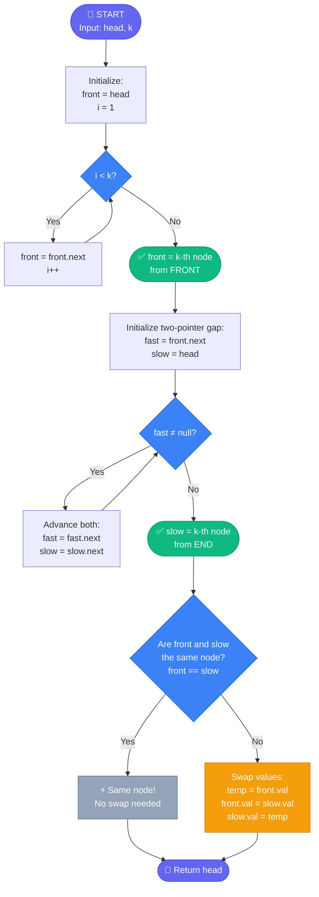

# 1721. Swapping Nodes in a Linked List Flowchart

```mermaid
flowchart TD
    A([🚀 START\nInput: head, k]) --> B

    B["Initialize:\nfront = head\ni = 1"]

    B --> C{i < k?}
    C -- Yes --> D["front = front.next\ni++"]
    D --> C
    C -- No --> E

    E(["✅ front = k-th node\nfrom FRONT"])

    E --> F["Initialize two-pointer gap:\nfast = front.next\nslow = head"]

    F --> G{fast ≠ null?}

    G -- Yes --> H["Advance both:\nfast = fast.next\nslow = slow.next"]
    H --> G

    G -- No --> I(["✅ slow = k-th node\nfrom END"])

    I --> J{"Are front and slow\nthe same node?\nfront == slow"}

    J -- Yes --> K["⚡ Same node!\nNo swap needed"]
    J -- No --> L["Swap values:\ntemp = front.val\nfront.val = slow.val\nslow.val = temp"]

    K --> M
    L --> M

    M([🏁 Return head])

    style A fill:#6366f1,color:#fff,stroke:#4f46e5
    style M fill:#6366f1,color:#fff,stroke:#4f46e5
    style E fill:#10b981,color:#fff,stroke:#059669
    style I fill:#10b981,color:#fff,stroke:#059669
    style L fill:#f59e0b,color:#fff,stroke:#d97706
    style K fill:#94a3b8,color:#fff,stroke:#64748b
    style C fill:#3b82f6,color:#fff,stroke:#2563eb
    style G fill:#3b82f6,color:#fff,stroke:#2563eb
    style J fill:#3b82f6,color:#fff,stroke:#2563eb
```
