# LeetCode 347: Top K Frequent Elements - Complete Guide

Let me guide you through this problem using first-principles thinking and a structured approach.

---

## 1. Problem Understanding

**In Simple Terms:**

You have a list of numbers, and some numbers appear more often than others. Your job is to find the `k` numbers that appear most frequently.

**Example Breakdown:**

- `nums = [1,1,1,2,2,3], k = 2`
- Count: 1 appears 3 times, 2 appears 2 times, 3 appears 1 time
- We want the top 2 most frequent → `[1, 2]`

**Edge Cases to Consider:**

- Single element array
- All elements have the same frequency
- k equals the number of unique elements
- Negative numbers (but frequency logic stays the same)

---

## 2. Constraints Analysis

Let's decode what the constraints tell us:

| Constraint                           | What It Tells Us                                                                 |
|--------------------------------------|----------------------------------------------------------------------------------|
| `1 <= nums.length <= 10^5`           | **Large input** - O(n²) solutions will be too slow; we need O(n) or O(n log n)   |
| `-10^4 <= nums[i] <= 10^4`           | Numbers can be negative; range is manageable (could use counting sort techniques)|
| `k is in range [1, unique elements]` | We'll always have at least k unique elements; no invalid k                       |
| `Answer is unique`                   | No ties to worry about - there's always a clear top k                            |
| `Time must be better than O(n log n)`| **Critical constraint** - rules out simple sorting approaches                    |

---

## 3. Highlight Keywords

🔑 **Key Terms to Recognize:**

- **"Top K"** → Often indicates: Heap, QuickSelect, or Bucket Sort
- **"Most Frequent"** → Need to count occurrences → HashMap/Frequency Counter
- **"Better than O(n log n)"** → Linear or near-linear solution required
- **"Any order"** → Don't need sorted output (simplifies problem)

**Pattern Recognition for Future:**
When you see "Top K [something]", think: **Heap** or **QuickSelect** or **Bucket Sort**

---

## 4. Break Down Into Manageable Parts

Let's decompose the problem:

**Part 1:
Frequency Counting**

- Task: Count how many times each number appears
- Tool: HashMap (number → count)

**Part 2:
Finding Top K**

- Task: Among all frequencies, identify the k highest
- Challenge: Need to do this efficiently (better than O(n log n))

**Part 3:
Extract Results**

- Task: Return the actual numbers (not just frequencies)

---

## 5. Pattern Identification

This problem combines **two classic patterns**:

### Primary Pattern: **Top K Elements**

- **When to use:** Finding k largest/smallest/most frequent items
- **Common approaches:**
  1. **Min Heap** (size k) → O(n log k)
  2. **QuickSelect** → O(n) average
  3. **Bucket Sort** → O(n) when range is limited

### Secondary Pattern: **Frequency Counter**

- **When to use:** Counting occurrences
- **Tool:** HashMap/Dictionary

**Why this pattern matters:**
"Top K" problems appear frequently in interviews (pun intended). Master this, and you'll recognize it instantly in problems like:

- Top K frequent words
- K closest points to origin
- Kth largest element

---

## 6. Approach Discussion

I'll show you **three approaches** from basic to optimal:

### **Approach 1: Sorting (O(n log n)) - NOT OPTIMAL**

1. Count frequencies → HashMap
2. Sort by frequency
3. Take top k elements

**Why it fails:** Violates the "better than O(n log n)" constraint.

---

### **Approach 2: Min Heap (O(n log k)) - GOOD**

**Step-by-step reasoning:**

1. **Count frequencies** using HashMap → O(n)
   - Build map: `{number: frequency}`

2. **Use a Min Heap of size k** → O(n log k)
   - Why Min Heap? Keep smallest at top, easy to evict
   - For each unique number:
     - If heap size < k → add element
     - If current frequency > heap's min → replace min with current

3. **Extract results** → O(k)
   - Heap now contains k most frequent elements

**Intuition:** We maintain a "top k leaderboard". When a new contender arrives, if it's better than the worst in our top k, we kick out the worst.

---

### **Approach 3: Bucket Sort (O(n)) - OPTIMAL**

**Step-by-step reasoning:**

1. **Count frequencies** → HashMap → O(n)

2. **Create buckets indexed by frequency** → O(n)
   - Bucket[i] = list of numbers that appear i times
   - Max frequency = array length
   - Why? A number can appear at most n times

3. **Iterate buckets from high to low frequency** → O(n)
   - Collect numbers until we have k elements

**Intuition:** Instead of sorting, we group numbers by frequency. Since frequencies are bounded [1, n], we can use them as array indices (bucket sort principle).

**Example visualization:**

```Javascript
nums = [1,1,1,2,2,3], k = 2

Frequency map: {1: 3, 2: 2, 3: 1}

Buckets:
bucket[1] = [3]       (numbers appearing 1 time)
bucket[2] = [2]       (numbers appearing 2 times)
bucket[3] = [1]       (numbers appearing 3 times)

Collect from right to left: [1, 2]
```

---

## 7. Code Implementation

### **Solution 1: Min Heap Approach (O(n log k))**

#### JavaScript

```javascript
/**
 * @param {number[]} nums
 * @param {number} k
 * @return {number[]}
 */
var topKFrequent = function(nums, k) {
    // Step 1: Count frequencies
    const freqMap = new Map();
    for (const num of nums) {
        freqMap.set(num, (freqMap.get(num) || 0) + 1);
    }
    
    // Step 2: Use a min heap (priority queue)
    // JavaScript doesn't have built-in heap, so we'll use a manual approach
    // or implement a simple heap
    
    // Alternative: Sort and take top k (easier in JS, but O(n log n))
    const sorted = [...freqMap.entries()]
        .sort((a, b) => b[1] - a[1]); // Sort by frequency descending
    
    // Step 3: Extract top k elements
    return sorted.slice(0, k).map(entry => entry[0]);
};

// More efficient heap-based implementation:
var topKFrequentHeap = function(nums, k) {
    const freqMap = new Map();
    for (const num of nums) {
        freqMap.set(num, (freqMap.get(num) || 0) + 1);
    }
    
    // Min heap implementation using array
    const heap = [];
    
    for (const [num, freq] of freqMap) {
        heap.push([num, freq]);
        heap.sort((a, b) => a[1] - b[1]); // Sort by frequency ascending
        
        // Keep only k elements
        if (heap.length > k) {
            heap.shift(); // Remove minimum
        }
    }
    
    return heap.map(item => item[0]);
};
```

#### Java

```java
class Solution {
    public int[] topKFrequent(int[] nums, int k) {
        // Step 1: Count frequencies
        Map<Integer, Integer> freqMap = new HashMap<>();
        for (int num : nums) {
            freqMap.put(num, freqMap.getOrDefault(num, 0) + 1);
        }
        
        // Step 2: Use a min heap (PriorityQueue)
        // Heap stores entries, ordered by frequency (min heap)
        PriorityQueue<Map.Entry<Integer, Integer>> heap = 
            new PriorityQueue<>((a, b) -> a.getValue() - b.getValue());
        
        for (Map.Entry<Integer, Integer> entry : freqMap.entrySet()) {
            heap.offer(entry);
            // Keep heap size at k
            if (heap.size() > k) {
                heap.poll(); // Remove element with minimum frequency
            }
        }
        
        // Step 3: Extract results
        int[] result = new int[k];
        int i = 0;
        while (!heap.isEmpty()) {
            result[i++] = heap.poll().getKey();
        }
        
        return result;
    }
}
```

---

### **Solution 2: Bucket Sort Approach (O(n)) - OPTIMAL**

#### JavaScript_

```javascript
var topKFrequent = function(nums, k) {
    // Step 1: Count frequencies
    const freqMap = new Map();
    for (const num of nums) {
        freqMap.set(num, (freqMap.get(num) || 0) + 1);
    }
    
    // Step 2: Create buckets
    // bucket[i] = list of numbers with frequency i
    const buckets = Array(nums.length + 1).fill(null).map(() => []);
    
    for (const [num, freq] of freqMap) {
        buckets[freq].push(num);
    }
    
    // Step 3: Collect top k from buckets (high frequency to low)
    const result = [];
    for (let i = buckets.length - 1; i >= 0 && result.length < k; i--) {
        if (buckets[i].length > 0) {
            // Add all numbers with this frequency
            result.push(...buckets[i]);
        }
    }
    
    // Return only k elements (in case last bucket had extras)
    return result.slice(0, k);
};
```

#### Java_

```java
class Solution {
    public int[] topKFrequent(int[] nums, int k) {
        // Step 1: Count frequencies
        Map<Integer, Integer> freqMap = new HashMap<>();
        for (int num : nums) {
            freqMap.put(num, freqMap.getOrDefault(num, 0) + 1);
        }
        
        // Step 2: Create buckets
        // buckets[i] = list of numbers with frequency i
        List<Integer>[] buckets = new List[nums.length + 1];
        for (int i = 0; i < buckets.length; i++) {
            buckets[i] = new ArrayList<>();
        }
        
        for (Map.Entry<Integer, Integer> entry : freqMap.entrySet()) {
            int num = entry.getKey();
            int freq = entry.getValue();
            buckets[freq].add(num);
        }
        
        // Step 3: Collect top k from buckets (high to low frequency)
        int[] result = new int[k];
        int index = 0;
        
        for (int i = buckets.length - 1; i >= 0 && index < k; i--) {
            for (int num : buckets[i]) {
                result[index++] = num;
                if (index == k) {
                    return result;
                }
            }
        }
        
        return result;
    }
}
```

---

## 8. Complexity Analysis

### **Min Heap Approach:**

**Time Complexity:
O(n log k)**

- Building frequency map: O(n)
- Heap operations: O(n log k)
  - n unique elements, each heap operation is O(log k)
- Total: O(n + n log k) = **O(n log k)**

**Space Complexity:
O(n)**

- Frequency map: O(n) for unique elements
- Heap: O(k)
- Total: **O(n)**

---

### **Bucket Sort Approach:**

**Time Complexity: O(n)** ✨

- Building frequency map: O(n)
- Creating buckets: O(n) unique elements
- Collecting results: O(n) worst case (iterate all buckets)
- Total: **O(n)** - Satisfies the constraint!

**Space Complexity:
O(n)**

- Frequency map: O(n)
- Buckets array: O(n)
- Total: **O(n)**

---

## 9. Alternative Solutions

### **QuickSelect Approach (O(n) average)**

Similar to QuickSort's partition, but only recurse on one side:

```javascript
var topKFrequent = function(nums, k) {
    const freqMap = new Map();
    for (const num of nums) {
        freqMap.set(num, (freqMap.get(num) || 0) + 1);
    }
    
    const unique = [...freqMap.keys()];
    
    // QuickSelect to find kth most frequent
    const n = unique.length;
    quickSelect(unique, 0, n - 1, n - k);
    
    return unique.slice(n - k);
    
    function quickSelect(arr, left, right, k) {
        if (left === right) return;
        
        let pivotIndex = partition(arr, left, right);
        
        if (k === pivotIndex) {
            return;
        } else if (k < pivotIndex) {
            quickSelect(arr, left, pivotIndex - 1, k);
        } else {
            quickSelect(arr, pivotIndex + 1, right, k);
        }
    }
    
    function partition(arr, left, right) {
        let pivot = freqMap.get(arr[right]);
        let i = left;
        
        for (let j = left; j < right; j++) {
            if (freqMap.get(arr[j]) < pivot) {
                [arr[i], arr[j]] = [arr[j], arr[i]];
                i++;
            }
        }
        
        [arr[i], arr[right]] = [arr[right], arr[i]];
        return i;
    }
};
```

**When to use each approach:**

- **Bucket Sort**: Best for most cases (O(n), simple)
- **Min Heap**: When k is very small compared to n
- **QuickSelect**: When you want average O(n) but can handle O(n²) worst case

---

## 10. Practice Recommendations

Master the "Top K" pattern with these problems:

### **Similar Difficulty:**

1. **LeetCode 692** - Top K Frequent Words (same pattern + sorting words)
2. **LeetCode 973** - K Closest Points to Origin (heap practice)
3. **LeetCode 451** - Sort Characters By Frequency

### **Build Up Skills:**

1. **LeetCode 215** - Kth Largest Element in Array (QuickSelect)
2. **LeetCode 703** - Kth Largest Element in Stream (heap maintenance)

### **Advanced:**

1. **LeetCode 767** - Reorganize String (frequency + greedy)
2. **LeetCode 895** - Maximum Frequency Stack (frequency tracking)

**Practice Strategy:**

1. Start with bucket sort approach (most intuitive)
2. Learn heap implementation in your language
3. Try QuickSelect for deeper understanding
4. Time yourself - aim for < 15 minutes per problem

---

## 11. Flowchart Design

```mermaid
flowchart TD
    Start([Start: nums array, k]) --> CountFreq[Build Frequency Map<br/>HashMap: num → count]
    
    CountFreq --> Choice{Which Approach?}
    
    %% Bucket Sort Path
    Choice -->|Bucket Sort<br/>O n| CreateBuckets[Create Buckets Array<br/>Size: nums.length + 1]
    CreateBuckets --> PopulateBuckets[Populate Buckets<br/>buckets frequency = numbers]
    PopulateBuckets --> IterateBuckets[Iterate from Max Frequency<br/>to Min Frequency]
    IterateBuckets --> CollectK{Collected k<br/>elements?}
    CollectK -->|No| AddToResult[Add numbers from<br/>current bucket]
    AddToResult --> IterateBuckets
    CollectK -->|Yes| Return1([Return Top K Elements])
    
    %% Min Heap Path
    Choice -->|Min Heap<br/>O n log k| CreateHeap[Create Min Heap<br/>Size: k]
    CreateHeap --> IterateMap[Iterate Frequency Map]
    IterateMap --> HeapCheck{Heap size<br/>< k?}
    HeapCheck -->|Yes| AddHeap[Add to Heap]
    HeapCheck -->|No| CompareFreq{Current freq ><br/>heap min?}
    CompareFreq -->|Yes| ReplaceMin[Remove min,<br/>Add current]
    CompareFreq -->|No| Skip[Skip current]
    AddHeap --> MoreEntries{More entries?}
    ReplaceMin --> MoreEntries
    Skip --> MoreEntries
    MoreEntries -->|Yes| IterateMap
    MoreEntries -->|No| ExtractHeap[Extract all from Heap]
    ExtractHeap --> Return2([Return Top K Elements])
    
    %% Styling
    style Start fill:#e1f5f,stroke:#4caf50,stroke-width:3px
    style Return1 fill:#c8e6c, stroke:#0dcaf0,stroke-width:2px
    style Return2 fill:#c8e6c,stroke:#dc3545,stroke-width:2px
    style Choice fill:#fff9c,stroke:#0d6efd,stroke-width:2px
    style CreateBuckets fill:#f8bbd,stroke:#4caf50,stroke-width:3px
    style CreateHeap fill:#f8bbd,stroke:#4caf50,stroke-width:3px
```



---

## 🎯 Key Takeaways

1. **Pattern Recognition**: "Top K" + "Frequency" = HashMap + (Heap OR Bucket Sort)

2. **Constraint Analysis**: "Better than O(n log n)" pushed us to O(n) solution

3. **Trade-offs**:
   - Bucket Sort: Faster but uses more space
   - Min Heap: More flexible, good when k << n

4. **Interview Strategy**:
   - Start with brute force (sorting) to show understanding
   - Optimize to heap solution (shows data structure knowledge)
   - Mention bucket sort for bonus points

5. **Common Mistake**: Forgetting that frequency is bounded by array length (enabling bucket sort)

---

**You're now equipped to tackle "Top K" problems! Practice the recommended problems and this pattern will become second nature.** 🚀

Great question! This is a subtle but important detail. Let me break down the reasoning:

## Why `nums.length + 1`?

### The Core Reasoning

**The maximum possible frequency of any element is `nums.length`.**

Let's think about extreme cases:

```javascript
// Example 1: All elements are the same
nums = [5, 5, 5, 5, 5]  // length = 5

// Frequency map: {5: 5}
// The number 5 appears 5 times (same as array length)
```

### Array Indexing

Since we're using **frequency as the array index**, we need:

```javascript
buckets[frequency] = [list of numbers]
```

If an element appears 5 times, we need `buckets[5]` to exist.

**Array indices go from 0 to length-1:**

- `Array(5)` gives indices: [0, 1, 2, 3, 4] ❌ (can't access buckets[5])
- `Array(6)` gives indices: [0, 1, 2, 3, 4, 5] ✅ (can access buckets[5])

So we need `nums.length + 1` to accommodate the maximum frequency.

---

## Visual Example

```javascript
nums = [1, 1, 1, 2, 2, 3]  // length = 6

// Frequency map
{
  1: 3,  // appears 3 times
  2: 2,  // appears 2 times
  3: 1   // appears 1 time
}

// We need buckets array with indices 0-6
buckets = Array(7)  // nums.length + 1 = 6 + 1 = 7

// After populating:
buckets[0] = []     // no number appears 0 times
buckets[1] = [3]    // number 3 appears 1 time
buckets[2] = [2]    // number 2 appears 2 times
buckets[3] = [1]    // number 1 appears 3 times
buckets[4] = []     // no number appears 4 times
buckets[5] = []     // no number appears 5 times
buckets[6] = []     // no number appears 6 times
```

---

## What About Index 0?

You might wonder: "Why keep index 0 if no element can appear 0 times?"

**Good observation!** We could technically use `Array(nums.length)` and adjust our indexing:

```javascript
// Alternative (less common):
const buckets = Array(nums.length);

for (const [num, freq] of freqMap) {
    buckets[freq - 1].push(num);  // freq-1 to shift index
}

// But this is confusing! bucket[0] = freq 1? 🤔
```

**Why we don't do this:**

- **Clarity**: `buckets[freq]` is more intuitive than `buckets[freq-1]`
- **Space**: One extra element is negligible (still O(n))
- **Bugs**: Off-by-one errors are common with adjusted indexing

---

## Edge Case: Maximum Frequency

```javascript
// Extreme case: single unique element
nums = [7, 7, 7, 7, 7, 7, 7, 7, 7, 7]  // length = 10

// Frequency map: {7: 10}
// We need buckets[10] to exist!

buckets = Array(10 + 1)  // Array(11)
buckets[10] = [7]  // ✅ Works!

// If we used Array(10):
buckets[10] = [7]  // ❌ undefined! (indices only go 0-9)
```

---

## Quick Reference

| Array Size  | Valid Indices | Max Frequency Supported |
|-------------|---------------|-------------------------|
| `Array(n)`  | 0 to n-1      | n-1 ❌                  |
| `Array(n+1)`| 0 to n        | n ✅                    |

---

## Code Annotation

```javascript
var topKFrequent = function(nums, k) {
    const freqMap = new Map();
    for (const num of nums) {
        freqMap.set(num, (freqMap.get(num) || 0) + 1);
    }
    
    // Create buckets
    // Why +1? Because max frequency = nums.length
    // and we use frequency as index: buckets[frequency]
    const buckets = Array(nums.length + 1)
        .fill(null)
        .map(() => []);
    
    // Example: if nums.length = 6
    // buckets has indices [0, 1, 2, 3, 4, 5, 6]
    // Can store frequencies from 0 to 6 ✅
    
    for (const [num, freq] of freqMap) {
        buckets[freq].push(num);  // Direct indexing by frequency
    }
    
    const result = [];
    for (let i = buckets.length - 1; i >= 0 && result.length < k; i--) {
        if (buckets[i].length > 0) {
            result.push(...buckets[i]);
        }
    }
    
    return result.slice(0, k);
};
```

---

## Summary

**Why `nums.length + 1`?**

1. ✅ Maximum frequency = `nums.length` (all elements the same)
2. ✅ We use frequency as array index: `buckets[frequency]`
3. ✅ Array indices go from `0` to `length - 1`
4. ✅ To access `buckets[nums.length]`, we need size `nums.length + 1`

**Mental Model:**
> "If I have n elements, the most frequent any single number can be is n times. To store that in an array indexed by frequency, I need indices from 0 to n, which requires size n+1."

Great question—this type of detail often appears in interviews! 🎯
