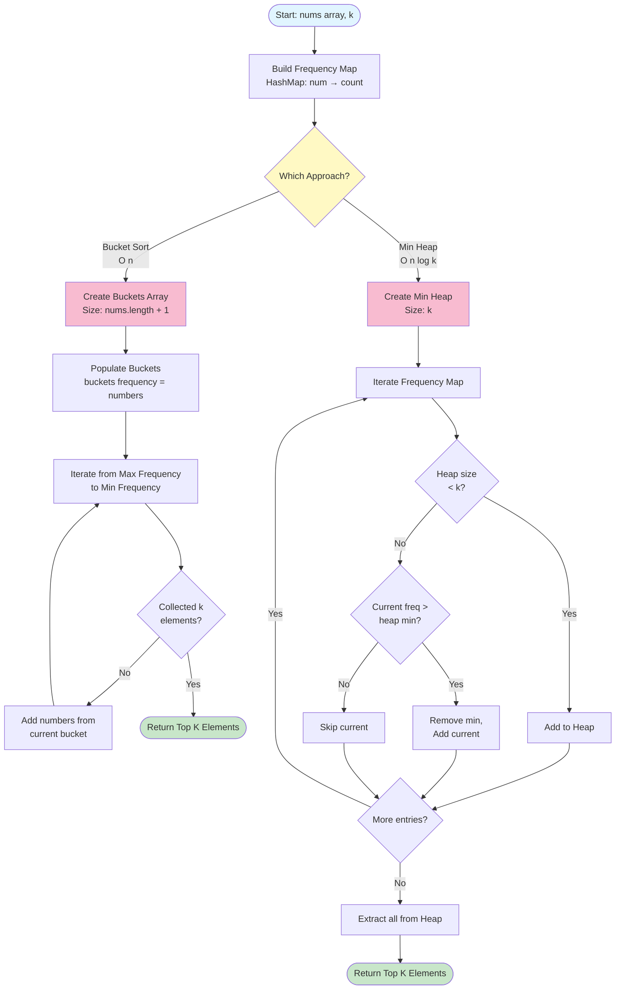

# Flowchart

```mermaid
flowchart TD
    Start([Start: nums array, k]) --> CountFreq[Build Frequency Map<br/>HashMap: num → count]
    
    CountFreq --> Choice{Which Approach?}
    
    %% Bucket Sort Path
    Choice -->|Bucket Sort<br/>O n| CreateBuckets[Create Buckets Array<br/>Size: nums.length + 1]
    CreateBuckets --> PopulateBuckets[Populate Buckets<br/>buckets frequency = numbers]
    PopulateBuckets --> IterateBuckets[Iterate from Max Frequency<br/>to Min Frequency]
    IterateBuckets --> CollectK{Collected k<br/>elements?}
    CollectK -->|No| AddToResult[Add numbers from<br/>current bucket]
    AddToResult --> IterateBuckets
    CollectK -->|Yes| Return1([Return Top K Elements])
    
    %% Min Heap Path
    Choice -->|Min Heap<br/>O n log k| CreateHeap[Create Min Heap<br/>Size: k]
    CreateHeap --> IterateMap[Iterate Frequency Map]
    IterateMap --> HeapCheck{Heap size<br/>< k?}
    HeapCheck -->|Yes| AddHeap[Add to Heap]
    HeapCheck -->|No| CompareFreq{Current freq ><br/>heap min?}
    CompareFreq -->|Yes| ReplaceMin[Remove min,<br/>Add current]
    CompareFreq -->|No| Skip[Skip current]
    AddHeap --> MoreEntries{More entries?}
    ReplaceMin --> MoreEntries
    Skip --> MoreEntries
    MoreEntries -->|Yes| IterateMap
    MoreEntries -->|No| ExtractHeap[Extract all from Heap]
    ExtractHeap --> Return2([Return Top K Elements])
    
    %% Styling
    style Start fill:#e1f5ff
    style Return1 fill:#c8e6c9
    style Return2 fill:#c8e6c9
    style Choice fill:#fff9c4
    style CreateBuckets fill:#f8bbd0
    style CreateHeap fill:#f8bbd0
```
