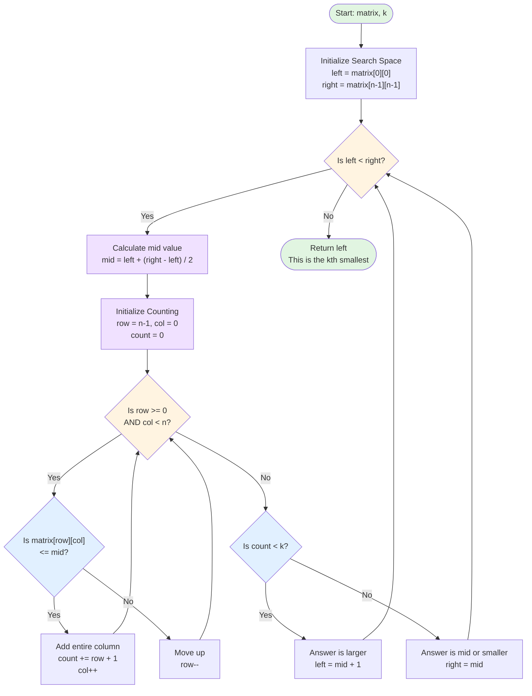

# *378. Kth Smallest Element in a Sorted Matrix*

```mermaid
flowchart TD
    Start([Start: matrix, k]) --> Init["Initialize Search Space<br/>left = matrix[0][0]<br/>right = matrix[n-1][n-1]"]

    Init --> BinaryLoop{Is left < right?}
    
    BinaryLoop -->|Yes| CalcMid["Calculate mid value<br/>mid = left + (right - left) / 2"]
    
    CalcMid --> CountInit[Initialize Counting<br/>row = n-1, col = 0<br/>count = 0]
    
    CountInit --> CountLoop{Is row >= 0<br/>AND col < n?}
    
    CountLoop -->|Yes| Compare{"Is matrix[row][col]<br/><= mid?"}
    
    Compare -->|Yes| AddCount[Add entire column<br/>count += row + 1<br/>col++]
    
    Compare -->|No| MoveUp[Move up<br/>row--]
    
    AddCount --> CountLoop
    MoveUp --> CountLoop
    
    CountLoop -->|No| CheckCount{Is count < k?}
    
    CheckCount -->|Yes| MoveRight[Answer is larger<br/>left = mid + 1]
    
    CheckCount -->|No| MoveLeft[Answer is mid or smaller<br/>right = mid]
    
    MoveRight --> BinaryLoop
    MoveLeft --> BinaryLoop
    
    BinaryLoop -->|No| Return([Return left<br/>This is the kth smallest])
    
    style Start fill:#e1f5e1
    style Return fill:#e1f5e1
    style BinaryLoop fill:#fff4e1
    style CountLoop fill:#fff4e1
    style Compare fill:#e1f0ff
    style CheckCount fill:#e1f0ff
    style CalcMid fill:#f0e1ff
    style CountInit fill:#f0e1ff
```
